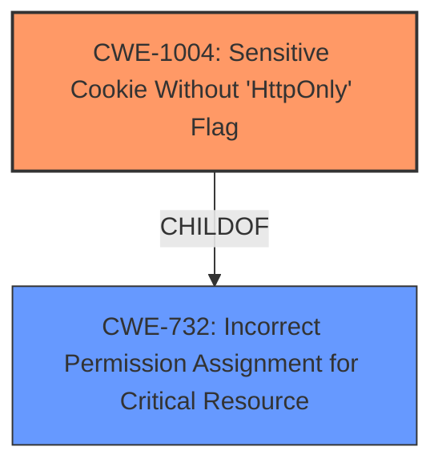

# Enhanced Analysis for CVE-2022-4630

# Summary
| CWE ID  | CWE Name                                                                       | Confidence | CWE Abstraction Level | CWE Vulnerability Mapping Label | CWE-Vulnerability Mapping Notes |
| :-------- | :----------------------------------------------------------------------------- | :---------- | :---------------------- | :------------------------------ | :------------------------------ |
| CWE-1004 | Sensitive Cookie Without 'HttpOnly' Flag                                     | 1          | Variant                 | Primary                         | Allowed                       |

## Evidence and Confidence

*   **Confidence Score:** 1
*   **Evidence Strength:** HIGH

## Relationship Analysis
The primary CWE, CWE-1004, is a variant that is a child of CWE-732, which is "Incorrect Permission Assignment for Critical Resource". The vulnerability focuses on the absence of the HttpOnly flag for a sensitive cookie, making CWE-1004 the most specific and appropriate choice.



## Vulnerability Chain
The vulnerability chain starts with a **Sensitive Cookie Without HttpOnly Flag**. This allows the cookie to be accessed by client-side scripts, potentially leading to Cross-Site Scripting (XSS) attacks, which is not directly addressed in the description but is a potential impact.
  - ROOT CAUSE: **Sensitive Cookie Without HttpOnly Flag**
  - IMPACT: Potential for sensitive information leakage and XSS attacks

## Summary of Analysis
The initial analysis identified **Sensitive Cookie Without HttpOnly Flag** as the root cause, which directly corresponds to CWE-1004. The provided description states: "**Sensitive Cookie Without HttpOnly Flag** in GitHub repository lirantal/daloradius prior to master."
The retriever results and graph relationships confirm that CWE-1004 is the most appropriate and specific CWE for this vulnerability. The high confidence score is due to the direct match between the vulnerability description and the CWE definition. The analysis is based on the provided evidence, which clearly indicates the absence of the HttpOnly flag for a sensitive cookie. The selection of CWE-1004 is at the optimal level of specificity, as it directly addresses the weakness described in the vulnerability.

Relevant CWE Information:

# Enhanced Context (25 CWEs)

## CWE-1004: Sensitive Cookie Without 'HttpOnly' Flag
**Abstraction:** Variant
**Status:** Incomplete

### Description
The product uses a cookie to store sensitive information, but the cookie is not marked with the HttpOnly flag.

### Extended Description
The HttpOnly flag directs compatible browsers to prevent client-side script from accessing cookies. Including the HttpOnly flag in the Set-Cookie HTTP response header helps mitigate the risk associated with Cross-Site Scripting (XSS) where an attacker's script code might attempt to read the contents of a cookie and exfiltrate information obtained. When set, browsers that support the flag will not reveal the contents of the cookie to a third party via client-side script executed via XSS.


## CWE Relationship Analysis

Current CWEs represent these abstraction levels: .


### Vulnerability Chain Analysis

**Chain starting from CWE-732:**
- 732 (Incorrect Permission Assignment for Critical Resource) - ROOT


**Chain starting from CWE-1004:**
- 1004 (Sensitive Cookie Without 'HttpOnly' Flag) - ROOT


### CWE Relationship Diagram

```mermaid
graph TD
    classDef primary fill:#f96,stroke:#333,stroke-width:2px
    classDef secondary fill:#69f,stroke:#333
    classDef tertiary fill:#9e9,stroke:#333
```