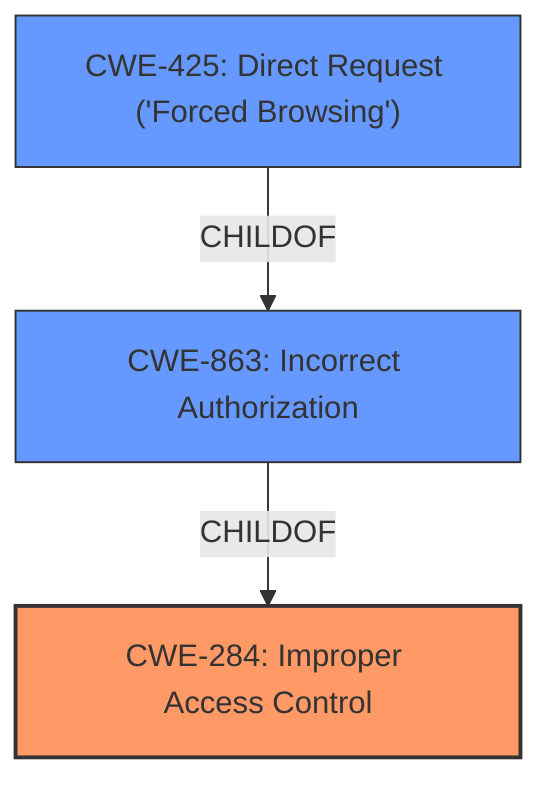

# Enhanced Analysis for CVE-2022-46331

# Summary
| CWE ID | CWE Name | Confidence | CWE Abstraction Level | CWE Vulnerability Mapping Label | CWE-Vulnerability Mapping Notes |
|---|---|---|---|---|---|
| CWE-284 | Improper Access Control | 0.75 | Pillar | Primary | Discouraged |
| CWE-863 | Incorrect Authorization | 0.65 | Class | Secondary | Allowed-with-Review |
| CWE-425 | Direct Request ('Forced Browsing') | 0.5 | Base | Secondary | Allowed |

## Evidence and Confidence

*   **Confidence Score:** 0.7
*   **Evidence Strength:** MEDIUM

## Relationship Analysis
The primary relationship influencing the CWE selection is the hierarchical structure with CWE-284 as a Pillar, CWE-863 as a Class child of CWE-284, and CWE-425 as a Base child of CWE-863. The vulnerability description suggests an access control issue. Given that the description lacks detailed information, a more specific Base CWE is hard to define, therefore, CWE-284 is chosen as the primary, even though it is discouraged. Because the vulnerability involves authorization checks being performed incorrectly, CWE-863 is included as a secondary CWE to represent the nature of the authorization problem more specifically. CWE-425 is included as a possible attack vector to bypass authorization.



## Vulnerability Chain
The vulnerability chain starts with **improper access control**, potentially leading to **incorrect authorization checks**, which can be exploited through **direct requests** to delete files on the system.

## Summary of Analysis
The initial assessment considered several CWEs, including CWE-284, CWE-863, and CWE-425. The final decision was influenced by the hierarchical relationships between these CWEs and the level of detail provided in the vulnerability description.

The vulnerability description states: "An unauthorized user could possibly delete any file on the system." This directly relates to **improper access control**. The "CVE Reference Links Content Summary" states: "**Root cause of vulnerability:** Improper Access Control" and "**Weaknesses/vulnerabilities present:** An unauthorized user can potentially delete any file on the system."

Given that the evidence points towards a general access control issue, but lacks specific details on the mechanism, CWE-284 is chosen as the primary CWE. However, CWE-284 is a Pillar and is discouraged, and therefore, a lower level CWE would be more appropriate. However, without more information, this is the best option.

CWE-863 (Incorrect Authorization) is included as a secondary CWE because the vulnerability involves authorization checks being performed incorrectly. This is a Class level CWE, which is more specific than the Pillar CWE of CWE-284.

CWE-425 (Direct Request ('Forced Browsing')) is included as a secondary CWE because it represents a potential attack vector where an attacker bypasses authorization checks by directly requesting restricted resources.

The selected CWEs are at an appropriate level of specificity given the available information. More detailed information about the specific access control mechanisms and authorization checks would allow for a more precise mapping to a Base or Variant CWE.

Relevant CWE Information:

# Enhanced Context (25 CWEs)

## CWE-274: Improper Handling of Insufficient Privileges
**Abstraction Level**: Base
**Similarity Score**: 0.76
**Source**: dense

**Description**:
The product does not handle or incorrectly handles when it has insufficient privileges to perform an operation, leading to resultant weaknesses.

**Mapping Guidance**:
- Usage: Discouraged
- Rationale: This CWE entry could be deprecated in a future version of CWE.

*Rationale for not selecting:* This CWE focuses on the handling of insufficient privileges, whereas the provided vulnerability description focuses on the broader issue of **improper access control** allowing unauthorized actions.

## CWE-1220: Insufficient Granularity of Access Control
**Abstraction Level**: Base
**Similarity Score**: 0.75
**Source**: dense

**Description**:
The product implements access controls via a policy or other feature with the intention to disable or restrict accesses (reads and/or writes) to assets in a system from untrusted agents. However, implemented access controls lack required granularity, which renders the control policy too broad because it allows accesses from unauthorized agents to the security-sensitive assets.

**Mapping Guidance**:
- Usage: Allowed
- Rationale: This CWE entry is at the Base level of abstraction, which is a preferred level of abstraction for mapping to the root causes of vulnerabilities.

*Rationale for not selecting:* This CWE describes the lack of granularity in access controls. The vulnerability description does not provide enough information to determine if the access controls are insufficiently granular.

## CWE-280: Improper Handling of Insufficient Permissions or Privileges
**Abstraction Level**: Base
**Similarity Score**: 0.75
**Source**: dense

**Description**:
The product does not handle or incorrectly handles when it has insufficient privileges to access resources or functionality as specified by their permissions. This may cause it to follow unexpected code paths that may leave the product in an invalid state.

**Mapping Guidance**:
- Usage: Allowed
- Rationale: This CWE entry is at the Base level of abstraction, which is a preferred level of abstraction for mapping to the root causes of vulnerabilities.

*Rationale for not selecting:* Similar to CWE-274, this CWE focuses on the handling of insufficient permissions or privileges, which is not the primary issue described in the vulnerability.

## CWE-807: Reliance on Untrusted Inputs in a Security Decision
**Abstraction Level**: Base
**Similarity Score**: 0.74
**Source**: dense

**Description**:
The product uses a protection mechanism that relies on the existence or values of an input, but the input can be modified by an untrusted actor in a way that bypasses the protection mechanism.

**Mapping Guidance**:
- Usage: Allowed
- Rationale: This CWE entry is at the Base level of abstraction, which is a preferred level of abstraction for mapping to the root causes of vulnerabilities.

*Rationale for not selecting:* This CWE focuses on reliance on untrusted inputs, which is not explicitly mentioned in the vulnerability description. The issue is more about general access control.

## CWE-639: Authorization Bypass Through User-Controlled Key
**Abstraction Level**: Base
**Similarity Score**: 0.74
**Source**: dense

**Description**:
The system's authorization functionality does not prevent one user from gaining access to another user's data or record by modifying the key value identifying the data.

**Mapping Guidance**:
- Usage: Allowed
- Rationale: This CWE entry is at the Base level of abstraction, which is a preferred level of abstraction for mapping to the root causes of vulnerabilities.

*Rationale for not selecting:* This CWE focuses on authorization bypass through user-controlled keys, which is not explicitly mentioned in the vulnerability description.

## CWE-266: Incorrect Privilege Assignment
**Abstraction Level**: Base
**Similarity Score**: 0.74
**Source**: dense

**Description**:
A product incorrectly assigns a privilege to a particular actor, creating an unintended sphere of control for that actor.

**Mapping Guidance**:
- Usage: Allowed
- Rationale: This CWE entry is at the Base level of abstraction, which is a preferred level of abstraction for mapping to the root causes of vulnerabilities.

*Rationale for not selecting:* The vulnerability description does not indicate incorrect privilege assignment as the root cause. The problem is more general **improper access control**.

## CWE-424: Improper Protection of Alternate Path
**Abstraction Level**: Class
**Similarity Score**: 0.74
**Source**: dense

**Description**:
The product does not sufficiently protect all possible paths that a user can take to access restricted functionality or resources.

**Mapping Guidance**:
- Usage: Allowed-with-Review
- Rationale: This CWE entry is a Class and might have Base-level children that would be more appropriate

*Rationale for not selecting:* This CWE is a Class and is similar to CWE-425, which is a child of this CWE.

## CWE-472: External Control of Assumed-Immutable Web Parameter
**Abstraction Level**: Base
**Similarity Score**: 0.74
**Source**: dense

**Description**:
The web application does not sufficiently verify inputs that are assumed to be immutable but are actually externally controllable, such as hidden form fields.

**Mapping Guidance**:
- Usage: Allowed
- Rationale: This CWE entry is at the Base level of abstraction, which is a preferred level of abstraction for mapping to the root causes of vulnerabilities.

*Rationale for not selecting:* This CWE focuses on external control of assumed-immutable web parameters, which is


## CWE Relationship Analysis

Current CWEs represent these abstraction levels: .


### Vulnerability Chain Analysis

**Chain starting from CWE-425:**
- 425 (Direct Request ('Forced Browsing')) - ROOT


**Chain starting from CWE-472:**
- 472 (External Control of Assumed-Immutable Web Parameter) - ROOT


### CWE Relationship Diagram

```mermaid
graph TD
    classDef primary fill:#f96,stroke:#333,stroke-width:2px
    classDef secondary fill:#69f,stroke:#333
    classDef tertiary fill:#9e9,stroke:#333
```