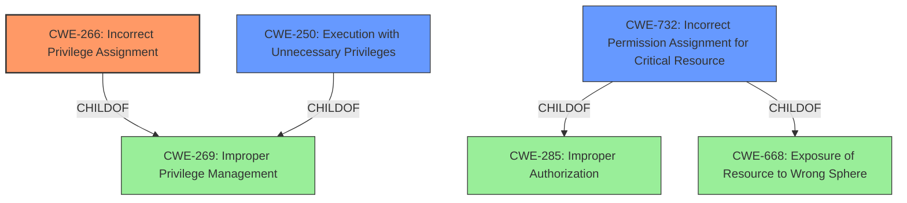

# Analysis Report for CVE-2022-46334

# Vulnerability Analysis Report: CVE-2022-46334

## Description


## Analysis (with Relationship Data)

# Summary
| CWE ID | CWE Name | Confidence | CWE Abstraction Level | CWE Vulnerability Mapping Label | CWE-Vulnerability Mapping Notes |
|---|---|---|---|---|---|
| CWE-266 | Incorrect Privilege Assignment | 0.9 | Base | Primary | Allowed |
| CWE-250 | Execution with Unnecessary Privileges | 0.7 | Base | Secondary | Allowed |
| CWE-732 | Incorrect Permission Assignment for Critical Resource | 0.6 | Class | Secondary | Allowed-with-Review |

## Evidence and Confidence

*   **Confidence Score:** 0.8
*   **Evidence Strength:** HIGH

## Relationship Analysis
The primary relationship influencing the CWE selection is the child-parent relationship where CWE-266 is a child of CWE-269 (Improper Privilege Management). This indicates a more specific type of privilege management issue. CWE-250 is also a child of CWE-269, representing a related but distinct issue where privileges are unnecessarily high. CWE-732 is related to CWE-285 (Improper Authorization) and CWE-668 (Exposure of Resource to Wrong Sphere), suggesting that incorrect permission assignments can lead to authorization failures or resource exposure. The analysis focuses on identifying the most specific and accurate representation of the vulnerability.



## Vulnerability Chain
The vulnerability chain starts with the **unnecessary permissions** assigned to the `pps` user (CWE-266), leading to a privilege escalation vulnerability. This can then lead to the `pps` user executing code with unnecessary privileges (CWE-250). If those permissions affect security-critical resources, then it also involves CWE-732. The chain highlights the progression from initial misconfiguration to potential impact.

## Summary of Analysis
The analysis is based on the provided vulnerability description and CVE reference, which clearly states the **root cause** as "**unnecessary permissions**" granted to the `pps` user.

The evidence to support this is:
*   "Vulnerability Description Key Phrases: **rootcause:** **unnecessary permissions**"
*   "CVE Reference Links Content Summary: The vulnerability is due to "**unnecessary permissions**" granted to the `pps` user within Proofpoint Enterprise Protection (PPS/PoD). This allows the `pps` user to escalate their privileges to root."

CWE-266 (Incorrect Privilege Assignment) is the most appropriate primary CWE because it directly addresses the **root cause** where a privilege is incorrectly assigned to an actor.

CWE-250 (Execution with Unnecessary Privileges) is considered as a secondary CWE since the `pps` user, due to the incorrect privilege assignment, is now able to execute with higher privileges than necessary.

CWE-732 (Incorrect Permission Assignment for Critical Resource) is another secondary CWE because the incorrect permissions assigned to the `pps` user allow them to access critical resources.

CWE-269 (Improper Privilege Management) was considered but not chosen as the primary CWE because it is a class-level CWE and less specific than CWE-266. The MITRE mapping guidance discourages the use of CWE-269 when more specific CWEs are available.

CWE-285 (Improper Authorization) was also considered but not chosen because the vulnerability isn't about a failure to perform or incorrect performance of an authorization check, but about assigning the incorrect privileges in the first place.

CWE-863 (Incorrect Authorization) was also considered but not chosen for the same reason as CWE-285.

The selected CWEs are at the optimal level of specificity because they accurately represent the **root cause** and contributing factors to the vulnerability. CWE-266 directly describes the incorrect privilege assignment, while CWE-250 describes the consequence of the incorrect assignment. CWE-732 represents the impact on critical resources.

Relevant CWE Information:

# Enhanced Context (25 CWEs)
The following CWEs were identified as potentially relevant to this vulnerability:

## CWE-274: Improper Handling of Insufficient Privileges
**Abstraction Level**: Base
**Similarity Score**: 0.78
**Source**: dense

**Description**:
The product does not handle or incorrectly handles when it has insufficient privileges to perform an operation, leading to resultant weaknesses.

**Mapping Guidance**:
- Usage: Discouraged
- Rationale: This CWE entry could be deprecated in a future version of CWE.

## CWE-280: Improper Handling of Insufficient Permissions or Privileges
**Abstraction Level**: Base
**Similarity Score**: 0.78
**Source**: dense

**Description**:
The product does not handle or incorrectly handles when it has insufficient privileges to access resources or functionality as specified by their permissions. This may cause it to follow unexpected code paths that may leave the product in an invalid state.

**Mapping Guidance**:
- Usage: Allowed
- Rationale: This CWE entry is at the Base level of abstraction, which is a preferred level of abstraction for mapping to the root causes of vulnerabilities.

## CWE-266: Incorrect Privilege Assignment
**Abstraction Level**: Base
**Similarity Score**: 0.78
**Source**: dense

**Description**:
A product incorrectly assigns a privilege to a particular actor, creating an unintended sphere of control for that actor.

**Mapping Guidance**:
- Usage: Allowed
- Rationale: This CWE entry is at the Base level of abstraction, which is a preferred level of abstraction for mapping to the root causes of vulnerabilities.

## CWE-267: Privilege Defined With Unsafe Actions
**Abstraction Level**: Base
**Similarity Score**: 0.76
**Source**: dense

**Description**:
A particular privilege, role, capability, or right can be used to perform unsafe actions that were not intended, even when it is assigned to the correct entity.

**Mapping Guidance**:
- Usage: Allowed
- Rationale: This CWE entry is at the Base level of abstraction, which is a preferred level of abstraction for mapping to the root causes of vulnerabilities.

## CWE-276: Incorrect Default Permissions
**Abstraction Level**: Base
**Similarity Score**: 0.76
**Source**: dense

**Description**:
During installation, installed file permissions are set to allow anyone to modify those files.

**Mapping Guidance**:
- Usage: Allowed
- Rationale: This CWE entry is at the Base level of abstraction, which is a preferred level of abstraction for mapping to the root causes of vulnerabilities.

## CWE-653: Improper Isolation or Compartmentalization
**Abstraction Level**: Class
**Similarity Score**: 0.75
**Source**: dense

**Description**:
The product does not properly compartmentalize or isolate functionality, processes, or resources that require different privilege levels, rights, or permissions.

**Mapping Guidance**:
- Usage: Allowed
- Rationale: This CWE entry is at the Base level of abstraction, which is a preferred level of abstraction for mapping to the root causes of vulnerabilities.

## CWE-281: Improper Preservation of Permissions
**Abstraction Level**: Base
**Similarity Score**: 0.75
**Source**: dense

**Description**:
The product does not preserve permissions or incorrectly preserves permissions when copying, restoring, or sharing objects, which can cause them to have less restrictive permissions than intended.

**Mapping Guidance**:
- Usage: Allowed
- Rationale: This CWE entry is at the Base level of abstraction, which is a preferred level of abstraction for mapping to the root causes of vulnerabilities.

## CWE-668: Exposure of Resource to Wrong Sphere
**Abstraction Level**: Class
**Similarity Score**: 0.75
**Source**: dense

**Description**:
The product exposes a resource to the wrong control sphere, providing unintended actors with inappropriate access to the resource.

**Mapping Guidance**:
- Usage: Discouraged
- Rationale: CWE-668 is high-level and is often misused as a catch-all when lower-level CWE IDs might be applicable. It is sometimes used for low-information vulnerability reports [REF-1287]. It is a level-1 Class (i.e., a child of a Pillar). It is not


## CWE Relationship Analysis

Current CWEs represent these abstraction levels: .


### Vulnerability Chain Analysis

**Chain starting from CWE-281:**
- 281 (Improper Preservation of Permissions) - ROOT


**Chain starting from CWE-266:**
- 266 (Incorrect Privilege Assignment) - ROOT


### CWE Relationship Diagram

```mermaid
graph TD
    classDef primary fill:#f96,stroke:#333,stroke-width:2px
    classDef secondary fill:#69f,stroke:#333
    classDef tertiary fill:#9e9,stroke:#333
```


*Report generated on 2025-03-30 13:33:30*
