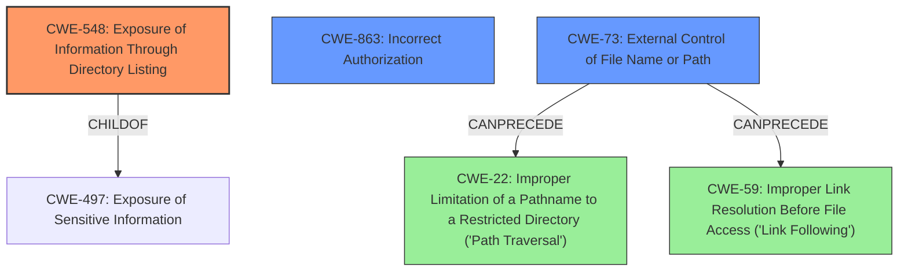

# Analysis for CVE-2022-46363

# Summary
| CWE ID | CWE Name | Confidence | CWE Abstraction Level | CWE Vulnerability Mapping Label | CWE-Vulnerability Mapping Notes |
|---|---|---|---|---|---|
| CWE-548 | Exposure of Information Through Directory Listing | 0.9 | Variant | Allowed | Primary CWE |
| CWE-863 | Incorrect Authorization | 0.6 | Class | Allowed-with-Review | Secondary Candidate |
| CWE-73 | External Control of File Name or Path | 0.4 | Base | Allowed | Secondary Candidate |

## Evidence and Confidence

*   **Confidence Score:** 0.9
*   **Evidence Strength:** HIGH

## Relationship Analysis
The primary CWE is CWE-548, a Variant of CWE-497 (Exposure of Sensitive Information).
CWE-863 is a Class-level weakness related to authorization issues, while CWE-73 is a Base-level weakness concerning external control of file names or paths.
CWE-73 can precede CWE-22 (Improper Limitation of a Pathname to a Restricted Directory ('Path Traversal')) and CWE-59 (Improper Link Resolution Before File Access ('Link Following')).

## Vulnerability Chain
The vulnerability chain begins with a **misconfiguration** of the CXFServlet (the **root cause**). This leads to an **exposure of directory listing**, potentially revealing sensitive information and allowing code exfiltration.

Misconfiguration -> Exposure of Directory Listing -> Information Disclosure / Code Exfiltration

## Summary of Analysis
The initial analysis focused on the **impact** of the vulnerability: remote directory listing and code exfiltration. The **Vulnerability Description** mentions that "the vulnerability only applies when the CXFServlet is configured with both the static-resources-list and redirect-query-check attributes" and "These attributes are not supposed to be used together, and so the vulnerability can only arise if the CXF service is **misconfigured**." This suggests that the **misconfiguration** is the root cause, which leads to the exposure of information.

The best fit is CWE-548 (Exposure of Information Through Directory Listing), which aligns directly with the **impact** of the vulnerability. The description for CWE-548 states: "A directory listing is inappropriately exposed, yielding potentially sensitive information to attackers."

CWE-863 (Incorrect Authorization) was considered because the **misconfiguration** could be seen as a form of incorrect authorization. However, the primary **impact** is the directory listing itself, making CWE-548 a more direct fit.

CWE-73 (External Control of File Name or Path) was also considered. While the **misconfiguration** might indirectly involve file paths, the **description** doesn't explicitly mention external control of file names or paths. Therefore, CWE-73 is less relevant than CWE-548.

The graph relationships show that CWE-73 can precede CWE-22 and CWE-59, indicating potential path traversal or link following vulnerabilities. However, these are not explicitly mentioned in the vulnerability **description**.

The final selection of CWE-548 is at the Variant level, which is appropriate because it directly describes the specific type of information exposure: directory listing. This is more specific than the Class-level CWE-497 (Exposure of Sensitive Information).

Relevant CWE Information:

# Enhanced Context (25 CWEs)
The following CWEs were identified as potentially relevant to this vulnerability:

## CWE-41: Improper Resolution of Path Equivalence
**Abstraction Level**: Base
**Similarity Score**: 0.78
**Source**: dense

**Description**:
The product is vulnerable to file system contents disclosure through path equivalence. Path equivalence involves the use of special characters in file and directory names. The associated manipulations are intended to generate multiple names for the same object.

**Mapping Guidance**:
- Usage: Allowed
- Rationale: This CWE entry is at the Base level of abstraction, which is a preferred level of abstraction for mapping to the root causes of vulnerabilities.

## CWE-668: Exposure of Resource to Wrong Sphere
**Abstraction Level**: Class
**Similarity Score**: 0.77
**Source**: dense

**Description**:
The product exposes a resource to the wrong control sphere, providing unintended actors with inappropriate access to the resource.

**Mapping Guidance**:
- Usage: Discouraged
- Rationale: CWE-668 is high-level and is often misused as a catch-all when lower-level CWE IDs might be applicable. It is sometimes used for low-information vulnerability reports [REF-1287]. It is a level-1 Class (i.e., a child of a Pillar). It is not useful for trend analysis.

## CWE-73: External Control of File Name or Path
**Abstraction Level**: Base
**Similarity Score**: 0.77
**Source**: dense

**Description**:
The product allows user input to control or influence paths or file names that are used in filesystem operations.

**Mapping Guidance**:
- Usage: Allowed
- Rationale: This CWE entry is at the Base level of abstraction, which is a preferred level of abstraction for mapping to the root causes of vulnerabilities.

## CWE-807: Reliance on Untrusted Inputs in a Security Decision
**Abstraction Level**: Base
**Similarity Score**: 0.77
**Source**: dense

**Description**:
The product uses a protection mechanism that relies on the existence or values of an input, but the input can be modified by an untrusted actor in a way that bypasses the protection mechanism.

**Mapping Guidance**:
- Usage: Allowed
- Rationale: This CWE entry is at the Base level of abstraction, which is a preferred level of abstraction for mapping to the root causes of vulnerabilities.

## CWE-941: Incorrectly Specified Destination in a Communication Channel
**Abstraction Level**: Base
**Similarity Score**: 0.77
**Source**: dense

**Description**:
The product creates a communication channel to initiate an outgoing request to an actor, but it does not correctly specify the intended destination for that actor.

**Mapping Guidance**:
- Usage: Allowed
- Rationale: This CWE entry is at the Base level of abstraction, which is a preferred level of abstraction for mapping to the root causes of vulnerabilities.

## CWE-319: Cleartext Transmission of Sensitive Information
**Abstraction Level**: Base
**Similarity Score**: 0.77
**Source**: dense

**Description**:
The product transmits sensitive or security-critical data in cleartext in a communication channel that can be sniffed by unauthorized actors.

**Mapping Guidance**:
- Usage: Allowed
- Rationale: This CWE entry is at the Base level of abstraction, which is a preferred level of abstraction for mapping to the root causes of vulnerabilities.

## CWE-799: Improper Control of Interaction Frequency
**Abstraction Level**: Class
**Similarity Score**: 0.77
**Source**: dense

**Description**:
The product does not properly limit the number or frequency of interactions that it has with an actor, such as the number of incoming requests.

**Mapping Guidance**:
- Usage: Allowed-with-Review
- Rationale: This CWE entry is a Class and might have Base-level children that would be more appropriate

## CWE-923: Improper Restriction of Communication Channel to Intended Endpoints
**Abstraction Level**: Class
**Similarity Score**: 0.77
**Source**: dense

**Description**:
The product establishes a communication channel to (or from) an endpoint for privileged or protected operations, but it does not properly ensure that it is communicating with the correct endpoint.

**Mapping Guidance**:
- Usage: Allowed-with-Review
- Rationale: This CWE entry is a Class and might have Base-level children that would be more appropriate

## CWE-345: Insufficient Verification of Data Authenticity
**Abstraction Level**: Class
**Similarity Score**: 0.77
**Source**: dense

**Description**:
The product does not sufficiently verify the origin or authenticity of data, in a way that causes it to accept invalid data.

**Mapping Guidance**:
- Usage: Discouraged
- Rationale: This CWE entry is a level-1 Class (i.e., a child