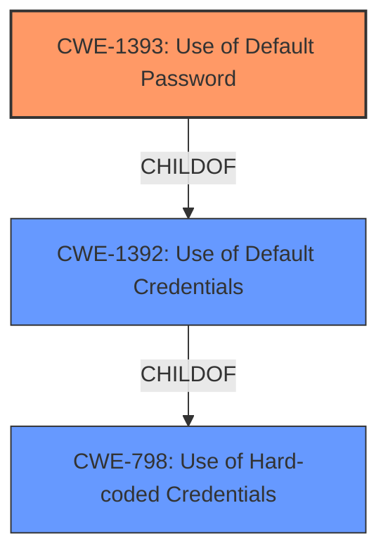

# Raw Analyzer Response for CVE-2022-46411

# Summary
| CWE ID  | CWE Name                      | Confidence | CWE Abstraction Level | CWE Vulnerability Mapping Label | CWE-Vulnerability Mapping Notes |
|---------|-------------------------------|------------|-----------------------|---------------------------------|-----------------------------------|
| CWE-1393 | Use of Default Password       | 1          | Base                  | Primary                           | Allowed                           |

## Evidence and Confidence

*   **Confidence Score:** 1
*   **Evidence Strength:** HIGH

## Relationship Analysis
The primary relationship that influenced the selection was the ChildOf relationship between CWE-1393 and CWE-1392. CWE-1393 is a more specific case of CWE-1392, focusing specifically on default passwords, while CWE-1392 covers a broader range of default credentials.

## Vulnerability Chain
The chain of events starts with the **default password being persisted** after installation, leading to the ability to **escalate privileges**. The root cause is the **use of default credentials**, and the impact is privilege escalation.

## Summary of Analysis
The initial analysis correctly identified the root cause as the **persistence of a default password** after installation, allowing for potential privilege escalation. The retriever results also highlighted CWE-1393 (Use of Default Password) and CWE-1392 (Use of Default Credentials) as top candidates.

The vulnerability description states "A **default password is persisted** after installation and may be discovered and used to escalate privileges." The CVE Reference Links Content Summary confirms this by stating: "Root cause: A default password is persisted after installation." and "Weaknesses: Use of default credentials".

Based on this evidence, CWE-1393 (Use of Default Password) is the most appropriate mapping. It is a Base level CWE, providing sufficient specificity. The MITRE mapping guidance allows its use, and the description aligns directly with the vulnerability.

Other CWEs considered:

*   CWE-1392 (Use of Default Credentials): While related as a parent, CWE-1393 is more specific, focusing solely on passwords.
*   CWE-798 (Use of Hard-coded Credentials): This is a more general case. Since the vulnerability specifically mentions a "default password" rather than a hard-coded credential, CWE-1393 is a better fit.
*   CWE-259 (Use of Hard-coded Password): This is similar to CWE-798, but more specific to passwords. However, "default password" is more accurate than "hard-coded password" based on the description.
*   CWE-276 (Incorrect Default Permissions) - Although it was one of the top hits, this is not related to the described vulnerability.
*   CWE-250 (Execution with Unnecessary Privileges) - Although it was one of the top hits, this is not related to the described vulnerability.

The selection of CWE-1393 is based on the evidence provided and represents the most specific and accurate classification of the vulnerability's root cause.