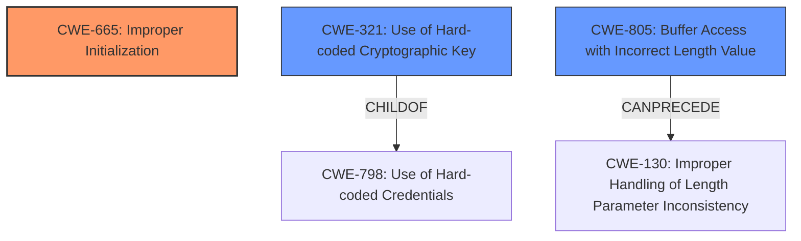

# Analysis Report for CVE-2022-46505

# Vulnerability Analysis Report: CVE-2022-46505

## Description


## Analysis (with Relationship Data)

# Summary
| CWE ID | CWE Name | Confidence | CWE Abstraction Level | CWE Vulnerability Mapping Label | CWE-Vulnerability Mapping Notes |
|---|---|---|---|---|---|
| CWE-665 | Improper Initialization | 0.9 | Class | Primary | Allowed-with-Review |
| CWE-321 | Use of Hard-coded Cryptographic Key | 0.7 | Variant | Secondary | Allowed |
| CWE-805 | Buffer Access with Incorrect Length Value | 0.6 | Base | Secondary | Allowed |

## Evidence and Confidence

*   **Confidence Score:** 0.8
*   **Evidence Strength:** HIGH

## Relationship Analysis
The primary CWE is CWE-665 Improper Initialization, as the **masterSecret** is initialized to all zeros. CWE-665 is a Class, and we should consider if any of its children apply better.
CWE-321 Use of Hard-coded Cryptographic Key is a plausible secondary CWE because the **masterSecret** is all zeros which can be considered a hard-coded cryptographic key.
CWE-805 Buffer Access with Incorrect Length Value is a plausible secondary CWE because the server does not properly validate the session ID length which can be a single byte instead of four bytes, leading to a lookup in the session table.



## Vulnerability Chain
The chain of events is:
1.  **Improper Initialization (CWE-665)**: The `masterSecret` is initialized to all zeros.
2.  **Insecure Session ID Handling**: The server **does not properly** validate the session ID length which can be a single byte instead of four bytes, leading to a lookup in the session table. (CWE-805)
3.  **Misuse of All-Zero MasterSecret**: The server selects the entry with the all-zero `masterSecret` due to the insecure session ID handling. (CWE-321)
4.  **Decryption of TLS Communication**: An attacker can decrypt TLS communication data because the `masterSecret` is all zeros.

## Summary of Analysis
The analysis is based on the provided evidence, particularly the "CVE Reference Links Content Summary," which gives a detailed explanation of the root cause and attack vectors. The key evidence supporting the CWE assignments includes:

*   The **masterSecret** field in this array is set to all zeros during initialization, indicating **Improper Initialization (CWE-665)**.
*   The server **does not properly** validate the session ID length which can be a single byte instead of four bytes, leading to a lookup in the session table where the **master secret could be all zeros**, indicating **Buffer Access with Incorrect Length Value (CWE-805)**.
*   The ability to force the server to use an **all-zero master secret** suggests a potential **Use of Hard-coded Cryptographic Key (CWE-321)**, although it's not strictly hard-coded, it functions similarly in this scenario.

The hierarchical relationships influenced the selection by guiding the choice towards the most specific CWE available. For instance, while CWE-664 might seem applicable, CWE-665 is more specific to the initialization aspect.

The selected CWEs are at the optimal level of specificity because they directly address the root causes identified in the vulnerability description.

*   **CWE-665: Improper Initialization** - This is the primary weakness, as the all-zero `masterSecret` is a direct result of **incorrect initialization**. The description of CWE-665, "The product does not initialize or incorrectly initializes a resource, which might leave the resource in an unexpected state when it is accessed or used," aligns perfectly with this scenario.
*   **CWE-321: Use of Hard-coded Cryptographic Key** - This is a secondary weakness. While not strictly hard-coded in the traditional sense, the all-zero `masterSecret` functions as a default, easily exploitable key. The description of CWE-321, "The use of a hard-coded cryptographic key significantly increases the possibility that encrypted data may be recovered," is relevant because the all-zero key allows decryption.
*   **CWE-805: Buffer Access with Incorrect Length Value** - This is a secondary weakness. The server does not properly validate the session ID length which can be a single byte instead of four bytes, leading to a lookup in the session table. The description of CWE-805, "The product uses a sequential operation to read or write a buffer, but it uses an incorrect length value that causes it to access memory that is outside of the bounds of the buffer."

CWEs considered but not used:

*   CWE-190: Integer Overflow or Wraparound: While possible, the description of the vulnerability does not mention this, so it's not a strong candidate.
*   CWE-125: Out-of-bounds Read: Similar to CWE-190, there is no direct evidence to support this.
*   CWE-522: Insufficiently Protected Credentials: This is not the primary issue, as the main problem is the use of an all-zero master secret, not how the credentials are being stored or transmitted.
*   CWE-614: Sensitive Cookie in HTTPS Session Without 'Secure' Attribute: This is not relevant to the vulnerability.
*   CWE-130: Improper Handling of Length Parameter Inconsistency: Although this can be considered, I think CWE-805 is more appropriate to describe this weakness.


## CWE Relationship Analysis

Current CWEs represent these abstraction levels: .


### Vulnerability Chain Analysis

**Chain starting from CWE-190:**
- 190 (Integer Overflow or Wraparound) - ROOT


**Chain starting from CWE-614:**
- 614 (Sensitive Cookie in HTTPS Session Without 'Secure' Attribute) - ROOT


### CWE Relationship Diagram

```mermaid
graph TD
    classDef primary fill:#f96,stroke:#333,stroke-width:2px
    classDef secondary fill:#69f,stroke:#333
    classDef tertiary fill:#9e9,stroke:#333
```


*Report generated on 2025-03-30 23:07:40*
