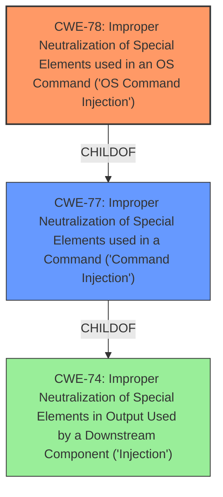

# Enhanced Analysis for CVE-2022-46598

# Summary
| CWE ID | CWE Name | Confidence | CWE Abstraction Level | CWE Vulnerability Mapping Label | CWE-Vulnerability Mapping Notes |
|---|---|---|---|---|---|
| CWE-78 | Improper Neutralization of Special Elements used in an OS Command ('OS Command Injection') | 1.0 | Base | Allowed | Primary CWE |
| CWE-77 | Improper Neutralization of Special Elements used in a Command ('Command Injection') | 0.7 | Class | Allowed-with-Review | Secondary Candidate |

## Evidence and Confidence

*   **Confidence Score:** 1.0
*   **Evidence Strength:** HIGH

## Relationship Analysis
The primary relationship that influenced the decision was the parent-child relationship between CWE-77 and CWE-78. CWE-78 is a more specific Base level CWE, representing OS Command Injection, which is a specific type of Command Injection (CWE-77). Since the vulnerability involves OS commands, CWE-78 is the more appropriate choice.



## Vulnerability Chain
The vulnerability chain is straightforward: the product receives input, and due to **improper neutralization**, this input is used to construct an OS command, leading to **command injection**.

## Summary of Analysis
The initial analysis identified **command injection** as the key weakness. The retriever results pointed to CWE-77 and CWE-78 as the most relevant CWEs. Examining the details, the vulnerability description explicitly mentions **command injection** and the context implies it is related to OS commands.

The vulnerability description states: "TRENDnet TEW755AP 1.13B01 was discovered to contain a **command injection** vulnerability via the wps_sta_enrollee_pin parameter in the action set_sta_enrollee_pin_5g function."

CWE-78 (Improper Neutralization of Special Elements used in an OS Command ('OS Command Injection')) is a Base level CWE that accurately describes the vulnerability. The description of CWE-78 states: "The product constructs all or part of an OS command using externally-influenced input from an upstream component, but it does not neutralize or incorrectly neutralizes special elements that could modify the intended OS command when it is sent to a downstream component." This aligns perfectly with the vulnerability description.

CWE-77 (Improper Neutralization of Special Elements used in a Command ('Command Injection')) is a Class level CWE. While it also describes **command injection**, it's a more general category. The MITRE mapping guidance for CWE-77 states: "CWE-77 is often misused when OS command injection (CWE-78) was intended instead [REF-1287]."

Therefore, CWE-78 is the more specific and appropriate choice. The decision is based on direct evidence from the vulnerability description and guidance from MITRE.

Other CWEs considered but not used:

*   CWE-96 (Improper Neutralization of Directives in Statically Saved Code ('Static Code Injection')): This CWE is related to injecting code into static resources. It is not relevant because the vulnerability involves injecting commands directly into an OS command.
*   CWE-790 (Improper Filtering of Special Elements): This is a class-level CWE that is too general.
*   CWE-89 (Improper Neutralization of Special Elements used in an SQL Command ('SQL Injection')): This CWE is specific to SQL injection, which is not relevant to the vulnerability.
*   CWE-121 (Stack-based Buffer Overflow): This CWE is about buffer overflows, which is a different type of weakness.
*   CWE-184 (Incomplete List of Disallowed Inputs): While a denylist could be a mitigation, the primary weakness is the lack of neutralization, not an incomplete list.
*   CWE-138 (Improper Neutralization of Special Elements): This is a class-level CWE that is too general.
*   CWE-88 (Improper Neutralization of Argument Delimiters in a Command ('Argument Injection')): This could be a related weakness if argument delimiters are not handled correctly, but the primary weakness is the overall lack of neutralization of special elements.
*   CWE-116 (Improper Encoding or Escaping of Output): This is a class-level CWE that is too general.


## CWE Relationship Analysis

Current CWEs represent these abstraction levels: .


### Vulnerability Chain Analysis

**Chain starting from CWE-89:**
- 89 (Improper Neutralization of Special Elements used in an SQL Command ('SQL Injection')) - ROOT


**Chain starting from CWE-184:**
- 184 (Incomplete List of Disallowed Inputs) - ROOT


### CWE Relationship Diagram

```mermaid
graph TD
    classDef primary fill:#f96,stroke:#333,stroke-width:2px
    classDef secondary fill:#69f,stroke:#333
    classDef tertiary fill:#9e9,stroke:#333
```