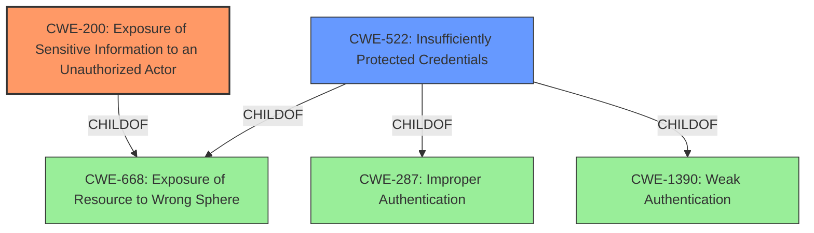

# Enhanced Analysis for CVE-2022-46650

# Summary
| CWE ID    | CWE Name                                                        | Confidence | CWE Abstraction Level | CWE Vulnerability Mapping Label | CWE-Vulnerability Mapping Notes |
| :-------- | :-------------------------------------------------------------- | :--------- | :---------------------- | :------------------------------ | :------------------------------ |
| CWE-200 | Exposure of Sensitive Information to an Unauthorized Actor | 0.95       | Class                   | Primary CWE                | Discouraged |
| CWE-522 | Insufficiently Protected Credentials                                 | 0.75       | Class                   | Secondary CWE              | Allowed-with-Review |

## Evidence and Confidence

*   **Confidence Score:** 0.85
*   **Evidence Strength:** HIGH

## Relationship Analysis
The primary CWE is CWE-200, which is a Class-level weakness. While it is often misused, the provided information explicitly points to an **Exposure of Sensitive Information** as the root cause. CWE-522 is a Class-level weakness and a child of both CWE-1390 (Weak Authentication) and CWE-287 (Improper Authentication). In this case, since the vulnerability leads to the exposure of ACEManager credentials, CWE-522 is considered a secondary candidate.



## Vulnerability Chain
The vulnerability chain begins with a user having valid credentials. The user then reconfigures the device in such a way that the credentials become exposed on the pre-login status page. This leads to **Exposure of Sensitive Information to an Unauthorized Actor (CWE-200)**, because the attacker gains unauthorized access to credentials. A contributing factor is the **Insufficiently Protected Credentials (CWE-522)**.

## Summary of Analysis
The initial analysis focused on the **Exposure of Sensitive Information (CWE-200)**, as indicated in the "CVE Reference Links Content Summary": "The root cause is an **Exposure of Sensitive Information to an Unauthorized Actor (CWE-200)** vulnerability".

The analysis considered the retriever results, specifically the higher-ranked CWEs like CWE-200, CWE-522, CWE-1390, CWE-256, and CWE-798. However, the explicit mention of **exposure** in the vulnerability description, combined with the CVSS score indicating high confidentiality impact, strongly supports CWE-200 as the primary weakness.

The graph relationships highlight that CWE-200 is a parent of several more specific weaknesses, and while these could be considered, the description focuses on the general **exposure** rather than a specific implementation flaw. CWE-522 is considered a secondary CWE to reflect that the credentials were not sufficiently protected, leading to their exposure.

The selection of CWE-200 and CWE-522 is at an appropriate level of specificity. While more specific child CWEs of CWE-200 could exist, the available evidence doesn't allow for a more granular classification. CWE-200 is explicitly mentioned as the root cause, and CWE-522 accounts for the nature of the exposed data being credentials.

Relevant CWE Information:

# Enhanced Context (25 CWEs)

## CWE-200: Exposure of Sensitive Information to an Unauthorized Actor
**Abstraction:** Class
**Status:** Draft

### Description
The product exposes sensitive information to an actor that is not explicitly authorized to have access to that information.

### Extended Description
There are many different kinds of mistakes that introduce information exposures. The severity of the error can range widely, depending on the context in which the product operates, the type of sensitive information that is revealed, and the benefits it may provide to an attacker.
...
Information exposures can occur in different ways:

  - the code  **explicitly inserts**  sensitive information into resources or messages that are intentionally made accessible to unauthorized actors, but should not contain the information - i.e., the information should have been "scrubbed" or "sanitized"

  - a different weakness or mistake  **indirectly inserts**  the sensitive information into resources, such as a web script error revealing the full system path of the program.

  - the code manages resources that intentionally contain sensitive information, but the resources are  **unintentionally made accessible**  to unauthorized actors. In this case, the information exposure is resultant - i.e., a different weakness enabled the access to the information in the first place.

### Mapping Guidance
**Usage:** Discouraged
**Rationale:** CWE-200 is commonly misused to represent the loss of confidentiality in a vulnerability, but confidentiality loss is a technical impact - not a root cause error. As of CWE 4.9, over 400 CWE entries can lead to a loss of confidentiality. Other options are often available. [REF-1287].
**Comments:** If an error or mistake causes information to be disclosed, then use the CWE ID for that error. Consider starting with improper authorization (CWE-285), insecure permissions (CWE-732), improper authentication (CWE-287), etc. Also consider children such as Insertion of Sensitive Information Into Sent Data (CWE-201), Observable Discrepancy (CWE-203), Insertion of Sensitive Information into Externally-Accessible File or Directory (CWE-538), or others.

### Observed Examples
- **CVE-2022-31162:** Rust library leaks Oauth client details in application debug logs
- **CVE-2021-25476:** Digital Rights Management (DRM) capability for mobile platform leaks pointer information, simplifying ASLR bypass
- **CVE-2001-1483:** Enumeration of valid usernames based on inconsistent responses

**Evidence:** The "CVE Reference Links Content Summary" states: "The root cause is an **Exposure of Sensitive Information to an Unauthorized Actor (CWE-200)** vulnerability." Also, the vulnerability description notes that the impact is to "expose ACEManager credentials."

## CWE-522: Insufficiently Protected Credentials
**Abstraction:** Class
**Status:** Incomplete

### Description
The product transmits or stores authentication credentials, but it uses an insecure method that is susceptible to unauthorized interception and/or retrieval.

### Observed Examples
- **CVE-2022-30018:** A messaging platform serializes all elements of User/Group objects, making private information available to adversaries
- **CVE-2022-29959:** Initialization file contains credentials that can be decoded using a "simple string transformation"
- **CVE-2022-35411:** Python-based RPC framework enables pickle functionality by default, allowing clients to unpickle untrusted data.

**Evidence:** The vulnerability description mentions that valid credentials allow reconfiguration that exposes the credentials, suggesting that the credentials themselves were not adequately protected. This aligns with the description of CWE-522.


## CWE Relationship Analysis

Current CWEs represent these abstraction levels: .


### Vulnerability Chain Analysis

**Chain starting from CWE-201:**
- 201 (Insertion of Sensitive Information Into Sent Data) - ROOT


**Chain starting from CWE-200:**
- 200 (Exposure of Sensitive Information to an Unauthorized Actor) - ROOT


### CWE Relationship Diagram

```mermaid
graph TD
    classDef primary fill:#f96,stroke:#333,stroke-width:2px
    classDef secondary fill:#69f,stroke:#333
    classDef tertiary fill:#9e9,stroke:#333
```