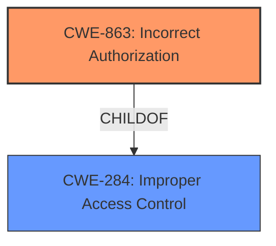

# Analysis for CVE-2022-46676

# Summary
| CWE ID | CWE Name | Confidence | CWE Abstraction Level | CWE Vulnerability Mapping Label | CWE-Vulnerability Mapping Notes |
|---|---|---|---|---|---|
| CWE-863 | Incorrect Authorization | 0.8 | Class | Primary | Allowed-with-Review |
| CWE-284 | Improper Access Control | 0.6 | Pillar | Secondary | Discouraged |

## Evidence and Confidence

*   **Confidence Score:** 0.8
*   **Evidence Strength:** HIGH

## Relationship Analysis
The primary CWE is CWE-863, which is a child of CWE-284. CWE-284 is a high-level pillar, while CWE-863 is a class that provides more specific information about the authorization issue. The relationship between these two CWEs is hierarchical, with CWE-863 being a more specific instance of the broader access control problem described by CWE-284.

## Vulnerability Chain
The vulnerability chain starts with **improper access control**, leading to a malicious admin user being able to disable or delete users under administration and unassigned admins for which the group admin is not authorized.

## Summary of Analysis
Initially, the vulnerability description points to **improper access control**. The key phrase "improper access control" is directly mentioned in the vulnerability description. The sparse retriever results also point to CWE-284 and related authorization CWEs. However, "improper access control" (CWE-284) is a very broad term. A more specific CWE is desired.

The vulnerability description states that "A malicious admin user can disable or delete users under administration and unassigned admins for which the group admin is not authorized." This suggests that the authorization check is present but **incorrect**, leading to the unauthorized actions. This aligns well with CWE-863 (Incorrect Authorization). The retriever results also list CWE-863 as a candidate.

The choice of CWE-863 over CWE-284 is based on the evidence suggesting that an authorization check exists but is flawed, rather than completely missing. CWE-863 is at the class level, while CWE-284 is at the pillar level; thus, CWE-863 provides a more specific classification.

Relevant CWE Information:

# Enhanced Context (25 CWEs)
The following CWEs were identified as potentially relevant to this vulnerability:

## CWE-285: Improper Authorization
**Abstraction:** Class
**Similarity Score**: 6101.34
**Source**: sparse

**Description**:
The product does not perform or incorrectly performs an authorization check when an actor attempts to access a resource or perform an action.

## CWE-863: Incorrect Authorization
**Abstraction:** Class
**Similarity Score**: 6166.51
**Source**: sparse

**Description**:
The product performs an authorization check when an actor attempts to access a resource or perform an action, but it does not correctly perform the check.

**Analysis of CWE-863:**

The vulnerability description indicates that a malicious admin user can perform actions (disable or delete users) that they are not authorized to do. This aligns perfectly with CWE-863, which states that the product performs an authorization check, but it does not correctly perform the check.

**Security Implications:**

The security implication is that unauthorized users can perform actions that they should not be able to, leading to potential data breaches, service disruption, and other security incidents.

**Relationship Analysis:**

CWE-863 is a child of CWE-285 (Improper Authorization) and CWE-284 (Improper Access Control). This means that it is a more specific type of authorization or access control issue.

**Mapping Guidance Analysis:**

CWE-863 is listed as "Allowed-with-Review," suggesting that it is a valid mapping but that other more specific CWEs might exist. However, in this case, CWE-863 seems to be the most appropriate.

**Final Conclusion:**

CWE-863 is the most appropriate CWE for this vulnerability because it accurately describes the root cause, which is an incorrect authorization check. The evidence from the vulnerability description supports this classification.