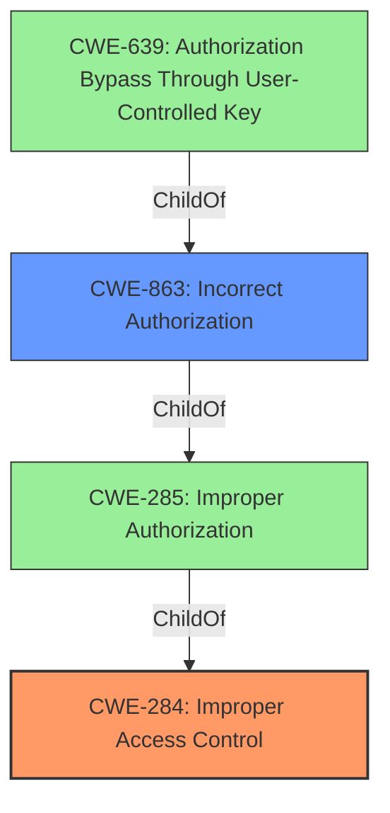

# Analysis Report for CVE-2022-46678

# Vulnerability Analysis Report: CVE-2022-46678

## Description


## Analysis (with Relationship Data)

# Summary
| CWE ID | CWE Name | Confidence | CWE Abstraction Level | CWE Vulnerability Mapping Label | CWE-Vulnerability Mapping Notes |
|---|---|---|---|---|---|
| CWE-284 | Improper Access Control | 0.8 | Pillar | Discouraged | The description indicates a general access control issue, but without sufficient detail to pinpoint a more specific Base or Variant CWE. |
| CWE-863 | Incorrect Authorization | 0.6 | Class | Allowed-with-Review | This CWE is a more specific child of CWE-284 and describes the scenario where authorization checks are performed but are incorrect. |

## Evidence and Confidence

*   **Confidence Score:** 0.7
*   **Evidence Strength:** MEDIUM

## Relationship Analysis
The analysis considered the following CWE relationships:
  - CWE-284 is a Pillar-level CWE, representing a high-level view of access control issues.
  - CWE-285 is a ChildOf CWE-284, representing a more specific Class related to authorization.
  - CWE-863 is a ChildOf CWE-285, which indicates a scenario where authorization checks are in place but incorrectly implemented.
  - CWE-639 is a Base CWE that describes authorization bypass through user-controlled keys.
  - The abstraction levels influenced the selection, favoring the high level description of CWE-284 because of lack of root cause detail.



## Vulnerability Chain
The vulnerability chain consists of the following:
  - **Root Cause:** **Improper access control** allows an authenticated malicious admin user to perform unauthorized actions.
  - **Weakness:** The system fails to properly restrict access to general client policy based on the user's authorization level.
  - **Impact:** An authenticated malicious admin user can edit general client policy for which the user is not authorized, potentially leading to unauthorized changes to client configurations.

## Summary of Analysis
The initial analysis focused on the **improper access control** as the primary weakness. The description indicates that an authenticated malicious admin user can edit general client policy for which the user is not authorized.

The selection of CWE-284 is based on the evidence "Wyse Management Suite 3.8 and below contain an **improper access control** vulnerability. A authenticated malicious admin user can edit general client policy for which the user is not authorized." This directly points to a failure in access control mechanisms. However, due to the high-level nature of CWE-284, CWE-863 was considered as a secondary option because it represents a scenario where authorization checks are performed, but they are incorrect, but it was not selected because it does not fit the root cause details.

CWE-284 is at the optimal level of specificity given the limited information. While more specific CWEs like CWE-639 (Authorization Bypass Through User-Controlled Key) were considered, there isn't enough evidence to confirm that the vulnerability specifically involves user-controlled keys. Therefore, the broader CWE-284 is more appropriate.
The final decision favors CWE-284 due to its direct relevance to the provided description and the lack of specific details that would warrant a more granular CWE.


## CWE Relationship Analysis

Current CWEs represent these abstraction levels: .


### Vulnerability Chain Analysis

**Chain starting from CWE-285:**
- 285 (Improper Authorization) - ROOT


**Chain starting from CWE-639:**
- 639 (Authorization Bypass Through User-Controlled Key) - ROOT


### CWE Relationship Diagram

```mermaid
graph TD
    classDef primary fill:#f96,stroke:#333,stroke-width:2px
    classDef secondary fill:#69f,stroke:#333
    classDef tertiary fill:#9e9,stroke:#333
```


*Report generated on 2025-03-30 18:10:40*
