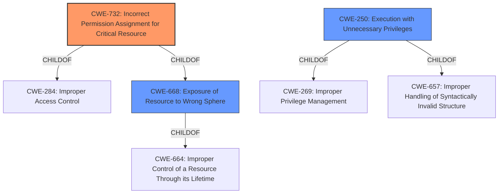

# Enhanced Analysis for CVE-2022-46756

# Summary
| CWE ID | CWE Name | Confidence | CWE Abstraction Level | CWE Vulnerability Mapping Label | CWE-Vulnerability Mapping Notes |
|---|---|---|---|---|---|
| CWE-732 | Incorrect Permission Assignment for Critical Resource | 0.75 | Class | Allowed-with-Review | Primary CWE |
| CWE-668 | Exposure of Resource to Wrong Sphere | 0.6 | Class | Discouraged | Secondary Candidate |
| CWE-250 | Execution with Unnecessary Privileges | 0.5 | Base | Allowed | Secondary Candidate |

## Evidence and Confidence

*   **Confidence Score:** 0.75
*   **Evidence Strength:** MEDIUM

## Relationship Analysis
The primary CWE, CWE-732, is a child of CWE-285 (Improper Authorization) and CWE-668 (Exposure of Resource to Wrong Sphere). This indicates that the vulnerability involves an authorization issue and/or exposing a resource to the wrong sphere. CWE-250 (Execution with Unnecessary Privileges) is a child of CWE-269 (Improper Privilege Management). The relationships suggest a hierarchy from broader privilege management issues down to specific instances of incorrect permission assignments. The chosen CWEs are at the Class or Base level, reflecting a reasonable level of specificity given the available information.



## Vulnerability Chain
The vulnerability chain involves:

1.  **Root Cause:** **Incorrect Permission Assignment for Critical Resources (CWE-732)** within the containerized environment.
2.  **Weakness Propagation:** This leads to a **Container Escape Vulnerability**, where the improperly assigned permissions allow a local attacker to bypass container boundaries.
3.  **Impact:** The attacker can then execute arbitrary OS commands on the underlying OS, potentially leading to system takeover.

## Summary of Analysis
The initial analysis considered several CWEs, with CWE-732 (Incorrect Permission Assignment for Critical Resource) emerging as the most relevant. The vulnerability description highlights a "**Container Escape Vulnerability**" that allows a local, high-privileged attacker to execute arbitrary OS commands. The **root cause** appears to be related to how permissions are assigned within the container environment, leading to the escape.

The evidence supporting CWE-732 includes:
*   The "Vulnerability Description Key Phrases" section identifies the "**Container Escape Vulnerability**" as a key weakness.
*   The "Vulnerability Description" indicates a local attacker can execute arbitrary OS commands due to this vulnerability.

CWE-732 aligns with this because it describes a scenario where "the product specifies permissions for a security-critical resource in a way that allows that resource to be read or modified by unintended actors." In this case, the "security-critical resource" could be the container environment itself, and the "unintended actors" are attackers who should not be able to escape the container.

Other CWEs were considered but deemed less suitable:

*   CWE-668 (Exposure of Resource to Wrong Sphere): While related, it's a broader category. CWE-732 is more specific to the permission assignment aspect.
*   CWE-250 (Execution with Unnecessary Privileges): This could be a contributing factor if the containers are running with elevated privileges, but it's not the primary **root cause** of the escape.
*   CWE-119 (Improper Restriction of Operations within the Bounds of a Memory Buffer) and CWE-78 (Improper Neutralization of Special Elements used in an OS Command ('OS Command Injection')): These are less relevant as the **root cause** doesn't appear to be a buffer overflow or command injection, but rather a permission issue.
*   CWE-20 (Improper Input Validation): This is less relevant, as there is no indication of input validation issues.

The relationships between the CWEs influenced the final selection. CWE-732's relationship to CWE-668 supports the idea that a resource is being exposed inappropriately, but CWE-732 better captures the specific mechanism of incorrect permission assignment.

The chosen CWEs are at an appropriate level of specificity. CWE-732 is a Class, which offers a balance between being specific to the vulnerability and avoiding overly granular details that are not evident in the description.

The confidence score is 0.75 because, while the evidence points strongly to a permission-related issue, the exact details of how the permissions are incorrectly assigned are not provided in the description. More information about the specific misconfiguration would increase the confidence level.


## CWE Relationship Analysis

Current CWEs represent these abstraction levels: .


### Vulnerability Chain Analysis

**Chain starting from CWE-657:**
- 657 (Violation of Secure Design Principles) - ROOT


**Chain starting from CWE-250:**
- 250 (Execution with Unnecessary Privileges) - ROOT


### CWE Relationship Diagram

```mermaid
graph TD
    classDef primary fill:#f96,stroke:#333,stroke-width:2px
    classDef secondary fill:#69f,stroke:#333
    classDef tertiary fill:#9e9,stroke:#333
```