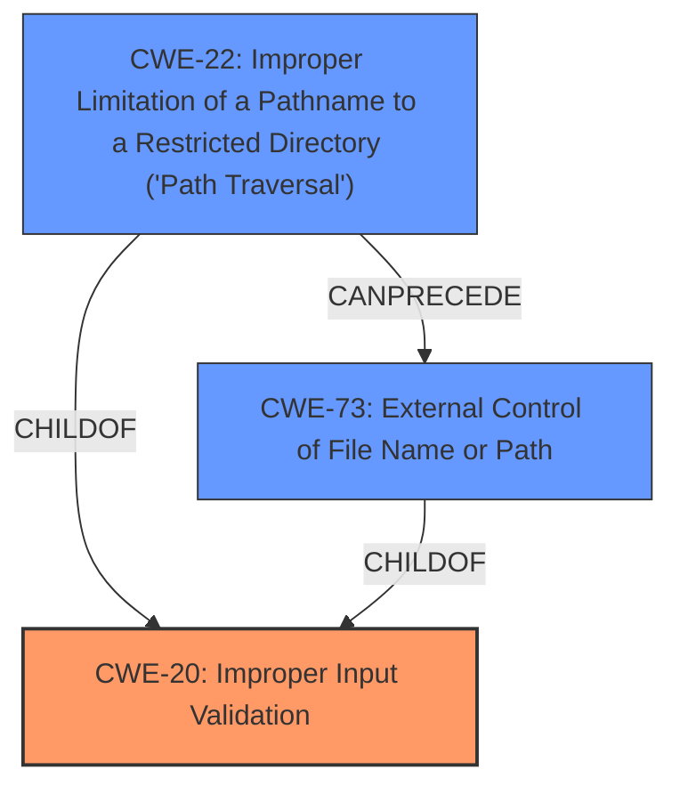

# Enhanced Analysis for CVE-2022-46768

# Summary
| CWE ID | CWE Name | Confidence | CWE Abstraction Level | CWE Vulnerability Mapping Label | CWE-Vulnerability Mapping Notes |
|---|---|---|---|---|---|
| **CWE-20** | Improper Input Validation | 0.8 | Class | Primary | Discouraged |
| CWE-22 | Improper Limitation of a Pathname to a Restricted Directory ('Path Traversal') | 0.6 | Base | Secondary | Allowed |
| CWE-73 | External Control of File Name or Path | 0.6 | Base | Secondary | Allowed |

## Evidence and Confidence

*   **Confidence Score:** 0.7
*   **Evidence Strength:** MEDIUM

## Relationship Analysis
The primary CWE selected is CWE-20, which is a Class-level weakness. While generally discouraged, it serves as a higher-level categorization for the **improper validation of URL parameters**. The secondary CWEs, CWE-22 and CWE-73, are both Base-level weaknesses that further specify the potential impact of the **improper validation**, leading to path traversal and external control of file names.



## Vulnerability Chain
The vulnerability chain starts with **improper validation of URL parameters** (CWE-20), which leads to potential path traversal (CWE-22) and external control of file names (CWE-73), eventually resulting in an arbitrary file read.

## Summary of Analysis
Initially, several CWEs were considered based on the description and retriever results. The vulnerability description clearly states the **root cause** as **improper validation of URL parameters**, leading to an **arbitrary file read**.

The selection of CWE-20 as the primary weakness is supported by the fact that the service does not properly validate URL parameters before reading files. The CVE Reference Links Content Summary also highlights this point.

The retriever results suggest CWE-20 as a potential match, but the mapping guidance discourages its use due to its high-level nature. However, in this case, the **improper validation** is the **root cause**, making CWE-20 a reasonable starting point.

CWE-22 and CWE-73 are also considered because the **improper validation** can lead to path traversal and external control of file names, respectively, eventually leading to the arbitrary file read.

The relationships between CWEs support this analysis. CWE-22 (Improper Limitation of a Pathname to a Restricted Directory) can precede CWE-73 (External Control of File Name or Path). Both are children of CWE-20.

Ultimately, the selection of CWE-20, CWE-22, and CWE-73 provides a comprehensive view of the vulnerability, starting from the **root cause** (**improper validation**) to the potential impact (arbitrary file read). The CWEs are chosen at the appropriate level of specificity, with CWE-20 providing a general classification and CWE-22 and CWE-73 offering more detailed insights into the potential consequences.

The primary weakness is the **improper validation of URL parameters**, which directly leads to the ability to read arbitrary files.

Relevant CWE Information:

# Enhanced Context (25 CWEs)

## CWE-41: Improper Resolution of Path Equivalence
Was considered but not selected. While path equivalence issues could be related, the primary issue is the **lack of validation** that allows the path to be manipulated in the first place, making CWE-20 more appropriate.

## CWE-74: Improper Neutralization of Special Elements in Output Used by a Downstream Component ('Injection')
Was considered but not selected. This CWE is about improper neutralization of special elements, but the vulnerability is more about the **lack of initial validation** of the URL parameters.

## CWE-184: Incomplete List of Disallowed Inputs
Was considered but not selected. While related to input handling, the core issue is the **lack of any validation**, not just an incomplete list.

## CWE-23: Relative Path Traversal
Was considered but rolled into the CWE-22 choice.

## CWE-1289: Improper Validation of Unsafe Equivalence in Input
Was considered but not selected. This is about unsafe equivalence in input, but the vulnerability is more general **improper validation**.

## CWE-138: Improper Neutralization of Special Elements
Was considered but not selected. Similar to CWE-74, this is about improper neutralization, while the core issue is **lack of validation**.

## CWE-807: Reliance on Untrusted Inputs in a Security Decision
Was considered but not selected. The **root cause** is **improper validation**, not just reliance on untrusted inputs.

## CWE-88: Improper Neutralization of Argument Delimiters in a Command ('Argument Injection')
Was considered but not selected. This CWE relates to command injection, which is not directly applicable here.

## CWE-472: External Control of Assumed-Immutable Web Parameter
Was considered but not selected. While external control is a factor, the **root cause** is **improper validation**, and the parameters aren't necessarily assumed immutable.

## CWE-918: Server-Side Request Forgery (SSRF)
Was considered but not selected. While there might be similarities, the vulnerability is primarily about arbitrary file read due to **improper validation**.

## CWE-770: Allocation of Resources Without Limits or Throttling
Was considered but not selected as it's unrelated to this vulnerability.

## CWE-190: Integer Overflow or Wraparound
Was considered but not selected as it's unrelated to this vulnerability.

## CWE-434: Unrestricted Upload of File with Dangerous Type
Was considered but not selected as it's unrelated to this vulnerability.

## CWE-613: Insufficient Session Expiration
Was considered but not selected as it's unrelated to this vulnerability.

## CWE-98: Improper Control of Filename for Include/Require Statement in PHP Program ('PHP Remote File Inclusion')
Was considered but not selected. This vulnerability is not specific to PHP and is about arbitrary file read in general.

## CWE-471: Modification of Assumed-Immutable Data (MAID)
Was considered but not selected. The URL parameters are not necessarily assumed immutable.

## CWE-611: Improper Restriction of XML External Entity Reference
Was considered but not selected as it's unrelated to this vulnerability.

## CWE-79: Improper Neutralization of Input During Web Page Generation ('Cross-site Scripting')
Was considered but not selected as it's unrelated to this vulnerability.

## CWE-78: Improper Neutralization of Special Elements used in an OS Command ('OS Command Injection')
Was considered but not selected. This CWE relates to command injection, which is not directly applicable here.


## CWE Relationship Analysis

Current CWEs represent these abstraction levels: .


### Vulnerability Chain Analysis

**Chain starting from CWE-41:**
- 41 (Improper Resolution of Path Equivalence) - ROOT


**Chain starting from CWE-807:**
- 807 (Reliance on Untrusted Inputs in a Security Decision) - ROOT


### CWE Relationship Diagram

```mermaid
graph TD
    classDef primary fill:#f96,stroke:#333,stroke-width:2px
    classDef secondary fill:#69f,stroke:#333
    classDef tertiary fill:#9e9,stroke:#333
```