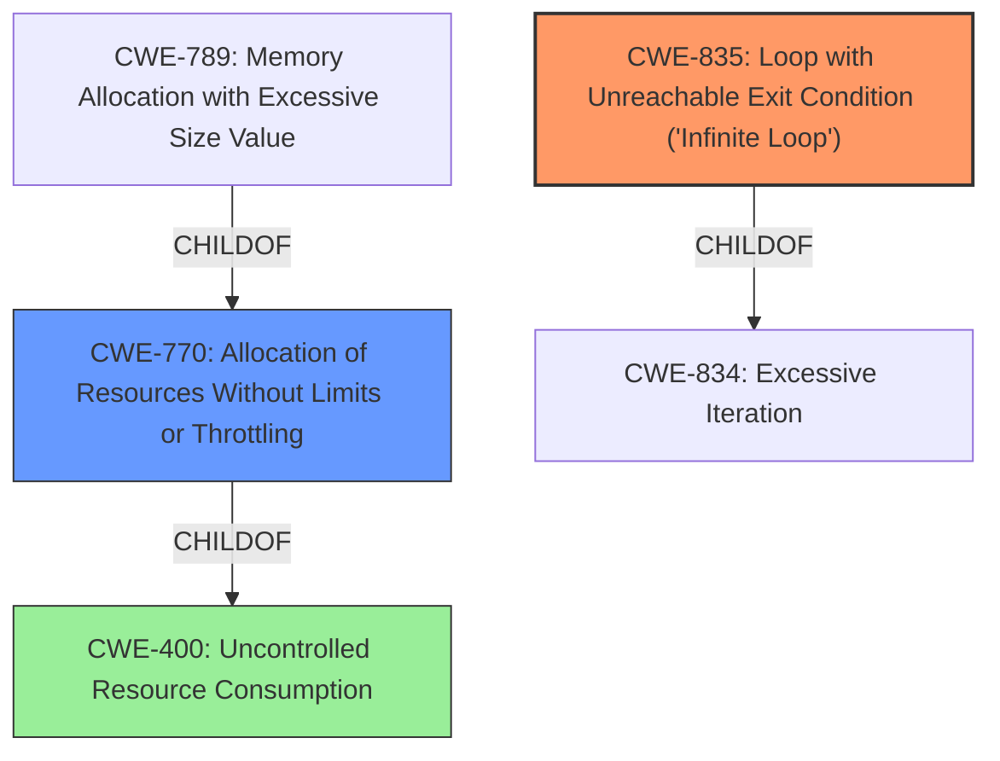

# Enhanced Analysis for CVE-2022-46770

# Summary
| CWE ID  | CWE Name  | Confidence | CWE Abstraction Level | CWE Vulnerability Mapping Label | CWE-Vulnerability Mapping Notes |
|---|---|---|---|---|---|
| CWE-835 | Loop with Unreachable Exit Condition ('Infinite Loop') | 0.9 | Base | Allowed | Primary CWE |
| CWE-770 | Allocation of Resources Without Limits or Throttling | 0.6 | Base | Allowed | Secondary candidate |
| CWE-400 | Uncontrolled Resource Consumption | 0.5 | Class | Discouraged | Secondary candidate |

## Evidence and Confidence

*   **Confidence Score:** 0.8
*   **Evidence Strength:** HIGH

## Relationship Analysis
The primary relationship that influenced the CWE selection was the parent-child relationship between CWE-400 (Uncontrolled Resource Consumption) and CWE-770 (Allocation of Resources Without Limits or Throttling), and CWE-835 (Loop with Unreachable Exit Condition ('Infinite Loop')). While CWE-400 is a broader class, CWE-770 and CWE-835 are more specific and accurately represent the weakness. The chain relationship between excessive resource allocation potentially leading to a denial-of-service condition was also considered.



## Vulnerability Chain
The vulnerability chain starts with a crafted UDP packet sent by a guest OS user. This packet triggers an infinite loop within the logging mechanism of the Mirage firewall, leading to excessive CPU consumption and a denial of service.

*   **Root Cause:** Infinite loop due to inefficient hexdump of large UDP payload.
*   **Weakness:** Excessive CPU consumption.
*   **Impact:** Denial of service (loss of forwarding).

## Summary of Analysis
The initial analysis focused on identifying the **ROOT CAUSE** of the denial-of-service vulnerability in the Qubes-Mirage firewall. The "CVE Reference Links Content Summary" section clearly indicates that the vulnerability stems from an **infinite loop** triggered by processing crafted UDP packets with large payloads, specifically within the logging mechanism. The logging function, when attempting to print the entire UDP payload using `Cstruct.hexdump_pp`, enters an **infinite loop**, consuming 100% of the CPU.

The primary CWE selected is CWE-835 (Loop with Unreachable Exit Condition ('Infinite Loop')). This selection is based on the explicit mention of an **infinite loop** as the **ROOT CAUSE** of the vulnerability. The "CVE Reference Links Content Summary" states that "the logging function enters an **infinite loop**, consuming 100% of the CPU."

CWE-770 (Allocation of Resources Without Limits or Throttling) was considered as a secondary CWE because the **infinite loop** effectively leads to uncontrolled CPU consumption. While not directly related to memory allocation, the CPU usage is unbounded.

CWE-400 (Uncontrolled Resource Consumption) was also considered but deemed less specific than CWE-835. While the vulnerability ultimately results in uncontrolled resource consumption, the **ROOT CAUSE** is the **infinite loop**.

The selection of CWE-835 is at the optimal level of specificity because it directly addresses the **ROOT CAUSE** of the vulnerability: the **infinite loop** within the logging mechanism. This aligns with the principle of choosing the most detailed CWE that accurately represents the weakness.

Relevant CWE Information:

# Enhanced Context (25 CWEs)
The following CWEs were identified as potentially relevant to this vulnerability:

## CWE-835: Loop with Unreachable Exit Condition ('Infinite Loop')
**CWE-835** is the primary CWE because the vulnerability involves an **infinite loop** in the logging mechanism. The "CVE Reference Links Content Summary" explicitly mentions the **infinite loop** as the **ROOT CAUSE**. The infinite loop consumes CPU resources, leading to a denial of service.
> Root Cause:
> The root cause is an **infinite loop** triggered within the logging mechanism of the Mirage firewall when processing specific UDP packets. This loop occurs due to the way `solo5` (the unikernel runtime) handles excessively long console log messages, specifically when printing the hexadecimal representation of a packet payload.

## CWE-770: Allocation of Resources Without Limits or Throttling
**CWE-770** is a secondary consideration because the infinite loop effectively leads to uncontrolled CPU consumption. While the vulnerability doesn't directly involve memory allocation, the CPU usage is unbounded due to the loop.
> Weaknesses/Vulnerabilities:
> **Denial of Service (DoS):** The primary vulnerability is a DoS condition. When a large UDP packet is sent to the firewall, the logging function enters an **infinite loop**, consuming 100% of the CPU, effectively halting the firewall's ability to process and forward packets.

## CWE-400: Uncontrolled Resource Consumption
**CWE-400** is considered but less specific than CWE-835. The vulnerability ultimately results in uncontrolled resource consumption, but the **ROOT CAUSE** is the **infinite loop**. Therefore, CWE-835 is a more accurate representation of the weakness.
> Impact of Exploitation:
> **High CPU Usage:** The vulnerable system experiences 100% CPU usage, indicating a severe resource exhaustion.


## CWE Relationship Analysis

Current CWEs represent these abstraction levels: .


### Vulnerability Chain Analysis

**Chain starting from CWE-834:**
- 834 (Excessive Iteration) - ROOT


**Chain starting from CWE-400:**
- 400 (Uncontrolled Resource Consumption) - ROOT


### CWE Relationship Diagram

```mermaid
graph TD
    classDef primary fill:#f96,stroke:#333,stroke-width:2px
    classDef secondary fill:#69f,stroke:#333
    classDef tertiary fill:#9e9,stroke:#333
```