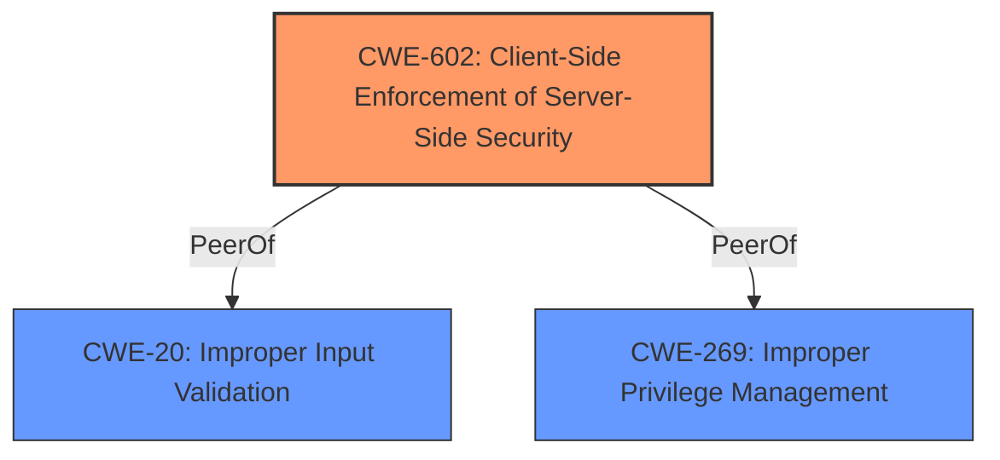

# Raw Analyzer Response for CVE-2022-46773

# Summary

| CWE ID    | CWE Name                                                                     | Confidence | CWE Abstraction Level | CWE Vulnerability Mapping Label | CWE-Vulnerability Mapping Notes |
| :-------- | :--------------------------------------------------------------------------- | :--------- | :-------------------- | :------------------------------ | :------------------------------ |
| CWE-602   | Client-Side Enforcement of Server-Side Security                              | 0.9        | Base                  | Allowed                         |                                 |

## Evidence and Confidence

*   **Confidence Score:** 0.9
*   **Evidence Strength:** HIGH

## Relationship Analysis

The primary relationship influencing the decision is that CWE-602 [Client-Side Enforcement of Server-Side Security] is a base CWE that specifically addresses vulnerabilities arising from relying on client-side mechanisms for security enforcement. It is a direct and accurate mapping of the vulnerability. Other CWEs such as CWE-20 [Improper Input Validation] and CWE-269 [Improper Privilege Management] are more general and do not fully capture the specific nature of the **client-side bypass** issue.

## Vulnerability Chain

The vulnerability chain begins with the **client-side validation bypass**, which is the root cause. This leads to the creation of invalid credential pools, which is the impact. There are no intermediate steps described.

## Summary of Analysis

The initial assessment identified the core issue as a **client-side validation bypass** leading to the creation of invalid credential pools in IBM Robotic Process Automation. The analysis focused on finding a CWE that specifically addresses this type of vulnerability.

The final decision to map the vulnerability to CWE-602 [Client-Side Enforcement of Server-Side Security] is based on the evidence from the vulnerability description: "IBM Robotic Process Automation 21.0.0 - 21.0.7 and 23.0.0 is vulnerable to **client-side validation bypass** for credential pools. Invalid credential pools may be created as a result."

CWE-602 is at the optimal level of specificity because it directly describes the **client-side enforcement** issue, which is the root cause.

Relevant CWE Information:

# Enhanced Context (25 CWEs)

## CWE-602: Client-Side Enforcement of Server-Side Security
**Abstraction Level**: Base

**Description:**
The application relies on client-side code to enforce security controls, but this code can be bypassed or modified by the user.

**Extended Description:**
Not provided.

**Mapping Guidance:**
- Usage: Allowed
- Rationale: This CWE entry is at the Base level of abstraction, which is a preferred level of abstraction for mapping to the root causes of vulnerabilities.

**Relationships:**
- PeerOf -> CWE-20 (Improper Input Validation)
- PeerOf -> CWE-269 (Improper Privilege Management)

**Explanation:**
The vulnerability description clearly indicates a **client-side validation bypass**. The application relies on client-side validation to ensure the integrity of credential pools, but this validation can be bypassed, leading to the creation of invalid pools. This aligns directly with CWE-602, which describes the risks of relying on client-side code for security enforcement. The impact is the creation of invalid credential pools, which can have further security implications.

Other CWEs Considered:

*   CWE-20 [Improper Input Validation]: While this could be a contributing factor, it's less specific than CWE-602. The problem isn't merely about improper input validation, but about the reliance on client-side validation that can be bypassed.
*   CWE-269 [Improper Privilege Management]: This is also less specific. While the creation of invalid credential pools might indirectly affect privilege management, the root cause is the **client-side bypass**.
*   CWE-522 [Insufficiently Protected Credentials]: This CWE focuses on how credentials are stored or transmitted, which isn't the primary issue here. The vulnerability is about creating *invalid* credentials pools.
*   CWE-613 [Insufficient Session Expiration]: This is unrelated to the described vulnerability.
*   CWE-287 [Improper Authentication]: This is also less relevant. The issue is not about authentication, but about the validation of credential pool creation.

The choice of CWE-602 is based on its direct relevance to the vulnerability description and its appropriate level of abstraction.