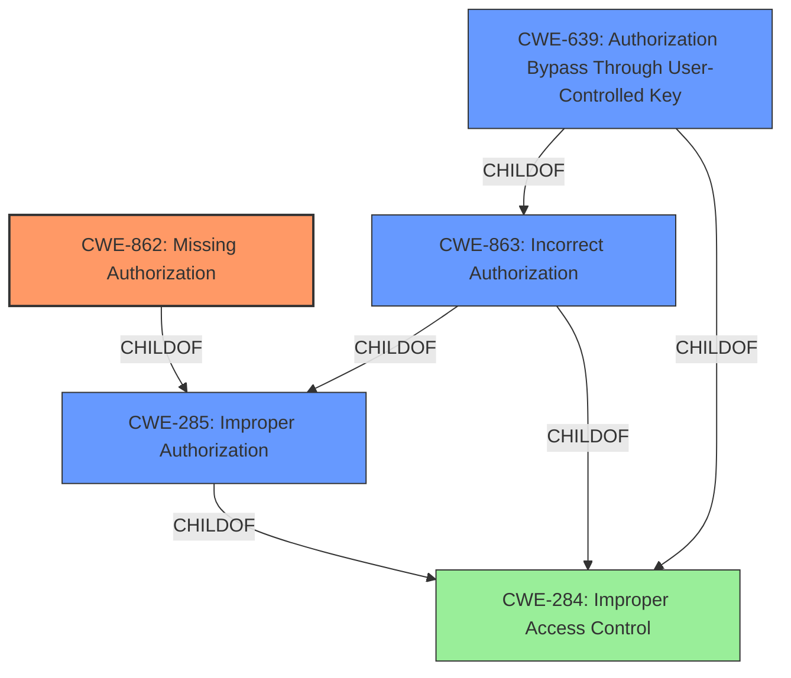

# Enhanced Analysis for CVE-2022-46792

# Summary
| CWE ID | CWE Name | Confidence | CWE Abstraction Level | CWE Vulnerability Mapping Label | CWE-Vulnerability Mapping Notes |
|---|---|---|---|---|---|
| CWE-862 | Missing Authorization | 0.9 | Class | Primary CWE | Allowed-with-Review |
| CWE-285 | Improper Authorization | 0.7 | Class | Secondary Candidate CWE | Discouraged |
| CWE-863 | Incorrect Authorization | 0.6 | Class | Secondary Candidate CWE | Allowed-with-Review |
| CWE-639 | Authorization Bypass Through User-Controlled Key | 0.5 | Base | Secondary Candidate CWE | Allowed |

## Evidence and Confidence

*   **Confidence Score:** 0.9
*   **Evidence Strength:** HIGH

## Relationship Analysis
The primary CWE selected is CWE-862, Missing Authorization. This is a child of CWE-285, Improper Authorization, and CWE-284, Improper Access Control. While CWE-285 could be considered, CWE-862 is more specific as the core issue is the absence of an authorization check. CWE-863, Incorrect Authorization, is also a child of CWE-285 and CWE-284, and is closely related, but the vulnerability description clearly indicates a **missing** check, not an incorrect one. CWE-639, Authorization Bypass Through User-Controlled Key, is a child of CWE-863 and CWE-284, but it doesn't precisely fit because the bypass isn't directly through a user-controlled key, but rather a **mishandling of row-level authorization**.



## Vulnerability Chain
The vulnerability chain starts with the **mishandling of row-level authorization** in the Update Many API. This leads to **missing authorization** checks, which results in an authorization bypass, allowing unauthorized data modification and potential data retrieval, and potentially data consistency issues.

## Summary of Analysis
The initial analysis focused on the **mishandling of row-level authorization** and the resulting bypass. The CVE Reference Links Content Summary specifically mentions "**Missing Authorization:** The core issue is a missing authorization check that allows users to bypass intended row-level access controls when using the "Update Many" API." This directly supports the selection of CWE-862.

The graph relationships reinforce the idea that CWE-862 is the most specific and appropriate choice, as it is a child of the more general CWE-285 and CWE-284. While CWE-285 and CWE-863 were considered, the evidence points to a **missing** check rather than an incorrect one. CWE-639 was also considered, but the bypass isn't directly through a user-controlled key.

Therefore, CWE-862 represents the root cause of the vulnerability at the optimal level of specificity.

Relevant CWE Information:

# Enhanced Context (25 CWEs)

## CWE-284: Improper Access Control
**Abstraction:** Pillar
**Similarity Score**: 0.800
**Source**: alternate_terms

**Description**:
The product does not restrict or incorrectly restricts access to a resource from an unauthorized actor.

**Mapping Guidance**:
**Usage:** Discouraged
**Rationale:** CWE-284 is extremely high-level, a Pillar. Its name, "Improper Access Control," is often misused in low-information vulnerability reports or by active use of the OWASP Top Ten, such as "A01:2021-Broken Access Control". It is not useful for trend analysis.
**Comments:** Consider using descendants of CWE-284 that are more specific to the kind of access control involved, such as those involving authorization (Missing Authorization (CWE-862), Incorrect Authorization (CWE-863), Incorrect Permission Assignment for Critical Resource (CWE-732), etc.); authentication (Missing Authentication (CWE-306) or Weak Authentication (CWE-1390)); Incorrect User Management (CWE-286); Improper Restriction of Communication Channel to Intended Endpoints (CWE-923); etc.

## CWE-862: Missing Authorization
**Abstraction:** Class
**Similarity Score**: 0.239
**Source**: sparse

**Description**:
The product does not perform an authorization check when an actor attempts to access a resource or perform an action.

**Mapping Guidance**:
**Usage:** Allowed-with-Review
**Rationale:** This CWE entry is a Class and might have Base-level children that would be more appropriate
**Comments:** Examine children of this entry to see if there is a better fit

## CWE-863: Incorrect Authorization
**Abstraction:** Class
**Similarity Score**: 0.291
**Source**: sparse

**Description**:
The product performs an authorization check when an actor attempts to access a resource or perform an action, but it does not correctly perform the check.

**Mapping Guidance**:
**Usage:** Allowed-with-Review
**Rationale:** This CWE entry is a Class and might have Base-level children that would be more appropriate
**Comments:** Examine children of this entry to see if there is a better fit

## CWE-285: Improper Authorization
**Abstraction:** Class
**Similarity Score**: 0.274
**Source**: sparse

**Description**:
The product does not perform or incorrectly performs an authorization check when an actor attempts to access a resource or perform an action.

**Mapping Guidance**:
**Usage:** Discouraged
**Rationale:** CWE-285 is high-level and lower-level CWEs can frequently be used instead. It is a level-1 Class (i.e., a child of a Pillar).
**Comments:** Look at CWE-285's children and consider mapping to CWEs such as CWE-862: Missing Authorization, CWE-863: Incorrect Authorization, CWE-732: Incorrect Permission Assignment for Critical Resource, or others.

## CWE-639: Authorization Bypass Through User-Controlled Key
**Abstraction:** Base
**Similarity Score**: 0.268
**Source**: sparse

**Description**:
The system's authorization functionality does not prevent one user from gaining access to another user's data or record by modifying the key value identifying the data.

**Mapping Guidance**:
**Usage:** Allowed
**Rationale:** This CWE entry is at the Base level of abstraction, which is a preferred level of abstraction for mapping to the root causes of vulnerabilities.
**Comments:** Carefully read both the name and description to ensure that this mapping is an appropriate fit. Do not try to 'force' a mapping to a lower-level Base/Variant simply to comply with this preferred level of abstraction.


## CWE Relationship Analysis

Current CWEs represent these abstraction levels: .


### Vulnerability Chain Analysis

**Chain starting from CWE-862:**
- 862 (Missing Authorization) - ROOT


**Chain starting from CWE-923:**
- 923 (Improper Restriction of Communication Channel to Intended Endpoints) - ROOT


### CWE Relationship Diagram

```mermaid
graph TD
    classDef primary fill:#f96,stroke:#333,stroke-width:2px
    classDef secondary fill:#69f,stroke:#333
    classDef tertiary fill:#9e9,stroke:#333
```