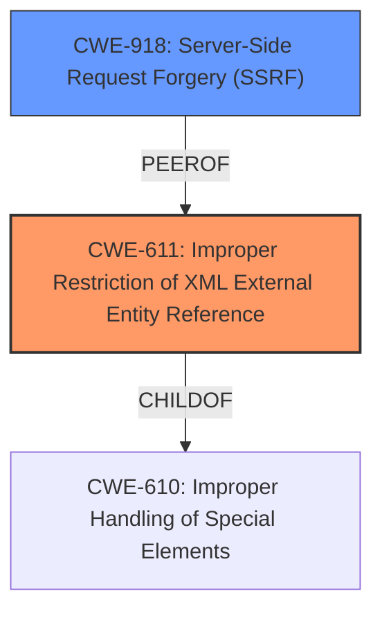

# Raw Analyzer Response for CVE-2022-46827

# Summary
| CWE ID | CWE Name | Confidence | CWE Abstraction Level | CWE Vulnerability Mapping Label | CWE-Vulnerability Mapping Notes |
|---|---|---|---|---|---|
| CWE-611 | Improper Restriction of XML External Entity Reference | 1.0 | Base | Allowed | Primary CWE |
| CWE-918 | Server-Side Request Forgery (SSRF) | 0.7 | Base | Allowed | Secondary CWE |

## Evidence and Confidence

*   **Confidence Score:** 0.85
*   **Evidence Strength:** HIGH

## Relationship Analysis
The primary relationship that impacted the decision was the parent-child relationship between CWE-610 (Improper Handling of Special Elements) and CWE-611 (Improper Restriction of XML External Entity Reference), where CWE-611 is a more specific instance of CWE-610. Additionally, the close relationship between CWE-611 (XXE) and CWE-918 (SSRF) was considered.

## Vulnerability Chain
The vulnerability chain starts with the **XXE attack** (CWE-611), which allows an attacker to control XML entities and their resolution. This leads to Server-Side Request Forgery (SSRF) (CWE-918), enabling the attacker to make requests to unintended destinations via custom plugin repositories.

## Summary of Analysis
The initial analysis strongly indicates that CWE-611 (Improper Restriction of XML External Entity Reference) is the primary weakness. The vulnerability description explicitly mentions an "**XXE attack**" leading to SSRF.

The evidence from the vulnerability description is: "In JetBrains IntelliJ IDEA before 2022.3 an **XXE attack** leading to SSRF via requests to custom plugin repositories was possible."

CWE-611 directly aligns with this description, as it involves the **improper restriction** of XML external entities, enabling an attacker to force the application to embed incorrect documents. The retriever results also ranked CWE-611 as the top match with a score of 0.800.

CWE-918 (Server-Side Request Forgery (SSRF)) is a secondary weakness because the **XXE attack** leads to SSRF. The application makes requests to custom plugin repositories, which can be controlled by an attacker due to the **XXE attack**, resulting in the SSRF.

The selection of CWE-611 and CWE-918 is at the optimal level of specificity, as both are Base-level CWEs that accurately describe the root cause and consequence of the vulnerability.

Other CWEs considered but not used:
*   CWE-79 (Improper Neutralization of Input During Web Page Generation ('Cross-site Scripting')): While XSS involves improper neutralization, the vulnerability description explicitly mentions XXE, making CWE-611 a more accurate fit.
*   CWE-22 (Improper Limitation of a Pathname to a Restricted Directory ('Path Traversal')): Path Traversal is not the primary issue; the issue is the XXE that allows for SSRF.
*   CWE-94 (Improper Control of Generation of Code ('Code Injection')): The **XXE attack** does not directly involve code injection; it's about embedding incorrect documents, making CWE-611 a better fit.