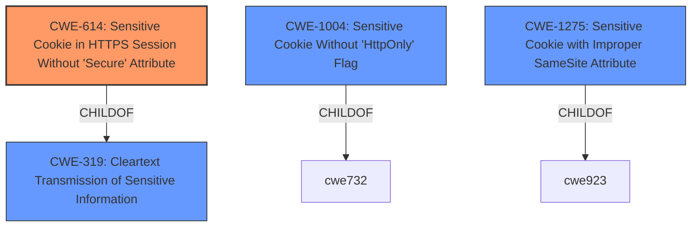

# Analysis for CVE-2022-4683

# Summary
| CWE ID | CWE Name | Confidence | CWE Abstraction Level | CWE Vulnerability Mapping Label | CWE-Vulnerability Mapping Notes |
|---|---|---|---|---|---|
| CWE-614 | Sensitive Cookie in HTTPS Session Without 'Secure' Attribute | 1.0 | Variant | Allowed | Primary CWE |

## Evidence and Confidence

*   **Confidence Score:** 1.0
*   **Evidence Strength:** HIGH

## Relationship Analysis
The primary relationship that influenced the decision was the ChildOf relationship between CWE-614 and CWE-319 (Cleartext Transmission of Sensitive Information). CWE-614 is a variant that specifically addresses the **sensitive cookie in HTTPS session without secure attribute**, while CWE-319 is a more general base class. Since the vulnerability description specifically mentions a **sensitive cookie** lacking the Secure attribute, CWE-614 is the more precise and appropriate choice. The relationships to other cookie-related CWEs like CWE-1004 (Sensitive Cookie Without 'HttpOnly' Flag) and CWE-1275 (Sensitive Cookie with Improper SameSite Attribute) were also considered.

## Vulnerability Chain
The vulnerability chain is relatively simple:
1.  **Root Cause:** The application **fails to set the Secure attribute on a sensitive cookie in an HTTPS session**.
2.  **Weakness:** This allows the cookie to be transmitted over HTTP.
3.  **Impact:** An attacker could potentially intercept the cookie and gain unauthorized access.

## Summary of Analysis
The analysis is strongly based on the provided vulnerability description and the associated key phrases, particularly the **rootcause**, which directly mentions the **sensitive cookie in HTTPS session without secure attribute**. The "CVE Reference Links Content Summary" does not directly relate to the cookie issue, which suggests a lack of details about the weakness, it focuses on settings validation. However, the retriever results and the CWE specifications strongly support CWE-614 as the most appropriate mapping.

The graph relationships were helpful in understanding the broader context of cookie-related vulnerabilities and the hierarchical structure of CWEs. The selection of CWE-614 is at the optimal level of specificity because it directly addresses the **missing Secure attribute** on a **sensitive cookie** in an **HTTPS session**, which is the core of the vulnerability.

Relevant CWE Information:

# Enhanced Context (25 CWEs)

## CWE-614: Sensitive Cookie in HTTPS Session Without 'Secure' Attribute
**Technical Explanation:**

The core issue is the **failure to set the Secure attribute for a cookie** used in an HTTPS session. When the Secure attribute is absent, the browser may transmit the cookie over unencrypted HTTP connections, potentially exposing it to interception by attackers.

**Security Implications and Potential Impact:**

An attacker who intercepts the cookie can potentially impersonate the user, gain unauthorized access to sensitive data, or perform actions on behalf of the user.

**Parent-Child Relationships and Chain Patterns:**

CWE-614 is a Variant of CWE-319 (Cleartext Transmission of Sensitive Information). This hierarchical relationship indicates that the fundamental problem is the transmission of sensitive information in cleartext. CWE-614 is a specific case of this general problem, focusing on cookies.

**Primary or Secondary Weakness:**

CWE-614 is the primary weakness, as the lack of the Secure attribute on the cookie is the direct cause of the vulnerability.

**Official MITRE Mapping Guidance Influence:**

The MITRE mapping guidance explicitly ALLOWS CWE-614, stating that it is at the Variant level of abstraction, which is a preferred level. The rationale emphasizes carefully reading the name and description to ensure an appropriate fit, which is clearly the case here.

**CWEs Considered But Not Used:**

*   **CWE-319 (Cleartext Transmission of Sensitive Information):** Considered, but it's a more general class. CWE-614 is more specific and thus a better fit.
*   **CWE-1004 (Sensitive Cookie Without 'HttpOnly' Flag):** Considered, but the description focuses on the HttpOnly flag, which is a different attribute than the Secure attribute.
*   **CWE-1275 (Sensitive Cookie with Improper SameSite Attribute):** Considered, but the description focuses on the SameSite attribute, which is a different attribute than the Secure attribute.