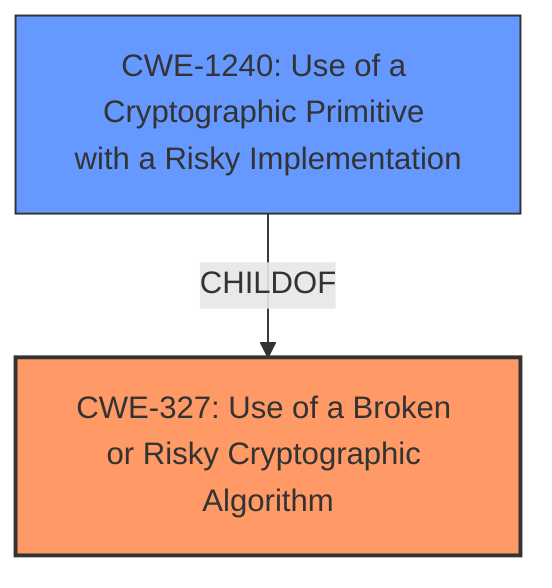

# Raw Analyzer Response for CVE-2022-46832

# Summary
| CWE ID  | CWE Name                                                   | Confidence | CWE Abstraction Level | CWE Vulnerability Mapping Label | CWE-Vulnerability Mapping Notes |
| ------- | ---------------------------------------------------------- | ---------- | ----------------------- | ----------------------------- | ----------------------------- |
| CWE-327 | Use of a Broken or Risky Cryptographic Algorithm           | 1          | Class                   | Primary CWE                   | Allowed-with-Review           |
| CWE-1240| Use of a Cryptographic Primitive with a Risky Implementation | 0.7        | Base                    | Secondary Candidate         | Allowed                       |

## Evidence and Confidence

*   **Confidence Score:** 0.85
*   **Evidence Strength:** MEDIUM

## Relationship Analysis
The primary relationship impacting the decision is that CWE-1240 is a ChildOf CWE-327. This indicates that CWE-1240 is a more specific case of CWE-327. While the description hints at a risky implementation, the root cause is the **use of a broken or risky algorithm** itself. Thus, the higher-level classification is more appropriate.

## Vulnerability Chain
The vulnerability chain starts with the **use of a broken or risky cryptographic algorithm**, which then leads to the ability of a low-privileged remote attacker to decrypt encrypted data.
  - The root cause is the **use of a broken or risky cryptographic algorithm**.
  - The impact is the ability to decrypt the encrypted data.

## Summary of Analysis
The initial analysis, based on the provided evidence, points towards CWE-327 as the primary weakness. The vulnerability description clearly states "**Use of a Broken or Risky Cryptographic Algorithm**" as the root cause. This aligns perfectly with the description of CWE-327.

The retriever results also support this conclusion, with CWE-327 being the top-ranked CWE.

The relationship analysis confirms that CWE-327 is a class-level CWE, and CWE-1240 is a base-level CWE that is a child of CWE-327. Because the description clearly says "**Use of a Broken or Risky Cryptographic Algorithm**," the more general CWE-327 is a better fit.

The evidence is limited to the vulnerability description key phrases, especially the **rootcause**. The CVE Reference Links Content Summary confirms NOINFO.

Therefore, the selected CWEs are at the optimal level of specificity given the available evidence.

Relevant CWE Information:

# Enhanced Context (25 CWEs)

## CWE-327: Use of a Broken or Risky Cryptographic Algorithm
**Abstraction:** Class
**Status:** Draft

### Description
The product uses a broken or risky cryptographic algorithm or protocol.

### Extended Description

Cryptographic algorithms are the methods by which data is scrambled to prevent observation or influence by unauthorized actors. Insecure cryptography can be exploited to expose sensitive information, modify data in unexpected ways, spoof identities of other users or devices, or other impacts.

**How the Vulnerability's Details Match the CWE's Characteristics:**
The vulnerability description states the "**Use of a Broken or Risky Cryptographic Algorithm**" in the SICK RFU62x firmware. This directly aligns with the CWE-327 description.
**Security Implications and Potential Impact:**
The security implication is the ability for a low-privileged remote attacker to decrypt the encrypted data.

## CWE-1240: Use of a Cryptographic Primitive with a Risky Implementation
**Abstraction:** Base
**Status:** Draft

### Description
To fulfill the need for a cryptographic primitive, the product implements a cryptographic algorithm using a non-standard, unproven, or disallowed/non-compliant cryptographic implementation.

**How the Vulnerability's Details Match the CWE's Characteristics:**
The vulnerability could be related to using a risky implementation, so it was considered as a secondary match.
**Security Implications and Potential Impact:**
The security implication is the ability for a low-privileged remote attacker to decrypt the encrypted data.
**Why Not Primary:** The primary issue is the **algorithm** itself, not the implementation. If the description said the algorithm was fine, but the implementation had issues, then this would be the primary.