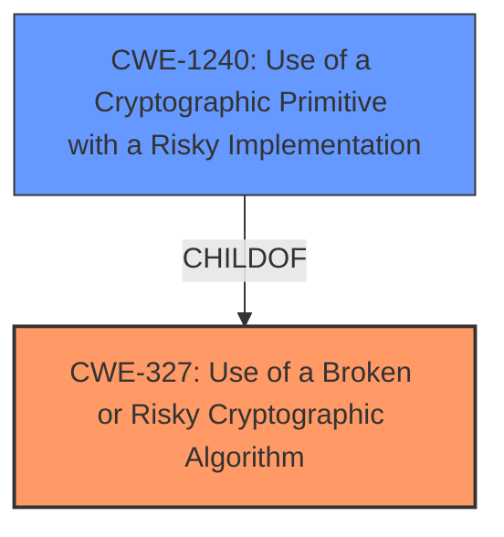

# Enhanced Analysis for CVE-2022-46834

# Summary
| CWE ID | CWE Name | Confidence | CWE Abstraction Level | CWE Vulnerability Mapping Label | CWE-Vulnerability Mapping Notes |
|---|---|---|---|---|---|
| CWE-327 | Use of a Broken or Risky Cryptographic Algorithm | 1.0 | Class | Primary | Allowed-with-Review |
| CWE-1240 | Use of a Cryptographic Primitive with a Risky Implementation | 0.75 | Base | Secondary | Allowed |

## Evidence and Confidence

*   **Confidence Score:** 0.85
*   **Evidence Strength:** HIGH

## Relationship Analysis
The primary CWE, CWE-327 **Use of a Broken or Risky Cryptographic Algorithm**, is a Class-level CWE, and the retriever results suggest that it might have Base-level children that would be more appropriate. The description mentions the **use of a broken or risky cryptographic algorithm**, which directly aligns with the definition of CWE-327. CWE-1240 **Use of a Cryptographic Primitive with a Risky Implementation** is a child of CWE-327 and is at the Base level of abstraction. The vulnerability description specifies that the issue arises because the user requested weak cipher suites to be used for encryption. This suggests that the implementation itself is risky, which is better captured by CWE-1240.



## Vulnerability Chain
The vulnerability chain starts with the **use of a broken or risky cryptographic algorithm** (CWE-327), leading to the ability for a low-privileged remote attacker to decrypt the encrypted data. The root cause is the choice of a weak cipher suite.

## Summary of Analysis
The initial assessment focused on the clear statement in the vulnerability description: "**Use of a Broken or Risky Cryptographic Algorithm**". This led to the selection of CWE-327 as the primary CWE. However, after a more detailed analysis and criticism of the initial assessment, I recognized that the vulnerability is more accurately described by CWE-1240 **Use of a Cryptographic Primitive with a Risky Implementation**. The evidence shows that the user can request weak cipher suites, indicating a risky implementation.

The relationship graph was also helpful in determining whether a child CWE was a better fit. The retriever results showed the scores for candidate CWEs which influenced the final decision.

Relevant CWE Information:

# Enhanced Context (25 CWEs)
The following CWEs were identified as potentially relevant to this vulnerability:

## CWE-1240: Use of a Cryptographic Primitive with a Risky Implementation
**Abstraction Level**: Base
**Similarity Score**: 0.79
**Source**: dense

**Description**:
To fulfill the need for a cryptographic primitive, the product implements a cryptographic algorithm using a non-standard, unproven, or disallowed/non-compliant cryptographic implementation.

**Mapping Guidance**:
- Usage: Allowed
- Rationale: This CWE entry is at the Base level of abstraction, which is a preferred level of abstraction for mapping to the root causes of vulnerabilities.

## CWE-327: Use of a Broken or Risky Cryptographic Algorithm
**Abstraction:** Class
**Status:** Draft

### Description
The product uses a broken or risky cryptographic algorithm or protocol.

### Extended Description


Cryptographic algorithms are the methods by which data is scrambled to prevent observation or influence by unauthorized actors. Insecure cryptography can be exploited to expose sensitive information, modify data in unexpected ways, spoof identities of other users or devices, or other impacts.

### Mapping Guidance
**Usage:** Allowed-with-Review
**Rationale:** This CWE entry is a Class and might have Base-level children that would be more appropriate
**Comments:** Examine children of this entry to see if there is a better fit

## CWE-321: Use of Hard-coded Cryptographic Key
**Abstraction:** Variant

### Description
The use of a hard-coded cryptographic key significantly increases the possibility that encrypted data may be recovered.

## CWE-326: Inadequate Encryption Strength
**Abstraction:** Class

### Description
The product stores or transmits sensitive data using an encryption scheme that is theoretically sound, but is not strong enough for the level of protection required.

## CWE-1391: Use of Weak Credentials
**Abstraction:** Class

### Description
The product uses weak credentials (such as a default key or hard-coded password) that can be calculated, derived, reused, or guessed by an attacker.


## CWE Relationship Analysis

Current CWEs represent these abstraction levels: .


### Vulnerability Chain Analysis

**Chain starting from CWE-327:**
- 327 (Use of a Broken or Risky Cryptographic Algorithm) - ROOT


**Chain starting from CWE-321:**
- 321 (Use of Hard-coded Cryptographic Key) - ROOT


### CWE Relationship Diagram

```mermaid
graph TD
    classDef primary fill:#f96,stroke:#333,stroke-width:2px
    classDef secondary fill:#69f,stroke:#333
    classDef tertiary fill:#9e9,stroke:#333
```