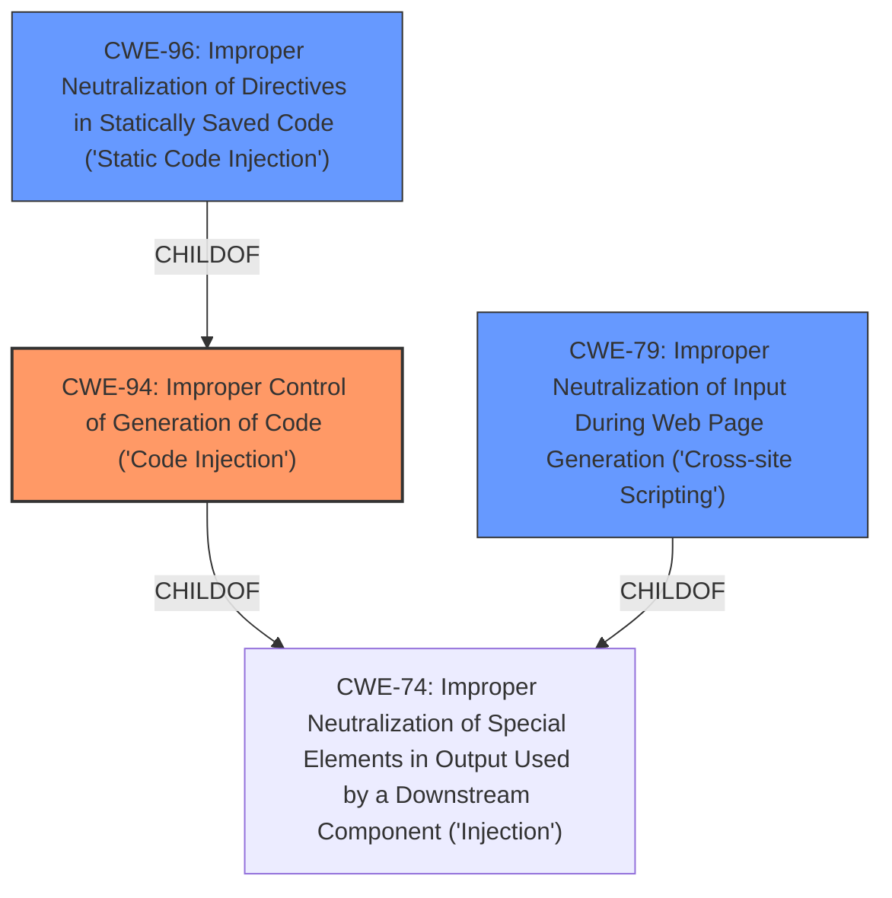

# Raw Analyzer Response for CVE-2022-46836

# Summary

| CWE ID | CWE Name | Confidence | CWE Abstraction Level | CWE Vulnerability Mapping Label | CWE-Vulnerability Mapping Notes |
|---|---|---|---|---|---|
| **CWE-94** | Improper Control of Generation of Code ('Code Injection') | 1.0 | Base | Primary | Allowed-with-Review |
| CWE-96 | Improper Neutralization of Directives in Statically Saved Code ('Static Code Injection') | 0.8 | Base | Secondary | Allowed |
| CWE-79 | Improper Neutralization of Input During Web Page Generation ('Cross-site Scripting') | 0.6 | Base | Secondary | Allowed |

## Evidence and Confidence

*   **Confidence Score:** 0.9
*   **Evidence Strength:** HIGH

## Relationship Analysis

The primary relationship that influenced the decision was the parent-child relationship between CWE-74 (Improper Neutralization of Special Elements in Output Used by a Downstream Component ('Injection')) and CWE-94. Since the vulnerability involves the **injection** of PHP code, CWE-94, being a child of CWE-74, is more specific and appropriate. CWE-96 (Improper Neutralization of Directives in Statically Saved Code ('Static Code Injection')) was considered as a possible secondary CWE because the injected code is saved in static files (auth.php, hosttags.php), but CWE-94 is a better fit as the primary cause. CWE-79 was considered because of the "Improper Neutralization of Input" aspect.

## Vulnerability Chain

The vulnerability chain starts with the **improper sanitization** of user-provided data when writing to PHP files. The `_format_php` function **fails to properly escape** existing backslashes before single quotes, leading to **PHP code injection**. This injected code is then **executed** upon a request to the vulnerable component, leading to **remote code execution** and potential system compromise.

Improper Sanitization -> **PHP Code Injection** (CWE-94) -> Remote Code Execution -> System Compromise

## Summary of Analysis

The initial assessment focused on the **PHP code injection** aspect of the vulnerability, aligning with CWE-94. The provided evidence highlights the **root cause** as insufficient sanitization of user-provided data, specifically the failure to properly escape backslashes before single quotes in the `_format_php` function.

The "CVE Reference Links Content Summary" states: "The vulnerability stems from insufficient sanitization of user-provided data when writing to PHP files, specifically within the `_format_php` function in Checkmk's `watolib`...This allows escaping the string context in PHP and **injection of arbitrary code**."

The selection of CWE-94 is based on its description: "The product constructs all or part of a code segment using externally-influenced input from an upstream component, but it does not neutralize or incorrectly neutralizes special elements that could modify the syntax or behavior of the intended code segment." This accurately describes the vulnerability where user-provided data is used to construct PHP code, but **insufficient neutralization** allows for the **injection of arbitrary code**.

The rationale for selecting CWE-94 is further supported by its relationships, specifically being a child of CWE-74, which represents a broader category of injection vulnerabilities.

CWE-96 (Improper Neutralization of Directives in Statically Saved Code ('Static Code Injection')) was considered because the injected PHP code is written to static files (`auth.php` and `hosttags.php`). However, CWE-94 is prioritized as it more directly captures the initial **code injection** flaw.

CWE-79 (Improper Neutralization of Input During Web Page Generation ('Cross-site Scripting')) was also considered due to the improper neutralization of input. However, since the final impact is not only about generating a web page, but rather about injecting code that gets executed, CWE-94 is the best match.

The selected CWEs are at the optimal level of specificity, with CWE-94 as the primary cause, and CWE-96 and CWE-79 as secondary candidates that describe other aspects of the vulnerability.