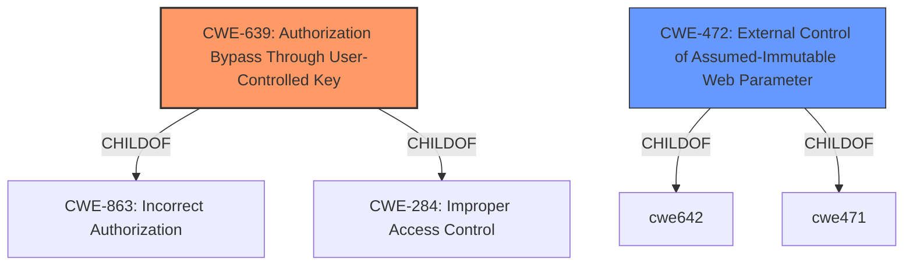

# Analysis for CVE-2022-4686

# Summary
| CWE ID | CWE Name | Confidence | CWE Abstraction Level | CWE Vulnerability Mapping Label | CWE-Vulnerability Mapping Notes |
|---|---|---|---|---|---|
| CWE-639 | Authorization Bypass Through User-Controlled Key | 0.7 | Base | Allowed | Primary CWE |
| CWE-472 | External Control of Assumed-Immutable Web Parameter | 0.6 | Base | Allowed | Secondary Candidate |

## Evidence and Confidence

*   **Confidence Score:** 0.7
*   **Evidence Strength:** LOW

## Relationship Analysis
The primary relationship influencing the CWE selection is the ChildOf relationship. CWE-639 is a child of CWE-863 (Incorrect Authorization) and CWE-284 (Improper Access Control). The description aligns more closely with the specifics of CWE-639, making it a better fit than its parents.

## Vulnerability Chain
The vulnerability chain starts with a user-controlled key being used for authorization. The system **fails to properly validate or sanitize this key**, leading to an authorization bypass. The final impact is unauthorized access to resources or data.

## Summary of Analysis
The initial analysis, based on the provided vulnerability description ("Authorization Bypass Through User-Controlled Key"), strongly suggests CWE-639. The vulnerability description key phrases further support this by highlighting "Authorization Bypass" as the impact and "User-Controlled Key" as the vector.

The provided CVE Reference Links Content Summary lacks sufficient information to provide more insights as the commit diff only states that the ID field was removed.

The retriever results listed CWE-639 as a possible match.

CWE-639 is selected because it directly addresses the scenario where a user-controlled key is used to bypass authorization. This aligns with the vulnerability description.

CWE-472 is considered as a secondary candidate because the web application does not sufficiently verify inputs that are assumed to be immutable but are actually externally controllable.

Relevant CWE Information:

# Enhanced Context (25 CWEs)

## CWE-639: Authorization Bypass Through User-Controlled Key
**Abstraction Level**: Base
**Similarity Score**: 0.77
**Source**: dense

**Description**:
The system's authorization functionality does not prevent one user from gaining access to another user's data or record by modifying the key value identifying the data.

**Mapping Guidance**:
- Usage: Allowed
- Rationale: This CWE entry is at the Base level of abstraction, which is a preferred level of abstraction for mapping to the root causes of vulnerabilities.

### Technical Explanation for CWE Selection

*   **CWE-639: Authorization Bypass Through User-Controlled Key**
    *   **How the vulnerability's details match the CWE's characteristics:** The vulnerability description explicitly states "Authorization Bypass Through User-Controlled Key". This aligns perfectly with the CWE-639 description, which focuses on scenarios where the system's authorization is bypassed by modifying a user-controlled key.
    *   **The security implications and potential impact:** An attacker can gain unauthorized access to resources or data belonging to other users by manipulating the key used for identification.
    *   **Any parent-child relationships or chain patterns that influenced your mapping:** CWE-639 is a child of CWE-863 (Incorrect Authorization) and CWE-284 (Improper Access Control), making it a more specific case of a general authorization issue.
    *   **Whether the weakness is primary or secondary in the vulnerability:** This is the primary weakness as it directly describes the root cause of the vulnerability.
    *   **How the official MITRE mapping guidance influenced your decision:** The MITRE mapping guidance allows the usage of this CWE and states "This CWE entry is at the Base level of abstraction, which is a preferred level of abstraction for mapping to the root causes of vulnerabilities."

*   **CWE-472: External Control of Assumed-Immutable Web Parameter**
    *   **How the vulnerability's details match the CWE's characteristics:** The key that is being modified can be considered an assumed-immutable parameter
    *   **The security implications and potential impact:** An attacker can modify critical data.
    *   **Any parent-child relationships or chain patterns that influenced your mapping:** Child of CWE-642 and CWE-471
    *   **Whether the weakness is primary or secondary in the vulnerability:** This is the secondary weakness as it explains the means by which an attacker bypasses the authorization.
    *   **How the official MITRE mapping guidance influenced your decision:** The MITRE mapping guidance allows the usage of this CWE and states "This CWE entry is at the Base level of abstraction, which is a preferred level of abstraction for mapping to the root causes of vulnerabilities."

### Summary of Other CWEs Considered But Not Used

*   **CWE-287 (Improper Authentication):** While related to authorization, the description focuses more on the authentication process itself, which isn't the core issue here. The problem is not failing to authenticate, but failing to properly authorize after authentication.
*   **CWE-863 (Incorrect Authorization):** This is a parent of CWE-639 and is less specific. While applicable, CWE-639 provides a more precise description of the vulnerability.
*   **CWE-285 (Improper Authorization):** Similar to CWE-863, this is a broader class of authorization issues and less specific than CWE-639.
*   **CWE-425 (Direct Request ('Forced Browsing')):** The vulnerability is not about directly requesting resources without proper authorization checks but about manipulating keys to bypass authorization.
*   **CWE-289 (Authentication Bypass by Alternate Name):** The vulnerability is not about alternate names for authentication but about manipulating a key value to access another user's data.
*   **CWE-178 (Improper Handling of Case Sensitivity):** While case sensitivity could be a factor in some authorization bypasses, it's not the primary issue described in the vulnerability.
*   **CWE-620 (Unverified Password Change):** The vulnerability is not about password changes but about bypassing authorization through a user-controlled key.