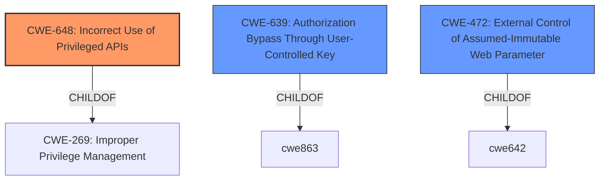

# Analysis for CVE-2022-4687

# Summary
| CWE ID | CWE Name | Confidence | CWE Abstraction Level | CWE Vulnerability Mapping Label | CWE-Vulnerability Mapping Notes |
|---|---|---|---|---|---|
| CWE-648 | Incorrect Use of Privileged APIs | 0.8 | Base | Allowed | Primary CWE |
| CWE-639 | Authorization Bypass Through User-Controlled Key | 0.6 | Base | Allowed | Secondary Candidate |
| CWE-472 | External Control of Assumed-Immutable Web Parameter | 0.6 | Base | Allowed | Secondary Candidate |

## Evidence and Confidence

*   **Confidence Score:** 0.8
*   **Evidence Strength:** MEDIUM

## Relationship Analysis
The primary CWE, CWE-648, is a child of CWE-269, which is the primary match identified in the "CWE for similar CVE Descriptions" section. This relationship supports the choice of CWE-648 as a more specific representation of the vulnerability. The relationships of the secondary candidates, CWE-639 and CWE-472, to authorization and input validation, respectively, highlight related aspects of the vulnerability but are not as directly aligned with the root cause as CWE-648.

## Vulnerability Chain
The vulnerability chain begins with the **incorrect use of privileged APIs** (CWE-648), which allows external control of the `ID` parameter. This leads to a potential authorization bypass (CWE-639) where users can modify resources they should not have access to, ultimately impacting data integrity.

## Summary of Analysis
The initial assessment, based on the "**rootcause: incorrect use of privileged APIs**" phrase and the "CWE for similar CVE Descriptions" suggesting CWE-269, pointed towards a privilege management issue. However, further analysis of the commit diff revealed that the API was improperly decoding and using the `ID` field in patch requests. The retriever results and complete CWE specifications were reviewed, with CWE-648 (Incorrect Use of Privileged APIs) emerging as the most fitting primary CWE. The evidence from the "CVE Reference Links Content Summary" section specifically mentions, "The commit message "fix: disable decode patch id" suggests that the `ID` field in the patch structs was previously being decoded from the JSON request body and used to update the entity's `ID`, this would have been an unexpected and **incorrect** behavior." This directly supports the selection of CWE-648. The selection of CWE-648 is at the optimal level of specificity, as it focuses on the **incorrect** usage rather than a general privilege management issue. The secondary CWEs are also at a good level of specificity as they address key aspects like the ability to control keys (CWE-639) and the external control of parameters (CWE-472).

Relevant CWE Information:

# Enhanced Context (25 CWEs)

## CWE-648: Incorrect Use of Privileged APIs
**Abstraction:** Base
**Status:** Incomplete

### Description
The product does not conform to the API requirements for a function call that requires extra privileges. This could allow attackers to gain privileges by causing the function to be called incorrectly.

### Extended Description

When a product contains certain functions that perform operations requiring an elevated level of privilege, the caller of a privileged API must be careful to:

  - ensure that assumptions made by the APIs are valid, such as validity of arguments

  - account for known weaknesses in the design/implementation of the API

  - call the API from a safe context

If the caller of the API does not follow these requirements, then it may allow a malicious user or process to elevate their privilege, hijack the process, or steal sensitive data.

For instance, it is important to know if privileged APIs do not shed their privileges before returning to the caller or if the privileged function might make certain assumptions about the data, context or state information passed to it by the caller. It is important to always know when and how privileged APIs can be called in order to ensure that their elevated level of privilege cannot be exploited.

### Alternative Terms
None

### Relationships
ChildOf -> CWE-269

### Mapping Guidance
**Usage:** Allowed
**Rationale:** This CWE entry is at the Base level of abstraction, which is a preferred level of abstraction for mapping to the root causes of vulnerabilities.
**Comments:** Carefully read both the name and description to ensure that this mapping is an appropriate fit. Do not try to 'force' a mapping to a lower-level Base/Variant simply to comply with this preferred level of abstraction.
**Reasons:**
- Acceptable-Use

### Observed Examples
- **CVE-2003-0645:** A Unix utility that displays online help files, if installed setuid, could allow a local attacker to gain privileges when a particular file-opening function is called.

**Explanation:**

The vulnerability description explicitly states "**incorrect use of privileged APIs**," which directly corresponds to CWE-648. The details of the commit diff reveal that the API was not being used correctly, as it allowed modification of the `ID` field in patch requests. This aligns with the description of CWE-648, which states, "The product does not conform to the API requirements for a function call that requires extra privileges." The security implication is that attackers could potentially manipulate object IDs, leading to data integrity issues and potential privilege escalation. CWE-648 is a child of CWE-269 (Improper Privilege Management), indicating a hierarchical relationship where CWE-648 is a more specific instance of improper privilege management. The MITRE mapping guidance allows the use of CWE-648 at the Base level of abstraction.

## CWE-639: Authorization Bypass Through User-Controlled Key
**Abstraction:** Base
**Status:** Incomplete

### Description
The system's authorization functionality does not prevent one user from gaining access to another user's data or record by modifying the key value identifying the data.

### Extended Description

Retrieval of a user record occurs in the system based on some key value that is under user control. The key would typically identify a user-related record stored in the system and would be used to lookup that record for presentation to the user. It is likely that an attacker would have to be an authenticated user in the system. However, the authorization process would not properly check the data access operation to ensure that the authenticated user performing the operation has sufficient entitlements to perform the requested data access, hence bypassing any other authorization checks present in the system.

For example, attackers can look at places where user specific data is retrieved (e.g. search screens) and determine whether the key for the item being looked up is controllable externally. The key may be a hidden field in the HTML form field, might be passed as a URL parameter or as an unencrypted cookie variable, then in each of these cases it will be possible to tamper with the key value.

One manifestation of this weakness is when a system uses sequential or otherwise easily-guessable session IDs that would allow one user to easily switch to another user's session and read/modify their data.

### Alternative Terms
Insecure Direct Object Reference / IDOR: The "Insecure Direct Object Reference" term, as described in the OWASP Top Ten, is broader than this CWE because it also covers path traversal (CWE-22). Within the context of vulnerability theory, there is a similarity between the OWASP concept and CWE-706: Use of Incorrectly-Resolved Name or Reference.
Broken Object Level Authorization / BOLA: BOLA is used in the 2019 OWASP API Security Top 10 and is said to be the same as IDOR.
Horizontal Authorization: "Horizontal Authorization" is used to describe situations in which two users have the same privilege level, but must be prevented from accessing each other's resources. This is fairly common when using key-based access to resources in a multi-user context.

### Relationships
ChildOf -> CWE-863
ChildOf -> CWE-863
ChildOf -> CWE-284

### Mapping Guidance
**Usage:** Allowed
**Rationale:** This CWE entry is at the Base level of abstraction, which is a preferred level of abstraction for mapping to the root causes of vulnerabilities.
**Comments:** Carefully read both the name and description to ensure that this mapping is an appropriate fit. Do not try to 'force' a mapping to a lower-level Base/Variant simply to comply with this preferred level of abstraction.
**Reasons:**
- Acceptable-Use

### Observed Examples
- **CVE-2