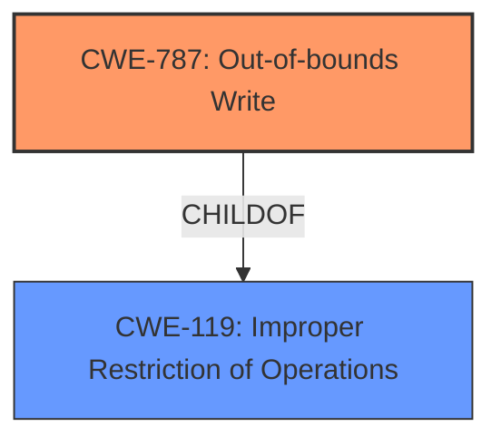

# Analysis Report for CVE-2022-46881

# Vulnerability Analysis Report: CVE-2022-46881

## Description


## Analysis (with Relationship Data)

# Summary
| CWE ID | CWE Name | Confidence | CWE Abstraction Level | CWE Vulnerability Mapping Label | CWE-Vulnerability Mapping Notes |
|---|---|---|---|---|---|
| CWE-787 | Out-of-bounds Write | 0.9 | Base | Primary | Allowed |
| CWE-119 | Improper Restriction of Operations within the Bounds of a Memory Buffer | 0.7 | Class | Secondary | Allowed |

## Evidence and Confidence

*   **Confidence Score:** 0.9
*   **Evidence Strength:** HIGH

## Relationship Analysis
The primary CWE selected is CWE-787 (**Out-of-bounds Write**), which is a **CHILDOF** CWE-119 (**Improper Restriction of Operations within the Bounds of a Memory Buffer**). This hierarchical relationship indicates that CWE-787 is a more specific case of CWE-119, where data is written outside the intended buffer's boundaries. Given the evidence of memory corruption and potential exploitable crash, CWE-787 is the more accurate representation of the vulnerability.



## Vulnerability Chain
The vulnerability chain starts with an **incorrect optimization in WebGL**, which leads to **memory corruption**, and finally results in a **potentially exploitable crash**.

*   **Root Cause:** Incorrect optimization in WebGL
*   **Weakness:** Out-of-bounds Write (CWE-787)
*   **Impact:** Memory corruption and potential exploitable crash

## Summary of Analysis
The analysis indicates that the **incorrect optimization in WebGL** led to **memory corruption**, specifically an **out-of-bounds write**, which could cause a crash. The evidence from the vulnerability description and the CVE reference links points towards a memory corruption issue due to a flawed optimization.

The key phrase "optimization in WebGL was incorrect" directly relates to the root cause of the vulnerability. The impact is clearly stated as "memory corruption and a potentially exploitable crash." The CVE Reference Links Content Summary further elaborates that the root cause was a flawed optimization within WebGL, resulting in memory corruption. The bug report also provides detailed crash information showing an stack-buffer-underflow with a write of size 4, which further reinforces the memory corruption and **out-of-bounds write**.

Given the evidence, the most appropriate CWE is CWE-787 (**Out-of-bounds Write**), as it accurately represents the **writing of data past the end, or before the beginning, of the intended buffer**, causing memory corruption and a potential crash. CWE-119 (**Improper Restriction of Operations within the Bounds of a Memory Buffer**) is a broader category that encompasses out-of-bounds write, but CWE-787 provides a more specific description of the vulnerability.

The retriever results also support this assessment, with CWE-787 listed as a potential match.

I am overriding the retriever result that listed CWE-124 (**Buffer Underwrite ('Buffer Underflow')**) as the top match, because the bug report specifies that this was an out-of-bounds write.

Relevant CWE Information:

# Enhanced Context (25 CWEs)

## CWE-704: Incorrect Type Conversion or Cast
**Abstraction Level**: Class
**Similarity Score**: 0.78
**Source**: dense

**Description**:
The product does not correctly convert an object, resource, or structure from one type to a different type.

**Mapping Guidance**:
- Usage: Allowed-with-Review
- Rationale: This CWE entry is a Class and might have Base-level children that would be more appropriate

*Not Used:* While type conversion issues can lead to memory corruption, the primary issue here is the **out-of-bounds write** due to an incorrect optimization, not a type conversion problem.

## CWE-681: Incorrect Conversion between Numeric Types
**Abstraction Level**: Base
**Similarity Score**: 0.78
**Source**: dense

**Description**:
When converting from one data type to another, such as long to integer, data can be omitted or translated in a way that produces unexpected values. If the resulting values are used in a sensitive context, then dangerous behaviors may occur.

**Mapping Guidance**:
- Usage: Allowed
- Rationale: This CWE entry is at the Base level of abstraction, which is a preferred level of abstraction for mapping to the root causes of vulnerabilities.

*Not Used:* The vulnerability does not explicitly describe an issue with numeric type conversion.

## CWE-843: Access of Resource Using Incompatible Type ('Type Confusion')
**Abstraction Level**: Base
**Similarity Score**: 0.78
**Source**: dense

**Description**:
The product allocates or initializes a resource such as a pointer, object, or variable using one type, but it later accesses that resource using a type that is incompatible with the original type.

**Mapping Guidance**:
- Usage: Allowed
- Rationale: This CWE entry is at the Base level of abstraction, which is a preferred level of abstraction for mapping to the root causes of vulnerabilities.

*Not Used:* While type confusion can lead to memory corruption, it is not the primary cause in this case. The main issue is the incorrect optimization leading to an out-of-bounds write.

## CWE-125: Out-of-bounds Read
**Abstraction Level**: Base
**Similarity Score**: 0.75
**Source**: dense

**Description**:
The product reads data past the end, or before the beginning, of the intended buffer.

**Mapping Guidance**:
- Usage: Allowed
- Rationale: This CWE entry is at the Base level of abstraction, which is a preferred level of abstraction for mapping to the root causes of vulnerabilities.

*Not Used:* The vulnerability description and CVE details focus on an **out-of-bounds write**, not a read.

## CWE-404: Improper Resource Shutdown or Release
**Abstraction Level**: Class
**Similarity Score**: 0.75
**Source**: dense

**Description**:
The product does not release or incorrectly releases a resource before it is made available for re-use.

**Mapping Guidance**:
- Usage: Allowed-with-Review
- Rationale: This CWE entry is a Class and might have Base-level children that would be more appropriate

*Not Used:* The description does not indicate any issue with resource management.

## CWE-1289: Improper Validation of Unsafe Equivalence in Input
**Abstraction Level**: Base
**Similarity Score**: 0.75
**Source**: dense

**Description**:
The product receives an input value that is used as a resource identifier or other type of reference, but it does not validate or incorrectly validates that the input is equivalent to a potentially-unsafe value.

**Mapping Guidance**:
- Usage: Allowed
- Rationale: This CWE entry is at the Base level of abstraction, which is a preferred level of abstraction for mapping to the root causes of vulnerabilities.

*Not Used:* There is no mention of improper validation of input equivalence in the vulnerability description.

## CWE-131: Incorrect Calculation of Buffer Size
**Abstraction Level**: Base
**Similarity Score**: 0.75
**Source**: dense

**Description**:
The product does not correctly calculate the size to be used when allocating a buffer, which could lead to a buffer overflow.

**Mapping Guidance**:
- Usage: Allowed
- Rationale: This CWE entry is at the Base level of abstraction, which is a preferred level of abstraction for mapping to the root causes of vulnerabilities.

*Not Used:* While incorrect buffer size calculation can lead to overflows, the root cause is more specifically tied to an incorrect optimization in WebGL.

## CWE-197: Numeric Truncation Error
**Abstraction Level**: Base
**Similarity Score**: 0.75
**Source**: dense

**Description**:
Truncation errors occur when a primitive is cast to a primitive of a smaller size and data is lost in the conversion.

**Mapping Guidance**:
- Usage: Allowed
- Rationale: This CWE entry is at the Base level of abstraction, which is a preferred level of abstraction for mapping to the root causes of vulnerabilities.

*Not Used:* The vulnerability does not involve numeric truncation.

## CWE-226: Sensitive Information in Resource Not Removed Before Reuse
**Abstraction Level**: Base
**Similarity Score**: 0.74
**Source**: dense

**Description**:
The product releases a resource such as memory or a file so that it can be made available for reuse, but it does not clear or "zeroize" the information contained in the resource before the product performs a critical state transition or makes the resource available for reuse by other entities.

**Mapping Guidance**:
- Usage: Allowed
- Rationale: This CWE entry is at the Base level of abstraction, which is a preferred level of abstraction for mapping to the root causes of vulnerabilities.

*Not Used:* The vulnerability does not involve sensitive information not being removed before resource reuse.

## CWE-191: Integer Underflow (Wrap


## CWE Relationship Analysis

Current CWEs represent these abstraction levels: .


### Vulnerability Chain Analysis

**Chain starting from CWE-131:**
- 131 (Incorrect Calculation of Buffer Size) - ROOT


**Chain starting from CWE-226:**
- 226 (Sensitive Information in Resource Not Removed Before Reuse) - ROOT


### CWE Relationship Diagram

```mermaid
graph TD
    classDef primary fill:#f96,stroke:#333,stroke-width:2px
    classDef secondary fill:#69f,stroke:#333
    classDef tertiary fill:#9e9,stroke:#333
```


*Report generated on 2025-03-30 22:25:18*
