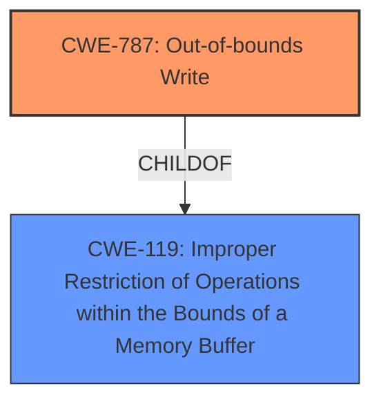

# Raw Analyzer Response for CVE-2022-46883

# Summary
| CWE ID | CWE Name | Confidence | CWE Abstraction Level | CWE Vulnerability Mapping Label | CWE-Vulnerability Mapping Notes |
|---|---|---|---|---|---|
| CWE-787 | Out-of-bounds Write | 0.9 | Base | Allowed | Primary CWE |
| CWE-119 | Improper Restriction of Operations within the Bounds of a Memory Buffer | 0.6 | Class | Discouraged | Secondary Candidate |

## Evidence and Confidence

*   **Confidence Score:** 0.8
*   **Evidence Strength:** HIGH

## Relationship Analysis
The primary relationship influencing the decision is the ChildOf relationship between CWE-787 and CWE-119. CWE-787 is a more specific type of CWE-119, and the vulnerability description suggests a write operation outside the intended buffer, therefore CWE-787 is preferred. Although CWE-119 is listed as a Top Combined Result in the Retriever Results, it is discouraged because more specific information is available.

## Vulnerability Chain
The vulnerability chain starts with **memory safety bugs**, leading to **memory corruption**, which allows for the potential to run arbitrary code.

## Summary of Analysis
The initial assessment focused on identifying the root cause of the vulnerability. The description explicitly mentions **memory safety bugs** and **memory corruption**, indicating issues with how memory is being handled. The "CVE Reference Links Content Summary" section confirms that the **root cause** is memory safety bugs that lead to potential memory corruption.

The Retriever Results highlighted several potential CWEs, including CWE-119, CWE-787, and CWE-682. CWE-119 is a broad category, and the mapping guidance discourages its use when more specific information is available. CWE-787 (Out-of-bounds Write) is a child of CWE-119 and describes writing data outside the intended buffer, which aligns with the **memory corruption** aspect of the vulnerability. CWE-682 (Incorrect Calculation) is less relevant as the description does not point to an incorrect calculation.

Based on the evidence and relationship analysis, CWE-787 is the most appropriate choice, as it is a base-level CWE that accurately describes the vulnerability. The evidence from the vulnerability description supports this selection: "memory safety bugs present in Firefox 106. Some of these bugs showed evidence of memory corruption."

The selection of CWE-787 is at the optimal level of specificity because it describes the exact nature of the **memory corruption** (out-of-bounds write). While other CWEs were considered, they were either too general (CWE-119) or not directly related to the described vulnerability (CWE-682).

Relevant CWE Information:

# Enhanced Context (25 CWEs)

## CWE-681: Incorrect Conversion between Numeric Types
**Abstraction Level**: Base
**Similarity Score**: 0.79

## CWE-131: Incorrect Calculation of Buffer Size
**Abstraction Level**: Base
**Similarity Score**: 0.79

## CWE-124: Buffer Underwrite ('Buffer Underflow')
**Abstraction Level**: Base
**Similarity Score**: 0.78

## CWE-843: Access of Resource Using Incompatible Type ('Type Confusion')
**Abstraction Level**: Base
**Similarity Score**: 0.78

## CWE-191: Integer Underflow (Wrap or Wraparound)
**Abstraction Level**: Base
**Similarity Score**: 0.78

## CWE-125: Out-of-bounds Read
**Abstraction Level**: Base
**Similarity Score**: 0.78

## CWE-805: Buffer Access with Incorrect Length Value
**Abstraction Level**: Base
**Similarity Score**: 0.77

## CWE-126: Buffer Over-read
**Abstraction Level**: Variant
**Similarity Score**: 0.77

## CWE-404: Improper Resource Shutdown or Release
**Abstraction Level**: Class
**Similarity Score**: 0.77

## CWE-667: Improper Locking
**Abstraction Level**: Class
**Similarity Score**: 0.77

## CWE-190: Integer Overflow or Wraparound
**Abstraction Level**: Base
**Similarity Score**: 5406.33

## CWE-125: Out-of-bounds Read
**Abstraction Level**: Base
**Similarity Score**: 5379.92

## CWE-787: Out-of-bounds Write
**Abstraction Level**: Base
**Similarity Score**: 5273.96

## CWE-124: Buffer Underwrite ('Buffer Underflow')
**Abstraction Level**: Base
**Similarity Score**: 5269.98

## CWE-119: Improper Restriction of Operations within the Bounds of a Memory Buffer
**Abstraction Level**: Class
**Similarity Score**: 5247.95

## CWE-120: Buffer Copy without Checking Size of Input ('Classic Buffer Overflow')
**Abstraction Level**: base
**Similarity Score**: 4.82

## CWE-123: Write-what-where Condition
**Abstraction Level**: base
**Similarity Score**: 4.82

## CWE-195: Signed to Unsigned Conversion Error
**Abstraction Level**: variant
**Similarity Score**: 4.33

## CWE-416: Use After Free
**Abstraction Level**: variant
**Similarity Score**: 4.33

## CWE-787: Out-of-bounds Write
**Abstraction Level**: base
**Similarity Score**: 4.33

## CWE-825: Expired Pointer Dereference
**Abstraction Level**: base
**Similarity Score**: 4.33

## CWE-190: Integer Overflow or Wraparound
**Abstraction Level**: base
**Similarity Score**: 4.33

## CWE-170: Improper Null Termination
**Abstraction Level**: base
**Similarity Score**: 4.33

## CWE-1284: Improper Validation of Specified Quantity in Input
**Abstraction Level**: base
**Similarity Score**: 4.33

## CWE-772: Missing Release of Resource after Effective Lifetime
**Abstraction Level**: base
**Similarity Score**: 3.89

**CWE-787**: The vulnerability description mentions **memory corruption**, which can be a consequence of writing to memory outside the bounds of a buffer. This aligns directly with the description of CWE-787. The security implication is that an attacker could potentially overwrite critical data or inject malicious code, leading to arbitrary code execution.
**CWE-119**: While **memory corruption** falls under the umbrella of improper memory buffer restrictions, CWE-119 is too general. The evidence points towards writing outside the bounds, making CWE-787 a more precise fit.
CWE-124, CWE-416, CWE-401, CWE-123, CWE-843, CWE-681, and CWE-122 were considered but were not as strongly supported by the evidence as CWE-787. These CWEs describe different types of memory-related issues, such as underwrites, use-after-free, missing releases, write-what-where conditions, type confusions, incorrect conversions, and heap-based overflows, none of which are explicitly mentioned in the vulnerability description.