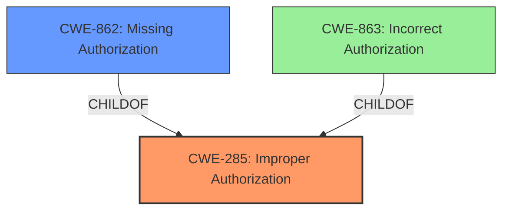

# Analysis for CVE-2022-4700

# Summary
| CWE ID | CWE Name | Confidence | CWE Abstraction Level | CWE Vulnerability Mapping Label | CWE-Vulnerability Mapping Notes |
|---|---|---|---|---|---|
| CWE-285 | Improper Authorization | 0.9 | Class | Primary | Allowed-with-Review |
| CWE-862 | Missing Authorization | 0.8 | Class | Secondary | Allowed-with-Review |

## Evidence and Confidence

*   **Confidence Score:** 0.9
*   **Evidence Strength:** HIGH

## Relationship Analysis
The primary CWE identified is CWE-285 (Improper Authorization), which is a Class-level CWE. CWE-285 has two child CWEs, CWE-862 (Missing Authorization) and CWE-863 (Incorrect Authorization). The vulnerability description indicates that the **insufficient access control** means that the system does not properly perform an authorization check, aligning with the definition of CWE-285. Because there is a lack of any authorization at all, the secondary CWE identified is CWE-862 (Missing Authorization), which is a more specific child of CWE-285.

## Vulnerability Chain
The vulnerability chain starts with the **insufficient access control** on the `wpr_activate_required_theme` AJAX action. This leads to any authenticated user being able to activate the `royal-elementor-kit` theme, even if they only have subscriber-level permissions. If the theme is not installed, the site attempts to load a nonexistent theme, resulting in site unavailability.

Root Cause: **Insufficient Access Control** (CWE-285 and CWE-862)
Impact: Site unavailability due to attempting to load a nonexistent theme.

## Summary of Analysis
The initial analysis focused on identifying the root cause of the vulnerability. The vulnerability description clearly states that the issue is due to **insufficient access control** in the `wpr_activate_required_theme` AJAX action, which aligns well with CWE-285 (Improper Authorization). The detailed description and CVE reference links content summary reinforce this by highlighting the lack of authorization checks, making CWE-862 (Missing Authorization) also relevant.

The retriever results also show CWE-284 (Improper Access Control), CWE-862 (Missing Authorization), CWE-863 (Incorrect Authorization), and CWE-285 (Improper Authorization) as top candidates. However, CWE-284 is a Pillar-level CWE and is too generic. CWE-863 implies that an authorization check is performed but is incorrect, while the evidence suggests that there is no authorization check at all, making CWE-862 a more precise fit as a secondary CWE.

The final decision is based on the evidence provided in the vulnerability description and the CVE reference links content summary. The relationship analysis confirms that CWE-285 and CWE-862 are appropriate, with CWE-862 providing more specificity as a child of CWE-285. The selected CWEs are at the optimal level of specificity, addressing the root cause of the vulnerability. The confidence score is high due to the clear evidence and alignment with the CWE definitions.

Relevant CWE Information:

# Enhanced Context (25 CWEs)
The following CWEs were identified as potentially relevant to this vulnerability:

## CWE-80: Improper Neutralization of Script-Related HTML Tags in a Web Page (Basic XSS)
**Abstraction Level**: Variant
**Similarity Score**: 0.77
**Source**: dense

**Description**:
The product receives input from an upstream component, but it does not neutralize or incorrectly neutralizes special characters such as "<", ">", and "&" that could be interpreted as web-scripting elements when they are sent to a downstream component that processes web pages.

**Mapping Guidance**:
- Usage: Allowed
- Rationale: This CWE entry is at the Variant level of abstraction, which is a preferred level of abstraction for mapping to the root causes of vulnerabilities.

*This CWE was not selected as there is no evidence of XSS in the vulnerability description.*

## CWE-74: Improper Neutralization of Special Elements in Output Used by a Downstream Component ('Injection')
**Abstraction Level**: Class
**Similarity Score**: 0.76
**Source**: dense

**Description**:
The product constructs all or part of a command, data structure, or record using externally-influenced input from an upstream component, but it does not neutralize or incorrectly neutralizes special elements that could modify how it is parsed or interpreted when it is sent to a downstream component.

**Mapping Guidance**:
- Usage: Discouraged
- Rationale: CWE-74 is high-level and often misused when lower-level weaknesses are more appropriate.

*This CWE was not selected as there is no evidence of injection in the vulnerability description.*

## CWE-838: Inappropriate Encoding for Output Context
**Abstraction Level**: Base
**Similarity Score**: 0.76
**Source**: dense

**Description**:
The product uses or specifies an encoding when generating output to a downstream component, but the specified encoding is not the same as the encoding that is expected by the downstream component.

**Mapping Guidance**:
- Usage: Allowed
- Rationale: This CWE entry is at the Base level of abstraction, which is a preferred level of abstraction for mapping to the root causes of vulnerabilities.

*This CWE was not selected as there is no evidence of encoding issues in the vulnerability description.*

## CWE-1289: Improper Validation of Unsafe Equivalence in Input
**Abstraction Level**: Base
**Similarity Score**: 0.76
**Source**: dense

**Description**:
The product receives an input value that is used as a resource identifier or other type of reference, but it does not validate or incorrectly validates that the input is equivalent to a potentially-unsafe value.

**Mapping Guidance**:
- Usage: Allowed
- Rationale: This CWE entry is at the Base level of abstraction, which is a preferred level of abstraction for mapping to the root causes of vulnerabilities.

*This CWE was not selected as there is no evidence of unsafe equivalence issues in the vulnerability description.*

## CWE-116: Improper Encoding or Escaping of Output
**Abstraction Level**: Class
**Similarity Score**: 0.76
**Source**: dense

**Description**:
The product prepares a structured message for communication with another component, but encoding or escaping of the data is either missing or done incorrectly. As a result, the intended structure of the message is not preserved.

**Mapping Guidance**:
- Usage: Allowed-with-Review
- Rationale: This CWE entry is a Class and might have Base-level children that would be more appropriate

*This CWE was not selected as there is no evidence of encoding or escaping issues in the vulnerability description.*

## CWE-472: External Control of Assumed-Immutable Web Parameter
**Abstraction Level**: Base
**Similarity Score**: 0.76
**Source**: dense

**Description**:
The web application does not sufficiently verify inputs that are assumed to be immutable but are actually externally controllable, such as hidden form fields.

**Mapping Guidance**:
- Usage: Allowed
- Rationale: This CWE entry is at the Base level of abstraction, which is a preferred level of abstraction for mapping to the root causes of vulnerabilities.

*This CWE was not selected as there is no evidence of issues with externally controlled immutable web parameters in the vulnerability description.*

## CWE-138: Improper Neutralization of Special Elements
**Abstraction Level**: Class
**Similarity Score**: 0.75
**Source**: dense

**Description**:
The product receives input from an upstream component, but it does not neutralize or incorrectly neutralizes special elements that could be interpreted as control elements or syntactic markers when they are sent to a downstream component.

**Mapping Guidance**:
- Usage: Discouraged
- Rationale: This CWE entry is a level-1 Class (i.e., a child of a Pillar). It might have lower-level children that would be more appropriate

*This CWE was not selected as there is no evidence of issues with improper neutralization of special elements in the vulnerability description.*

## CWE-184: Incomplete List of Disallowed Inputs
**Abstraction Level**: Base
**Similarity Score**: 0.75
**Source**: dense

**Description**:
The product implements a protection mechanism that relies on a list of inputs (or properties of inputs) that are not allowed by policy or otherwise require other action to neutralize before additional processing takes place, but the list is incomplete.

**Mapping Guidance**:
- Usage: Allowed
- Rationale: This CWE entry is at the Base level of abstraction, which is a preferred level of abstraction for mapping to the root causes of vulnerabilities.