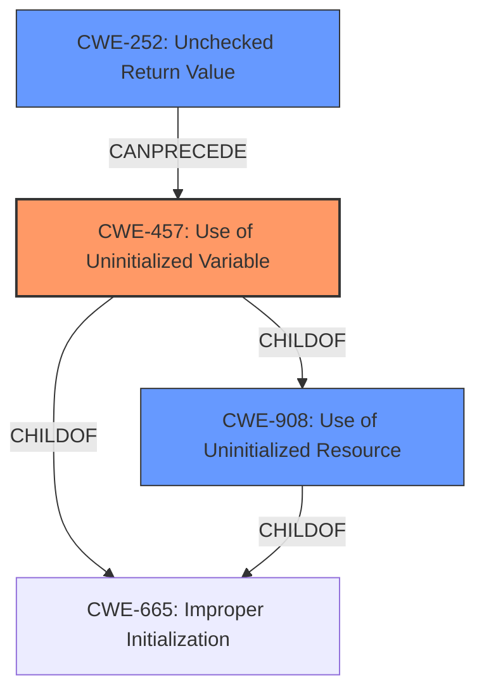

# Analysis for CVE-2022-47012

# Summary
| CWE ID | CWE Name | Confidence | CWE Abstraction Level | CWE Vulnerability Mapping Label | CWE-Vulnerability Mapping Notes |
|---|---|---|---|---|---|
| CWE-457 | Use of Uninitialized Variable | 0.9 | Variant | Allowed | Primary CWE |
| CWE-908 | Use of Uninitialized Resource | 0.7 | Base | Allowed | Secondary Candidate |
| CWE-252 | Unchecked Return Value | 0.6 | Base | Allowed | Secondary Candidate |

## Evidence and Confidence

*   **Confidence Score:** 0.9
*   **Evidence Strength:** HIGH

## Relationship Analysis
The primary CWE selected is CWE-457, which is a variant of CWE-908 (Use of Uninitialized Resource) and CWE-665 (Improper Initialization). The vulnerability description explicitly mentions the use of an uninitialized variable. The secondary CWE, CWE-908, is a base class that encompasses the use of any uninitialized resource, including variables. CWE-252 (Unchecked Return Value) is considered a potential contributing factor, as the root cause analysis mentions the interaction with `pcap_next` and the possibility of it returning an uninitialized pointer.

## Vulnerability Chain
The vulnerability chain starts with the potential for an unchecked return value from `pcap_next` (CWE-252), leading to the use of an uninitialized variable (CWE-457) which could result in unpredictable program behavior or information leakage.

## Summary of Analysis
The initial report indicates a potential **use of an uninitialized variable** within the `pcap_next` function call within dynamips. The vulnerability description mentions the "**rootcause:** **Use of uninitialized variable**". The analysis of the CVE Reference Links Content Summary also highlights the "**Potential Uninitialized Variable**" issue.
"The initial report suggests a potential **use of an uninitialized variable** within the `pcap_next` function call within dynamips"
"**rootcause:** **Use of uninitialized variable**"
"**Potential Uninitialized Variable**"
Therefore, CWE-457 is the most appropriate primary CWE because it directly addresses the specific issue of using an uninitialized variable. CWE-908 is a more general case. The retriever results also support CWE-457 as the top candidate.

CWE-665 was considered but not selected as the primary CWE. While it is related to improper initialization, CWE-457 is more specific to the **use** of an uninitialized variable, which aligns more closely with the vulnerability description.

CWE-824 (Access of Uninitialized Pointer) was considered but not selected because the description does not explicitly state that a pointer is being accessed.

CWE-252 (Unchecked Return Value) was considered as a possible contributing factor, as the root cause analysis mentions the interaction with `pcap_next` and the possibility of it returning an uninitialized pointer if the return value is not checked.

The selection of CWE-457 is at the optimal level of specificity, as it is a Variant-level CWE that directly describes the vulnerability. The evidence strongly supports this classification, and the relationship analysis helps to contextualize the vulnerability within a broader class of initialization issues.

# Enhanced Query for CVE-2022-47012

## Vulnerability Description
**Use of uninitialized variable** in function gen_eth_recv in GNS3 dynamips 0.2.21.

### Vulnerability Description Key Phrases
- **rootcause:** **Use of uninitialized variable**
- **product:** GNS3 dynamips
- **version:** 0.2.21
- **component:** function gen_eth_recv

## CVE Reference Links Content Summary
Based on the provided content, here's an analysis of the potential vulnerability:

**Root Cause of Vulnerability:**
The initial report suggests a potential use of an uninitialized variable within the `pcap_next` function call within dynamips. Specifically, the issue lies within the interaction between `dynamips/common/rom2c.c` and `libpcap-1.8.1/pcap.c`. The reporter claims that `pcap_next` could return an uninitialized `pkt` pointer, which is then used in a comparison. However, later analysis indicates the variable may not actually be uninitialized.

**Weaknesses/Vulnerabilities Present:**
- **Potential Uninitialized Variable:** The original report indicates that the `pkt` variable within `libpcap-1.8.1/pcap.c` might be uninitialized when returned by `pcap_next`. This would lead to unpredictable behavior when the caller uses the returned pointer. If true, this is a classic uninitialized memory issue. 
- However, the analysis by flaviojs indicates that the `pkt` variable is initialized by `pcap_dispatch` and the only scenario it would return without a valid packet is when a prior packet is held in `buffer`, so this might be a false positive.

**Impact of Exploitation:**
If the uninitialized variable scenario were true, the impact of this could include:
-   **Unpredictable Program Behavior:**  Using an uninitialized pointer for a comparison operation could lead to crashes or other undefined behavior.
-   **Potential for Information Leakage:** If the memory pointed to by `pkt` is not initialized, it could potentially contain sensitive data from the heap/stack.

**Attack Vectors:**
The attack vector would involve triggering the `pcap_next` function in a way that leads to the uninitialized `pkt` variable being used. This would likely involve manipulating the network traffic or the circumstances under which `pcap_next` is called.

**Required Attacker Capabilities/Position:**
An attacker would need to be able to control or influence the network traffic being processed by dynamips or influence the conditions under which libpcap is called. The attacker would need to understand how `dynamips/common/rom2c.c` interacts with `libpcap` and how to create the specific condition.

**Additional Notes**
The issue is marked as fixed via the commit `71ac4e2` and pull request #227. Also, the analysis indicates the initial report was likely a false positive.

## Retriever Results

### Top Combined Results

| Rank | CWE ID | Name | Abstraction | Usage  | Retrievers | Individual Scores |
|------|--------|------|-------------|-------|------------|-------------------|
| 1 | 457 | Use of Uninitialized Variable | Variant | Allowed | sparse | 0.198 |
| 2 | 665 | Improper Initialization | Class | Discouraged | sparse | 0.126 |
| 3 | 252 | Unchecked Return Value | Base | Allowed | sparse | 0.124 |
| 4 | 456 | Missing Initialization of a Variable | Variant | Allowed | sparse | 0.124 |
| 5 | 908 | Use of Uninitialized Resource | Base | Allowed | sparse | 0.123 |
| 6 | 394 | Unexpected Status Code or Return Value | Base | Allowed | dense | 0.388 |
| 7 | 476 | NULL Pointer Dereference | Base | Allowed | graph | 0.002 |
| 8 | 909 | Missing Initialization of Resource | Class | Allowed-with-Review | sparse | 0.111 |
| 9 | 824 | Access of Uninitialized Pointer | Base | Allowed | sparse | 0.102 |
| 10 | 253 | Incorrect Check of Function Return Value | Base | Allowed | sparse | 0.098 |

# Complete CWE Specifications

## CWE-457: Use of Uninitialized Variable
**Abstraction:** Variant
**Status:** Draft

### Description
The code uses a variable that has not been initialized, leading to unpredictable or unintended results.

### Extended Description
In some languages such as C and C++, stack variables are not initialized by default. They generally contain junk data with the contents of stack memory before the function was invoked. An attacker can sometimes control or read these contents. In other languages or conditions, a variable that is not explicitly initialized can be given a default value that has security implications, depending on the logic of the program. The presence of an uninitialized variable can sometimes indicate a typographic error in the code.

### Alternative Terms
None

### Relationships
ChildOf -> CWE-908
ChildOf -> CWE-665
ChildOf -> CWE-665

### Mapping Guidance
**Usage:** Allowed
**Rationale:** This CWE entry is at the Variant level of abstraction, which is a preferred level of abstraction for mapping to the root causes of vulnerabilities.
**Comments:** Carefully read both the name and description to ensure that this mapping is an appropriate fit. Do not try to 'force' a mapping to a lower-level Base/Variant simply to comply with this preferred level of abstraction.
**Reasons:**
- Acceptable-Use

### Observed Examples
- **CVE-2019-15900:** Chain: sscanf() call is used to check if a username and group exists, but the return value of sscanf() call is not checked (CWE-252), causing an uninitialized variable to be checked (CWE-457), returning success to allow authorization bypass for executing a privileged (CWE-863).
- **CVE-2008-3688:** Chain: A denial of service may be caused by an uninitialized variable (CWE-457) allowing an infinite loop (CWE-835) resulting from a connection to an unresponsive server.
- **CVE-2008-0081:** Uninitialized variable leads to code execution in popular desktop application.

## CWE-665: Improper Initialization
**Abstraction:** Class
**Status:** Draft

### Description
The product does not initialize or incorrectly initializes a resource, which might leave the resource in an unexpected state when it is accessed or used.

### Extended Description
This can have security implications when the associated resource is expected to have certain properties or values, such as a variable that determines whether a user has been authenticated or not.

### Alternative Terms
None

### Relationships
ChildOf -> CWE-664

### Mapping Guidance
**Usage:** Discouraged
**Rationale:** This CWE entry is a level-1 Class (i.e., a child of a Pillar). It might have lower-level children that would be more appropriate
**Comments:** Examine children of this entry to see if there is a better fit
**Reasons:**
- Abstraction

### Observed Examples
- **CVE-2001-1471:** chain: an invalid value prevents a library file from being included, skipping initialization of key variables, leading to resultant eval injection.
- **CVE-2008-3637:** Improper error checking in protection mechanism produces an uninitialized variable, allowing security bypass and code execution.
- **CVE-2008-4197:** Use of uninitialized memory may allow code execution.

## CWE-252: Unchecked Return Value
**Abstraction:** Base
**Status:** Draft

### Description
The product does not check the return value from a method or function, which can prevent it from detecting unexpected states and conditions.

### Extended Description
Two common programmer assumptions are "this function call can never fail" and "it doesn't matter if this function call fails". If an attacker can force the function to fail or otherwise return a value that is not expected, then the subsequent program logic could lead to a vulnerability, because the product is not in a state that the programmer assumes. For example, if the program calls a function to drop privileges but does not check the return code to ensure that privileges were successfully dropped, then the program will continue to operate with the higher privileges.

### Alternative Terms
None

### Relationships
ChildOf -> CWE-754
ChildOf -> CWE-754
CanPrecede -> CWE-476

### Mapping Guidance
**Usage:** Allowed
**Rationale:** This CWE entry is at the Base level of abstraction, which is a preferred level of abstraction for mapping to the root causes of vulnerabilities.
**Comments:** Carefully read both the name and description to ensure that this mapping is an appropriate fit. Do not try to 'force' a mapping to a lower-level Base/Variant simply to comply with this preferred level of abstraction.
**Reasons:**
- Acceptable-Use

### Observed Examples
- **CVE-2020-17533:** Chain: unchecked return value (CWE-252) of some functions for policy enforcement leads to authorization bypass (CWE-862)
- **CVE-2020-6078:** Chain: The return value of a function returning a pointer is not checked for success (CWE-252) resulting in the later use of an uninitialized variable (CWE-456) and a null pointer dereference (CWE-476)
- **CVE-2019-15900:** Chain: sscanf() call is used to check if a username and group exists, but the return value of sscanf() call is not checked (CWE-252), causing an uninitialized variable to be checked (CWE-457), returning success to allow authorization bypass for executing a privileged (CWE-863).

## CWE-456: Missing Initialization of a Variable
**Abstraction:** Variant
**Status:** Draft

### Description
The product does not initialize critical variables, which causes the execution environment to use unexpected values.

### Extended Description
Not provided

### Alternative Terms
None

### Relationships
ChildOf -> CWE-909
ChildOf -> CWE-665
ChildOf -> CWE-665
CanPrecede -> CWE-89
CanPrecede -> CWE-120
CanPrecede -> CWE-98
CanPrecede -> CWE-457

### Mapping Guidance
**Usage:** Allowed
**Rationale:** This CWE entry is at the Variant level of abstraction, which is a preferred level of abstraction for mapping to the root causes of vulnerabilities.
**Comments:** Carefully read both the name and description to ensure that this mapping is an appropriate fit. Do not try to 'force' a mapping to a lower-level Base/Variant simply to comply with this preferred level of abstraction.
**Reasons:**
- Acceptable-Use

### Additional Notes
**[Relationship]** This weakness is a major factor in a number of resultant weaknesses, especially in web applications that allow global variable initialization (such as PHP) with libraries that can be directly requested.

**[Research Gap]** It is highly likely that a large number of resultant weaknesses have missing initialization as a primary factor, but researcher reports generally do not provide this level of detail.

### Observed Examples
- **CVE-2020-6078:** Chain: The return value of a function returning a pointer is not checked for success (CWE-252) resulting in the later use of an uninitialized variable (CWE-456) and a null pointer dereference (CWE-476)
- **CVE-2009-2692:** Chain: Use of an unimplemented network socket operation pointing to an uninitialized handler function (CWE-456) causes a crash because of a null pointer dereference (CWE-476).
- **CVE-2020-20739:** A variable that has its value set in a conditional statement is sometimes used when the conditional fails, sometimes causing data leakage

## CWE-908: Use of Uninitialized Resource
**Abstraction:** Base
**Status:** Incomplete

### Description
The product uses or accesses a resource that has not been initialized.

### Extended Description
When a resource has not been properly initialized, the product may behave unexpectedly. This may lead to a crash or invalid memory access, but the consequences vary depending on the type of resource and how it is used within the product.

### Alternative Terms
None

### Relationships
ChildOf -> CWE-665
ChildOf -> CWE-665

### Mapping Guidance
**Usage:** Allowed
**Rationale:** This CWE entry is at the Base level of abstraction, which is a preferred level of abstraction for mapping to the root causes of vulnerabilities.
**Comments:** Carefully read both the name and description to ensure that this mapping is an appropriate fit. Do not try to 'force' a mapping to a lower-level Base/Variant simply to comply with this preferred level of abstraction.
**Reasons:**
- Acceptable-Use

### Observed Examples
- **CVE-2019-9805:** Chain: Creation of the packet client occurs before initialization is complete (CWE-696) resulting in a read from uninitialized memory (CWE-908), causing memory corruption.
- **CVE-2008-4197:** Use of uninitialized memory may allow code execution.
- **CVE-2008-2934:** Free of an uninitialized pointer leads to crash and possible code execution.

## CWE-394: Unexpected Status Code or Return Value
**Abstraction:** Base
**Status:** Draft

### Description
The product does not properly check when a function or operation returns a value that is legitimate for the function, but is not expected by the product.

### Extended Description
Not provided

### Alternative Terms
None

### Relationships
ChildOf -> CWE-754

### Mapping Guidance
**Usage:** Allowed
**Rationale:** This CWE entry is at the Base level of abstraction, which is a preferred level of abstraction for mapping to the root causes of vulnerabilities.
**Comments:** Carefully read both the name and description to ensure that this mapping is an appropriate fit. Do not try to 'force' a mapping to a lower-level Base/Variant simply to comply with this preferred level of abstraction.
**Reasons:**
- Acceptable-Use

### Additional Notes
**[Relationship]** Usually primary, but can be resultant from issues such as behavioral change or API abuse. This can produce resultant vulnerabilities.

### Observed Examples
- **CVE-2004-1395:** Certain packets (zero byte and other lengths) cause a recvfrom call to produce an unexpected return code that causes a server's listening loop to exit.
- **CVE-2002-2124:** Unchecked return code from recv() leads to infinite loop.
- **CVE-2005-2553:** Kernel function does not properly handle when a null is returned by a function call, causing it to call another function that it shouldn't.

## CWE-476: NULL Pointer Dereference
**Abstraction:** Base
**Status:** Stable

### Description
The product dereferences a pointer that it expects to be valid but is NULL.

### Extended Description
Not provided

### Alternative Terms
NPD: Common abbreviation for Null Pointer Dereference
null deref: Common abbreviation for Null Pointer Dereference
NPE: Common abbreviation for Null Pointer Exception
nil pointer dereference: used for access of nil in Go programs

### Relationships
ChildOf -> CWE-710
ChildOf -> CWE-754
ChildOf -> CWE-754

### Mapping Guidance
**Usage:** Allowed
**Rationale:** This CWE entry is at the Base level of abstraction, which is a preferred level of abstraction for mapping to the root causes of vulnerabilities.
**Comments:** Carefully read both the name and description to ensure that this mapping is an appropriate fit. Do not try to 'force' a mapping to a lower-level Base/Variant simply to comply with this preferred level of abstraction.
**Reasons:**
- Acceptable-Use

### Observed Examples
- **CVE-2005-3274:** race condition causes a table to be corrupted if a timer activates while it is being modified, leading to resultant NULL dereference; also involves locking.
- **CVE-2002-1912:** large number of packets leads to NULL dereference
- **CVE-2005-0772:** packet with invalid error status value triggers NULL dereference

## CWE-909: Missing Initialization of Resource
**Abstraction:** Class
**Status:** Incomplete

### Description
The product does not initialize a critical resource.

### Extended Description
Many resources require initialization before they can be properly used. If a resource is not initialized, it could contain unpredictable or expired data, or it could be initialized to defaults that are invalid. This can have security implications when the resource is expected to have certain properties or values.

### Alternative Terms
None

### Relationships
ChildOf -> CWE-665
ChildOf -> CWE-665
CanPrecede -> CWE-908

### Mapping Guidance
**Usage:** Allowed-with-Review
**Rationale:** This CWE entry is a Class and might have Base-level children that would be more appropriate
**Comments:** Examine children of this entry to see if there is a better fit
**Reasons:**
- Abstraction

### Observed Examples
- **CVE-2020-20739:** A variable that has its value set in a conditional statement is sometimes used when the conditional fails, sometimes causing data leakage
- **CVE-2005-1036:** Chain: Bypass of access restrictions due to improper authorization (CWE-862) of a user results from an improperly initialized (CWE-909) I/O permission bitmap

## CWE-824: Access of Uninitialized Pointer
**Abstraction:** Base
**Status:** Incomplete

### Description
The product accesses or uses a pointer that has not been initialized.

### Extended Description

If the pointer contains an uninitialized value, then the value might not point to a valid memory location. This could cause the product to read from or write to unexpected memory locations, leading to a denial of service. If the uninitialized pointer is used as a function call, then arbitrary functions could be invoked. If an attacker can influence the portion of uninitialized memory that is contained in the pointer, this weakness could be leveraged to execute code or perform other attacks.

Depending on memory layout, associated memory management behaviors, and product operation, the attacker might be able to influence the contents of the uninitialized pointer, thus gaining more fine-grained control of the memory location to be accessed.

### Alternative Terms
None

### Relationships
ChildOf -> CWE-119
ChildOf -> CWE-119
ChildOf -> CWE-119
ChildOf -> CWE-119
CanPrecede -> CWE-125
CanPrecede -> CWE-787

### Mapping Guidance
**Usage:** Allowed
**Rationale:** This CWE entry is at the Base level of abstraction, which is a preferred level of abstraction for mapping to the root causes of vulnerabilities.
**Comments:** Carefully read both the name and description to ensure that this mapping is an appropriate fit. Do not try to 'force' a mapping to a lower-level Base/Variant simply to comply with this preferred level of abstraction.
**Reasons:**
- Acceptable-Use

### Additional Notes
**[Maintenance]** There are close relationships between incorrect pointer dereferences and other weaknesses related to buffer operations. There may not be sufficient community agreement regarding these relationships. Further study is needed to determine when these relationships are chains, composites, perspective/layering, or other types of relationships. As of September 2010, most of the relationships are being captured as chains.

**[Terminology]** Many weaknesses related to pointer dereferences fall under the general term of "memory corruption" or "memory safety." As of September 2010, there is no commonly-used terminology that covers the lower-level variants.

### Observed Examples
- **CVE-2024-32878:** LLM product has a free of an uninitialized pointer
- **CVE-2010-0211:** chain: unchecked return value (CWE-252) leads to free of invalid, uninitialized pointer (CWE-824).
- **CVE-2009-2768:** Pointer in structure is not initialized, leading to NULL pointer dereference (CWE-476) and system crash.

## CWE-253: Incorrect Check of Function Return Value
**Abstraction:** Base
**Status:** Incomplete

### Description
The product incorrectly checks a return value from a function, which prevents it from detecting errors or exceptional conditions.

### Extended Description
Important and common functions will return some value about the success of its actions. This will alert the program whether or not to handle any errors caused by that function.

### Alternative Terms
None

### Relationships
ChildOf -> CWE-573
ChildOf -> CWE-754

### Mapping Guidance
**Usage:** Allowed
**Rationale:** This CWE entry is at the Base level of abstraction, which is a preferred level of abstraction for mapping to the root causes of vulnerabilities.
**Comments:** Carefully read both the name and description to ensure that this mapping is an appropriate fit. Do not try to 'force' a mapping to a lower-level Base/Variant simply to comply with this preferred level of abstraction.
**Reasons:**
- Acceptable-Use

### Observed Examples
- **CVE-2023-49286:** Chain: function in web caching proxy does not correctly check a return value (CWE-253) leading to a reachable assertion (CWE-617)

