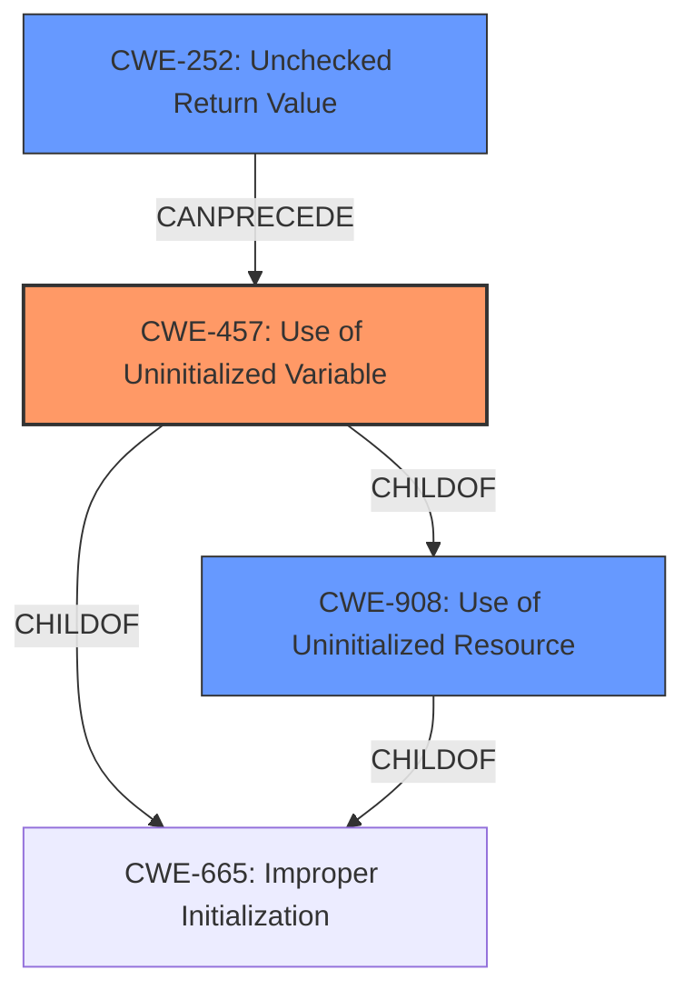

# Analysis Report for CVE-2022-47012

# Vulnerability Analysis Report: CVE-2022-47012

## Description


## Analysis (with Relationship Data)

# Summary
| CWE ID | CWE Name | Confidence | CWE Abstraction Level | CWE Vulnerability Mapping Label | CWE-Vulnerability Mapping Notes |
|---|---|---|---|---|---|
| CWE-457 | Use of Uninitialized Variable | 0.9 | Variant | Allowed | Primary CWE |
| CWE-908 | Use of Uninitialized Resource | 0.7 | Base | Allowed | Secondary Candidate |
| CWE-252 | Unchecked Return Value | 0.6 | Base | Allowed | Secondary Candidate |

## Evidence and Confidence

*   **Confidence Score:** 0.9
*   **Evidence Strength:** HIGH

## Relationship Analysis
The primary CWE selected is CWE-457, which is a variant of CWE-908 (Use of Uninitialized Resource) and CWE-665 (Improper Initialization). The vulnerability description explicitly mentions the use of an uninitialized variable. The secondary CWE, CWE-908, is a base class that encompasses the use of any uninitialized resource, including variables. CWE-252 (Unchecked Return Value) is considered a potential contributing factor, as the root cause analysis mentions the interaction with `pcap_next` and the possibility of it returning an uninitialized pointer.



## Vulnerability Chain
The vulnerability chain starts with the potential for an unchecked return value from `pcap_next` (CWE-252), leading to the use of an uninitialized variable (CWE-457) which could result in unpredictable program behavior or information leakage.

## Summary of Analysis
The initial report indicates a potential **use of an uninitialized variable** within the `pcap_next` function call within dynamips. The vulnerability description mentions the "**rootcause:** **Use of uninitialized variable**". The analysis of the CVE Reference Links Content Summary also highlights the "**Potential Uninitialized Variable**" issue.
"The initial report suggests a potential **use of an uninitialized variable** within the `pcap_next` function call within dynamips"
"**rootcause:** **Use of uninitialized variable**"
"**Potential Uninitialized Variable**"
Therefore, CWE-457 is the most appropriate primary CWE because it directly addresses the specific issue of using an uninitialized variable. CWE-908 is a more general case. The retriever results also support CWE-457 as the top candidate.

CWE-665 was considered but not selected as the primary CWE. While it is related to improper initialization, CWE-457 is more specific to the **use** of an uninitialized variable, which aligns more closely with the vulnerability description.

CWE-824 (Access of Uninitialized Pointer) was considered but not selected because the description does not explicitly state that a pointer is being accessed.

CWE-252 (Unchecked Return Value) was considered as a possible contributing factor, as the root cause analysis mentions the interaction with `pcap_next` and the possibility of it returning an uninitialized pointer if the return value is not checked.

The selection of CWE-457 is at the optimal level of specificity, as it is a Variant-level CWE that directly describes the vulnerability. The evidence strongly supports this classification, and the relationship analysis helps to contextualize the vulnerability within a broader class of initialization issues.


## CWE Relationship Analysis

Current CWEs represent these abstraction levels: .


### Vulnerability Chain Analysis

**Chain starting from CWE-908:**
- 908 (Use of Uninitialized Resource) - ROOT


**Chain starting from CWE-457:**
- 457 (Use of Uninitialized Variable) - ROOT


### CWE Relationship Diagram

```mermaid
graph TD
    classDef primary fill:#f96,stroke:#333,stroke-width:2px
    classDef secondary fill:#69f,stroke:#333
    classDef tertiary fill:#9e9,stroke:#333
```


*Report generated on 2025-03-31 10:55:04*
