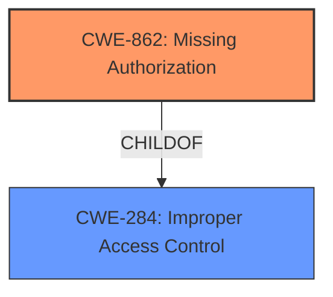

# Analysis Report for CVE-2022-4704

# Vulnerability Analysis Report: CVE-2022-4704

## Description


## Analysis (with Relationship Data)

# Summary
| CWE ID | CWE Name | Confidence | CWE Abstraction Level | CWE Vulnerability Mapping Label | CWE-Vulnerability Mapping Notes |
|---|---|---|---|---|---|
| CWE-862 | Missing Authorization | 1.0 | Class | Allowed-with-Review | Primary CWE. The product does not perform an authorization check when an actor attempts to access a resource or perform an action. |
| CWE-284 | Improper Access Control | 0.7 | Pillar | Discouraged | Secondary candidate. The product does not restrict or incorrectly restricts access to a resource from an unauthorized actor. |

## Evidence and Confidence

*   **Confidence Score:** 1.0
*   **Evidence Strength:** HIGH

## Relationship Analysis
The primary CWE is CWE-862, Missing Authorization, which is a child of CWE-284, Improper Access Control. Since the vulnerability description clearly states that there is **insufficient access control** because the system does not perform an authorization check, CWE-862 is the more specific and appropriate choice.



## Vulnerability Chain
The chain of root cause and weaknesses for the Vulnerability Description are:
1.  **Root Cause:** **Insufficient Access Control** due to **missing authorization** checks in the `wpr_import_templates_kit` AJAX action.
2.  **Weakness:** Any authenticated user, including those with subscriber-level permissions, can access the function.
3.  **Impact:** Ability to import preset site configuration templates, potentially overwriting content, injecting malicious content, or defacing the site.

## Summary of Analysis
The initial analysis focused on the **insufficient access control** in the `wpr_import_templates_kit` AJAX action. The vulnerability description and CVE Reference Links Content Summary clearly indicate a **missing authorization** check.

The evidence supporting this decision is:

*   "The Royal Elementor Addons plugin for WordPress is vulnerable to **insufficient access control** in the wpr_import_templates_kit AJAX action..."
*   "The vulnerability stems from a lack of access control in the `wpr_import_templates_kit` AJAX action within the Royal Elementor Addons plugin. This means the function doesn't check if the user has the necessary permissions to perform the action."
*   "**Insufficient Access Control:** The core issue is that the `wpr_import_templates_kit` AJAX action is accessible to any authenticated user, including those with minimal privileges like subscriber-level permissions."

The graph relationships confirm that CWE-862 is a more specific child of CWE-284, making it a better fit. The selected CWE is at the optimal level of specificity because it accurately describes the root cause of the vulnerability, which is the **lack of authorization** checks.

Relevant CWE Information:

# Enhanced Context (25 CWEs)
The following CWEs were identified as potentially relevant to this vulnerability:

## CWE-807: Reliance on Untrusted Inputs in a Security Decision
**Abstraction Level**: Base
**Similarity Score**: 0.76
**Source**: dense

**Description**:
The product uses a protection mechanism that relies on the existence or values of an input, but the input can be modified by an untrusted actor in a way that bypasses the protection mechanism.
**REJECTED:** Not directly applicable as the core issue is the **missing authorization** check, not the reliance on untrusted inputs.

## CWE-639: Authorization Bypass Through User-Controlled Key
**Abstraction Level**: Base
**Similarity Score**: 0.76
**Source**: dense

**Description**:
The system's authorization functionality does not prevent one user from gaining access to another user's data or record by modifying the key value identifying the data.
**REJECTED:** Not applicable as the issue is not related to modifying a key value. The vulnerability allows access due to the **absence of authorization** checks.

## CWE-668: Exposure of Resource to Wrong Sphere
**Abstraction Level**: Class
**Similarity Score**: 0.76
**Source**: dense

**Description**:
The product exposes a resource to the wrong control sphere, providing unintended actors with inappropriate access to the resource.
**REJECTED:** Too high-level and not specific to the root cause, which is the **missing authorization** check.

## CWE-472: External Control of Assumed-Immutable Web Parameter
**Abstraction Level**: Base
**Similarity Score**: 0.76
**Source**: dense

**Description**:
The web application does not sufficiently verify inputs that are assumed to be immutable but are actually externally controllable, such as hidden form fields.
**REJECTED:** Not applicable because the vulnerability is not related to the verification of immutable web parameters.

## CWE-74: Improper Neutralization of Special Elements in Output Used by a Downstream Component ('Injection')
**Abstraction Level**: Class
**Similarity Score**: 0.76
**Source**: dense

**Description**:
The product constructs all or part of a command, data structure, or record using externally-influenced input from an upstream component, but it does not neutralize or incorrectly neutralizes special elements that could modify how it is parsed or interpreted when it is sent to a downstream component.
**REJECTED:** Not applicable as the vulnerability is not related to injection.

## CWE-303: Incorrect Implementation of Authentication Algorithm
**Abstraction Level**: Base
**Similarity Score**: 0.75
**Source**: dense

**Description**:
The requirements for the product dictate the use of an established authentication algorithm, but the implementation of the algorithm is incorrect.
**REJECTED:** Not applicable as the vulnerability is not related to the authentication algorithm itself.

## CWE-1390: Weak Authentication
**Abstraction Level**: Class
**Similarity Score**: 0.75
**Source**: dense

**Description**:
The product uses an authentication mechanism to restrict access to specific users or identities, but the mechanism does not sufficiently prove that the claimed identity is correct.
**REJECTED:** The authentication is valid and not weak, so this is not relevant. The problem is the **missing authorization**.

## CWE-1220: Insufficient Granularity of Access Control
**Abstraction Level**: Base
**Similarity Score**: 0.75
**Source**: dense

**Description**:
The product implements access controls via a policy or other feature with the intention to disable or restrict accesses (reads and/or writes) to assets in a system from untrusted agents. However, implemented access controls lack required granularity, which renders the control policy too broad because it allows accesses from unauthorized agents to the security-sensitive assets.
**REJECTED:** While the access control is **insufficient**, the core issue is the complete **lack of authorization**, not just the granularity.

## CWE-1289: Improper Validation of Unsafe Equivalence in Input
**Abstraction Level**: Base
**Similarity Score**: 0.75
**Source**: dense

**Description**:
The product receives an input value that is used as a resource identifier or other type of reference, but it does not validate or incorrectly validates that the input is equivalent to a potentially-unsafe value.
**REJECTED:** Not relevant as the issue is not about validating input equivalence.

## CWE-41: Improper Resolution of Path Equivalence
**Abstraction Level**: Base
**Similarity Score**: 0.75
**Source**: dense

**Description**:
The product is vulnerable to file system contents disclosure through path equivalence. Path equivalence involves the use of special characters in file and directory names. The associated manipulations are intended to generate multiple names for the same object.
**REJECTED:** Not related to file system path equivalence.

## CWE-863: Incorrect Authorization
**Abstraction Level**: Class
**Similarity Score**: 6562.27
**Source**: sparse

**Description**:
The product performs an authorization check when an actor attempts to access a resource or perform an action, but it does not correctly perform the check.
**REJECTED:** The vulnerability is due to a **missing authorization** check, not an incorrect one.

## CWE-285: Improper Authorization
**Abstraction Level**: Class
**Similarity Score**: 6520.49
**Source**: sparse

**Description**:
The product does not perform or incorrectly performs an authorization check when an actor attempts to access a resource or perform an action.
**REJECTED:** While CWE-285 covers both cases of **missing or incorrect authorization**, CWE-862 (Missing Authorization) is a more specific child and therefore a better fit.

## CWE-639: Authorization Bypass Through User-Controlled Key
**Abstraction Level**: Base
**Similarity Score**: 6264.84
**Source**: sparse

**Description**:
The system's authorization functionality does not prevent one user from gaining access to another user's data or record by modifying the key value identifying the data.
**REJECTED:**


## CWE Relationship Analysis

Current CWEs represent these abstraction levels: .


### Vulnerability Chain Analysis

**Chain starting from CWE-862:**
- 862 (Missing Authorization) - ROOT


**Chain starting from CWE-472:**
- 472 (External Control of Assumed-Immutable Web Parameter) - ROOT


### CWE Relationship Diagram

```mermaid
graph TD
    classDef primary fill:#f96,stroke:#333,stroke-width:2px
    classDef secondary fill:#69f,stroke:#333
    classDef tertiary fill:#9e9,stroke:#333
```


*Report generated on 2025-03-31 09:48:55*
