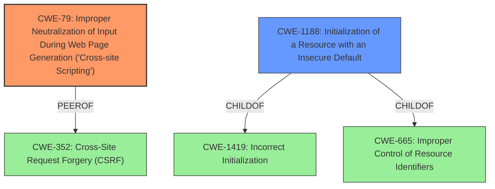

# Enhanced Analysis for CVE-2022-47196

# Summary
| CWE ID | CWE Name | Confidence | CWE Abstraction Level | CWE Vulnerability Mapping Label | CWE-Vulnerability Mapping Notes |
|---|---|---|---|---|---|
| CWE-79 | Improper Neutralization of Input During Web Page Generation ('Cross-site Scripting') | 1.0 | Base | Allowed | Primary CWE |
| CWE-1188 | Initialization of a Resource with an Insecure Default | 0.8 | Base | Allowed | Secondary Candidate |

## Evidence and Confidence

*   **Confidence Score:** 0.9
*   **Evidence Strength:** HIGH

## Relationship Analysis
The primary CWE is CWE-79, which is a Base level weakness. CWE-79 can be related to CWE-352 (Cross-Site Request Forgery). The secondary CWE is CWE-1188, which is a Base level weakness and a ChildOf CWE-1419 (Improper Initialization) and CWE-665 (Improper Control of Resource Identifiers).



## Vulnerability Chain
The chain of weaknesses is:
1.  **Insecure default configuration** (CWE-1188) allowing arbitrary Javascript injection.
2.  Improper neutralization of input during web page generation (CWE-79).
3.  Privilege escalation to administrator.

## Summary of Analysis
The analysis identifies two CWEs: CWE-79 (Primary) and CWE-1188 (Secondary).

CWE-79 is selected as the primary CWE because the vulnerability description and the CVE Reference Links Content Summary clearly indicate a stored cross-site scripting vulnerability due to a lack of input sanitization. The **root cause** allows a non-administrator user to inject arbitrary Javascript in posts that are then viewed by an administrator. This aligns directly with the description of CWE-79, which states that the product does not neutralize user-controllable input before it is placed in output that is used as a web page served to other users.

CWE-1188 is selected as a secondary CWE because the vulnerability description mentions an **insecure default configuration** that allows the Javascript injection. This aligns with the description of CWE-1188, which states that the product initializes a resource with a default that is intended to be changed by the administrator, but the default is not secure.

The other CWEs listed in the Retriever Results were considered, but they were not selected because they did not accurately describe the vulnerability. For example, CWE-352 (Cross-Site Request Forgery) was considered because there can be a relationship between XSS and CSRF, but the vulnerability description does not indicate that CSRF is involved. The vulnerability description clearly focuses on the improper neutralization of input, which is the defining characteristic of XSS, and insecure default configurations.

The selected CWEs are at the optimal level of specificity because they accurately describe the **root cause** of the vulnerability. CWE-79 is a Base level CWE, which is a preferred level of abstraction for mapping to the **root causes** of vulnerabilities. CWE-1188 is a Base level CWE and a contributing factor to the vulnerability.

Evidence:
*   Vulnerability Description Key Phrases: "**weakness:** **insecure default configuration**"
*   CVE Reference Links Content Summary: "The **root cause** is an insecure default configuration in Ghost CMS that allows a user to inject arbitrary JavaScript code into the `codeinjection_head` field of a post. This is due to a lack of input sanitization."
*   CVE Reference Links Content Summary: "- Stored Cross-Site Scripting (XSS) vulnerability in the `codeinjection_head` field."

Relevant CWE Information:

# Enhanced Context (25 CWEs)
The following CWEs were identified as potentially relevant to this vulnerability:

## CWE-74: Improper Neutralization of Special Elements in Output Used by a Downstream Component ('Injection')
**Abstraction Level**: Class
**Similarity Score**: 0.77
**Source**: dense

**Description**:
The product constructs all or part of a command, data structure, or record using externally-influenced input from an upstream component, but it does not neutralize or incorrectly neutralizes special elements that could modify how it is parsed or interpreted when it is sent to a downstream component.

**Mapping Guidance**:
- Usage: Discouraged
- Rationale: CWE-74 is high-level and often misused when lower-level weaknesses are more appropriate.


## CWE-807: Reliance on Untrusted Inputs in a Security Decision
**Abstraction Level**: Base
**Similarity Score**: 0.77
**Source**: dense

**Description**:
The product uses a protection mechanism that relies on the existence or values of an input, but the input can be modified by an untrusted actor in a way that bypasses the protection mechanism.

**Mapping Guidance**:
- Usage: Allowed
- Rationale: This CWE entry is at the Base level of abstraction, which is a preferred level of abstraction for mapping to the root causes of vulnerabilities.


## CWE-1289: Improper Validation of Unsafe Equivalence in Input
**Abstraction Level**: Base
**Similarity Score**: 0.77
**Source**: dense

**Description**:
The product receives an input value that is used as a resource identifier or other type of reference, but it does not validate or incorrectly validates that the input is equivalent to a potentially-unsafe value.

**Mapping Guidance**:
- Usage: Allowed
- Rationale: This CWE entry is at the Base level of abstraction, which is a preferred level of abstraction for mapping to the root causes of vulnerabilities.


## CWE-472: External Control of Assumed-Immutable Web Parameter
**Abstraction Level**: Base
**Similarity Score**: 0.76
**Source**: dense

**Description**:
The web application does not sufficiently verify inputs that are assumed to be immutable but are actually externally controllable, such as hidden form fields.

**Mapping Guidance**:
- Usage: Allowed
- Rationale: This CWE entry is at the Base level of abstraction, which is a preferred level of abstraction for mapping to the root causes of vulnerabilities.


## CWE-639: Authorization Bypass Through User-Controlled Key
**Abstraction Level**: Base
**Similarity Score**: 0.76
**Source**: dense

**Description**:
The system's authorization functionality does not prevent one user from gaining access to another user's data or record by modifying the key value identifying the data.

**Mapping Guidance**:
- Usage: Allowed
- Rationale: This CWE entry is at the Base level of abstraction, which is a preferred level of abstraction for mapping to the root causes of vulnerabilities.


## CWE-668: Exposure of Resource to Wrong Sphere
**Abstraction Level**: Class
**Similarity Score**: 0.76
**Source**: dense

**Description**:
The product exposes a resource to the wrong control sphere, providing unintended actors with inappropriate access to the resource.

**Mapping Guidance**:
- Usage: Discouraged
- Rationale: CWE-668 is high-level and is often misused as a catch-all when lower-level CWE IDs might be applicable. It is sometimes used for low-information vulnerability reports [REF-1287]. It is a level-1 Class (i.e., a child of a Pillar). It is not useful for trend analysis.


## CWE-184: Incomplete List of Disallowed Inputs
**Abstraction Level**: Base
**Similarity Score**: 0.76
**Source**: dense

**Description**:
The product implements a protection mechanism that relies on a list of inputs (or properties of inputs) that are not allowed by policy or otherwise require other action to neutralize before additional processing takes place, but the list is incomplete.

**Mapping Guidance**:
- Usage: Allowed
- Rationale: This CWE entry is at the Base level of abstraction, which is a preferred level of abstraction for mapping to the root causes of vulnerabilities.


## CWE-41: Improper Resolution of Path Equivalence
**Abstraction Level**: Base
**Similarity Score**: 0.75
**Source**: dense

**Description**:
The product is vulnerable to file system contents disclosure through path equivalence. Path equivalence involves the use of special characters in file and


## CWE Relationship Analysis

Current CWEs represent these abstraction levels: .


### Vulnerability Chain Analysis

**Chain starting from CWE-472:**
- 472 (External Control of Assumed-Immutable Web Parameter) - ROOT


**Chain starting from CWE-41:**
- 41 (Improper Resolution of Path Equivalence) - ROOT


### CWE Relationship Diagram

```mermaid
graph TD
    classDef primary fill:#f96,stroke:#333,stroke-width:2px
    classDef secondary fill:#69f,stroke:#333
    classDef tertiary fill:#9e9,stroke:#333
```