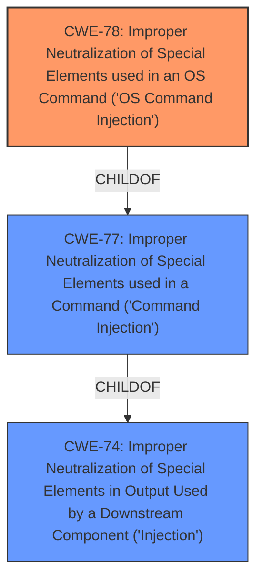

# Raw Analyzer Response for CVE-2022-47208

# Summary
| CWE ID | CWE Name | Confidence | CWE Abstraction Level | CWE Vulnerability Mapping Label | CWE-Vulnerability Mapping Notes |
|---|---|---|---|---|---|
| CWE-78 | Improper Neutralization of Special Elements used in an OS Command ('OS Command Injection') | 1.0 | Base | Allowed | Primary CWE |

## Evidence and Confidence

*   **Confidence Score:** 1.0
*   **Evidence Strength:** HIGH

## Relationship Analysis
The primary relationship that influenced the decision was the ChildOf relationship between CWE-78 and CWE-77. CWE-78 is a more specific Base-level CWE that focuses on OS command injection, while CWE-77 is a more general Class-level CWE that covers command injection in various command languages. Since the vulnerability specifically involves the execution of OS commands due to **improperly sanitized user input**, CWE-78 was chosen as the more appropriate and specific classification.

## Vulnerability Chain
The vulnerability chain starts with the **improper sanitization of user input**, which is the root cause. This leads to the weakness of **command injection**, specifically OS command injection. The impact of this vulnerability is that an unauthenticated attacker can execute arbitrary commands on the device.

## Summary of Analysis
The initial analysis identified command injection as the primary weakness. The provided vulnerability description and the CVE Reference Links Content Summary clearly indicate that the "puhttpsniff" service suffers from **improperly sanitized user input**, leading to **command injection**. The CVE summary explicitly states, "Improperly sanitized user input in the “puhttpsniff” service" and lists "Command Injection" as a weakness. This evidence strongly supports the selection of a CWE related to command injection.

The Retriever Results further reinforced this assessment, with CWE-77 and CWE-78 being the top candidates. The choice between CWE-77 and CWE-78 was made based on the specificity of the vulnerability. Since the vulnerability involves the execution of OS commands, CWE-78, "Improper Neutralization of Special Elements used in an OS Command ('OS Command Injection')", was deemed the most appropriate.

The MITRE mapping guidance for CWE-78 allows its usage and states that it is at the Base level of abstraction, which is a preferred level. The guidance also suggests carefully reading the name and description to ensure an appropriate fit, which aligns with the analysis performed.

The decision to select CWE-78 is based on direct evidence from the vulnerability description and the CVE summary, the Retriever Results, and the MITRE mapping guidance. The chosen CWE is at the optimal level of specificity, as it accurately reflects the nature of the vulnerability and its impact.

Relevant CWE Information:

# Enhanced Context (25 CWEs)
The following CWEs were identified as potentially relevant to this vulnerability:

## CWE-74: Improper Neutralization of Special Elements in Output Used by a Downstream Component ('Injection')
**Abstraction Level**: Class
**Similarity Score**: 0.75
**Source**: dense

**Description**:
The product constructs all or part of a command, data structure, or record using externally-influenced input from an upstream component, but it does not neutralize or incorrectly neutralizes special elements that could modify how it is parsed or interpreted when it is sent to a downstream component.

**Mapping Guidance**:
- Usage: Discouraged
- Rationale: CWE-74 is high-level and often misused when lower-level weaknesses are more appropriate.

*Was considered but rejected because:* This is a high-level class and not specific enough.

## CWE-184: Incomplete List of Disallowed Inputs
**Abstraction Level**: Base
**Similarity Score**: 0.74
**Source**: dense

**Description**:
The product implements a protection mechanism that relies on a list of inputs (or properties of inputs) that are not allowed by policy or otherwise require other action to neutralize before additional processing takes place, but the list is incomplete.

**Mapping Guidance**:
- Usage: Allowed
- Rationale: This CWE entry is at the Base level of abstraction, which is a preferred level of abstraction for mapping to the root causes of vulnerabilities.

*Was considered but rejected because:* While an incomplete list of disallowed inputs could contribute to the vulnerability, the primary issue is the **improper sanitization**, not the incompleteness of a list.

## CWE-99: Improper Control of Resource Identifiers ('Resource Injection')
**Abstraction Level**: Class
**Similarity Score**: 0.74
**Source**: dense

**Description**:
The product receives input from an upstream component, but it does not restrict or incorrectly restricts the input before it is used as an identifier for a resource that may be outside the intended sphere of control.

**Mapping Guidance**:
- Usage: Allowed-with-Review
- Rationale: This CWE entry is a Class and might have Base-level children that would be more appropriate

*Was considered but rejected because:* This is not related to resource identifiers.

## CWE-73: External Control of File Name or Path
**Abstraction Level**: Base
**Similarity Score**: 0.74
**Source**: dense

**Description**:
The product allows user input to control or influence paths or file names that are used in filesystem operations.

**Mapping Guidance**:
- Usage: Allowed
- Rationale: This CWE entry is at the Base level of abstraction, which is a preferred level of abstraction for mapping to the root causes of vulnerabilities.

*Was considered but rejected because:* This is not related to file names or paths.

## CWE-470: Use of Externally-Controlled Input to Select Classes or Code ('Unsafe Reflection')
**Abstraction Level**: Base
**Similarity Score**: 0.73
**Source**: dense

**Description**:
The product uses external input with reflection to select which classes or code to use, but it does not sufficiently prevent the input from selecting improper classes or code.

**Mapping Guidance**:
- Usage: Allowed
- Rationale: This CWE entry is at the Base level of abstraction, which is a preferred level of abstraction for mapping to the root causes of vulnerabilities.

*Was considered but rejected because:* This is not related to reflection.

## CWE-1289: Improper Validation of Unsafe Equivalence in Input
**Abstraction Level**: Base
**Similarity Score**: 0.73
**Source**: dense

**Description**:
The product receives an input value that is used as a resource identifier or other type of reference, but it does not validate or incorrectly validates that the input is equivalent to a potentially-unsafe value.

**Mapping Guidance**:
- Usage: Allowed
- Rationale: This CWE entry is at the Base level of abstraction, which is a preferred level of abstraction for mapping to the root causes of vulnerabilities.

*Was considered but rejected because:* This is not related to unsafe equivalence.

## CWE-917: Improper Neutralization of Special Elements used in an Expression Language Statement ('Expression Language Injection')
**Abstraction Level**: Base
**Similarity Score**: 0.73
**Source**: dense

**Description**:
The product constructs all or part of an expression language (EL) statement in a framework such as a Java Server Page (JSP) using externally-influenced input from an upstream component, but it does not neutralize or incorrectly neutralizes special elements that could modify the intended EL statement before it is executed.

**Mapping Guidance**:
- Usage: Allowed
- Rationale: This CWE entry is at the Base level of abstraction, which is a preferred level of abstraction for mapping to the root causes of vulnerabilities.

*Was considered but rejected because:* This is not related to expression language.

## CWE-138: Improper Neutralization of Special Elements
**Abstraction Level**: Class
**Similarity Score**: 0.72
**Source**: dense

**Description**:
The product receives input from an upstream component, but it does not neutralize or incorrectly neutralizes special elements that could be interpreted as control elements or syntactic markers when they are sent to a downstream component.

**Mapping Guidance**:
- Usage: Discouraged
- Rationale: This CWE entry is a level-1 Class (i.e., a child of a Pillar). It might have lower-level children that would be more appropriate

*Was considered but rejected because:* This is a higher level class, and CWE-78 is a better fit

## CWE-41: Improper Resolution of Path Equivalence
**Abstraction Level**: Base
**Similarity Score**: 0.72
**Source**: dense

**Description**:
The product is vulnerable to file system contents disclosure through path equivalence. Path equivalence involves the use of special characters in file and directory