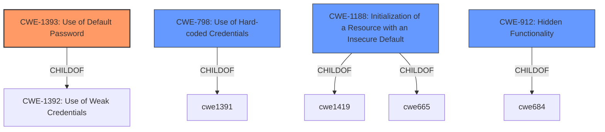

# Analysis Report for CVE-2022-47209

# Vulnerability Analysis Report: CVE-2022-47209

## Description


## Analysis (with Relationship Data)

# Summary
| CWE ID  | CWE Name                         | Confidence | CWE Abstraction Level | CWE Vulnerability Mapping Label | CWE-Vulnerability Mapping Notes |
| :-------- | :--------------------------------- | :--------- | :-------------------- | :------------------------------ | :------------------------------ |
| CWE-1393  | Use of Default Password           | 1          | Base                  | Primary                         | Allowed                       |
| CWE-798   | Use of Hard-coded Credentials       | 0.9        | Base                  | Secondary                       | Allowed                       |
| CWE-1188  | Initialization of a Resource with an Insecure Default | 0.7        | Base                  | Secondary                       | Allowed                       |
| CWE-912   | Hidden Functionality              | 0.6        | Class                 | Secondary                       | Allowed-with-Review         |

## Evidence and Confidence

*   **Confidence Score:** 0.9
*   **Evidence Strength:** HIGH

## Relationship Analysis
The primary CWE selected is CWE-1393 (Use of Default Password), which is a Base level CWE and a child of CWE-1392 (Use of Weak Credentials). CWE-798 (Use of Hard-coded Credentials) is also selected because the **default password** cannot be changed by a user via any normally accessible means, which indicates that the **default password** is effectively **hard-coded**. CWE-1188 (Initialization of a Resource with an Insecure Default) is considered because the account is initialized with an insecure **default password**. CWE-912 (Hidden Functionality) is a potential secondary CWE because the account appears to be a backdoor for Technical Support staff, which is a functionality that is not documented.



## Vulnerability Chain
The vulnerability chain starts with the **default password** for the support user account, which leads to unauthorized access to the device.

## Summary of Analysis
The primary CWE is CWE-1393 (Use of Default Password) because the vulnerability description explicitly mentions the presence of a **default password** for the support user account. The evidence for this is "The **default password** for this account is support and cannot be changed by a user via any normally accessible means." The **default password** constitutes a **weakness** in the device's security.

CWE-798 (Use of Hard-coded Credentials) is also considered because the **default password** cannot be changed by a user via any normally accessible means. This means that the password is, for all intents and purposes, **hard-coded**.

CWE-1188 (Initialization of a Resource with an Insecure Default) is considered because the account is initialized with an insecure **default password**, however, since the **default password** cannot be changed, it leans more into CWE-798.

CWE-912 (Hidden Functionality) is considered because the account appears to be a backdoor for Technical Support staff, which is a functionality that is not documented.

The selected CWEs are at the optimal level of specificity, as they accurately represent the **weakness** described in the vulnerability description.


## CWE Relationship Analysis

Current CWEs represent these abstraction levels: .


### Vulnerability Chain Analysis

**Chain starting from CWE-1392:**
- 1392 (Use of Default Credentials) - ROOT


**Chain starting from CWE-798:**
- 798 (Use of Hard-coded Credentials) - ROOT


### CWE Relationship Diagram

```mermaid
graph TD
    classDef primary fill:#f96,stroke:#333,stroke-width:2px
    classDef secondary fill:#69f,stroke:#333
    classDef tertiary fill:#9e9,stroke:#333
```


*Report generated on 2025-03-31 07:23:58*
