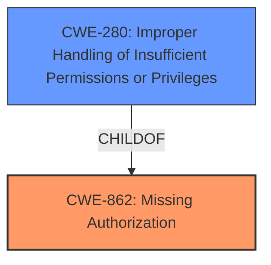

# Raw Analyzer Response for CVE-2022-47325

# Summary
| CWE ID  | CWE Name                   | Confidence | CWE Abstraction Level | CWE Vulnerability Mapping Label | CWE-Vulnerability Mapping Notes |
| :------- | :-------------------------- | :--------- | :-------------------- | :------------------------------- | :----------------------------- |
| CWE-862  | Missing Authorization      | 0.9        | Class                | Primary                          | Allowed-with-Review           |
| CWE-280  | Improper Handling of Insufficient Permissions or Privileges | 0.7       | Base                | Secondary                          | Allowed           |

## Evidence and Confidence

*   **Confidence Score:** 0.8
*   **Evidence Strength:** MEDIUM

## Relationship Analysis
The primary relationship influencing the decision is the hierarchical one. CWE-862 "Missing Authorization" is a Class-level CWE, with potential Base-level children that might be more appropriate. CWE-280 "Improper Handling of Insufficient Permissions or Privileges" is a potential candidate. While CWE-862 is a good fit, exploring its children ensures the most specific CWE is chosen. Both CWE-862 and CWE-280 are related to authorization issues, but CWE-280 is more specific about handling insufficient permissions.

## Vulnerability Chain
The vulnerability chain starts with the **missing permission check** (**WEAKNESS**) in the wlan driver, leading to local information disclosure.
  - The root cause is the **missing permission check**.
  - The impact is local information disclosure.

## Summary of Analysis
The initial analysis identified CWE-862 as a strong candidate based on the "Missing Authorization" description. However, the description also mentions "missing permission check", suggesting a nuance that might be better captured by a more specific CWE. By examining the children of CWE-862 and other related CWEs, CWE-280 was identified as another applicable CWE because it discusses the product's handling of insufficient privileges which is a more precise description of the **missing permission check**. Since the **missing permission check** is the **ROOTCAUSE**, CWE-862 captures the high-level missing authorization, and CWE-280 captures the more specific improper handling of insufficient privileges, I am including both. The evidence for this is the "Vulnerability Description Key Phrases" which lists "missing permission check" as the **rootcause**.

Relevant CWE Information:

# Enhanced Context (25 CWEs)

## CWE-280: Improper Handling of Insufficient Permissions or Privileges 
**Abstraction Level**: Base
**Similarity Score**: 0.79
**Source**: dense

**Description**:
The product does not handle or incorrectly handles when it has insufficient privileges to access resources or functionality as specified by their permissions. This may cause it to follow unexpected code paths that may leave the product in an invalid state.

**Mapping Guidance**:
- Usage: Allowed
- Rationale: This CWE entry is at the Base level of abstraction, which is a preferred level of abstraction for mapping to the root causes of vulnerabilities.

### CWE-862: Missing Authorization
**Abstraction:** Class
**Status:** Incomplete

### Description
The product does not perform an authorization check when an actor attempts to access a resource or perform an action.

### Mapping Guidance
**Usage:** Allowed-with-Review
**Rationale:** This CWE entry is a Class and might have Base-level children that would be more appropriate
**Comments:** Examine children of this entry to see if there is a better fit

## CWE-862: Missing Authorization
*   **Technical Explanation:** The vulnerability description states a "missing permission check" in the wlan driver. This aligns directly with the definition of CWE-862, which describes a product that "does not perform an authorization check when an actor attempts to access a resource or perform an action."
*   **Security Implications:** The absence of proper authorization checks allows unauthorized access to resources, potentially leading to sensitive information disclosure.
*   **Relationship Analysis:** CWE-862 is a class-level CWE, and the mapping guidance suggests examining its children for a better fit.
*   **Mapping Guidance Influence:** The "Allowed-with-Review" usage suggests caution and a check for more specific CWEs.
*   **Evidence:** "missing permission check" from the Vulnerability Description Key Phrases section.
*   **Confidence:** 0.9

## CWE-280: Improper Handling of Insufficient Permissions or Privileges
*   **Technical Explanation:** This CWE describes a situation where the product "does not handle or incorrectly handles when it has insufficient privileges to access resources or functionality". This is a more specific case of missing authorization.
*   **Security Implications:** Similar to CWE-862, this can lead to unauthorized access and information disclosure.
*   **Relationship Analysis:** CWE-280 is a Base level CWE and a child of CWE-862, providing a more specific classification.
*   **Mapping Guidance Influence:** The "Allowed" usage suggests this is an appropriate mapping.
*   **Evidence:** The **missing permission check** means the product isn't properly handling the case where permissions are insufficient.
*   **Confidence:** 0.7

CWEs considered but not used:

*   CWE-927, CWE-126, CWE-129, CWE-909, CWE-170, CWE-367, CWE-863, CWE-732: These CWEs were not selected because they did not directly address the root cause of the **missing permission check** as precisely as CWE-862 and CWE-280. They cover different types of weaknesses, such as use of implicit intents, buffer over-reads, or time-of-check time-of-use race conditions, which are not relevant to the described vulnerability.