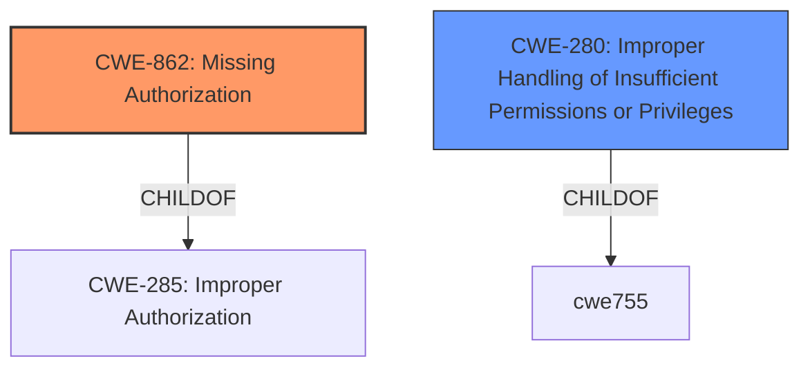

# Analysis for CVE-2022-47326

# Summary
| CWE ID | CWE Name | Confidence | CWE Abstraction Level | CWE Vulnerability Mapping Label | CWE-Vulnerability Mapping Notes |
|---|---|---|---|---|---|
| CWE-862 | Missing Authorization | 0.9 | Class | Primary CWE | Allowed-with-Review |
| CWE-280 | Improper Handling of Insufficient Permissions or Privileges | 0.6 | Base | Secondary Candidate | Allowed |

## Evidence and Confidence

*   **Confidence Score:** 0.9
*   **Evidence Strength:** HIGH

## Relationship Analysis
The primary relationship influencing the decision is the parent-child relationship between CWE-285 (Improper Authorization) and CWE-862 (Missing Authorization). While CWE-862 is a class-level CWE, it directly addresses the described vulnerability of a **missing permission check**. CWE-280, while related, is a base-level CWE and broader in scope. The chain relationships were not applicable in this instance.

## Vulnerability Chain
The vulnerability chain is relatively simple: a **missing permission check** (CWE-862) leads to local information disclosure. The root cause is the **missing check**, and the impact is the information disclosure.

## Summary of Analysis
The analysis is based on the vulnerability description, particularly the key phrase "**missing permission check**". This directly aligns with the definition of CWE-862 (Missing Authorization). While the retriever results also suggest other CWEs like CWE-125 (Out-of-bounds Read) and CWE-787 (Out-of-bounds Write), these are less relevant as the primary issue is the **missing authorization**, not a memory safety issue.

CWE-862 is selected because it precisely captures the **missing check**, which is the **root cause** of the vulnerability. The Unisoc webpage does not give enough detail to assess further weaknesses in the chain.

Relevant CWE Information:

# Enhanced Context (25 CWEs)
The following CWEs were identified as potentially relevant to this vulnerability:

## CWE-280: Improper Handling of Insufficient Permissions or Privileges 
**Abstraction Level**: Base
**Similarity Score**: 0.79
**Source**: dense

**Description**:
The product does not handle or incorrectly handles when it has insufficient privileges to access resources or functionality as specified by their permissions. This may cause it to follow unexpected code paths that may leave the product in an invalid state.

**Mapping Guidance**:
- Usage: Allowed
- Rationale: This CWE entry is at the Base level of abstraction, which is a preferred level of abstraction for mapping to the root causes of vulnerabilities.

## CWE-862: Missing Authorization
**Abstraction:** Class
**Status:** Incomplete

### Description
The product does not perform an authorization check when an actor attempts to access a resource or perform an action.

### Extended Description
Not provided

### Alternative Terms
AuthZ: "AuthZ" is typically used as an abbreviation of "authorization" within the web application security community. It is distinct from "AuthN" (or, sometimes, "AuthC") which is an abbreviation of "authentication." The use of "Auth" as an abbreviation is discouraged, since it could be used for either authentication or authorization.

### Relationships
ChildOf -> CWE-285
ChildOf -> CWE-284

### Mapping Guidance
**Usage:** Allowed-with-Review
**Rationale:** This CWE entry is a Class and might have Base-level children that would be more appropriate
**Comments:** Examine children of this entry to see if there is a better fit
**Reasons:**
- Abstraction

### Additional Notes
**[Terminology]** Assuming a user with a given identity, authorization is the process of determining whether that user can access a given resource, based on the user's privileges and any permissions or other access-control specifications that apply to the resource.

### Observed Examples
- **CVE-2022-24730:** Go-based continuous deployment product does not check that a user has certain privileges to update or create an app, allowing adversaries to read sensitive repository information
- **CVE-2009-3168:** Web application does not restrict access to admin scripts, allowing authenticated users to reset administrative passwords.
- **CVE-2009-3597:** Web application stores database file under the web root with insufficient access control (CWE-219), allowing direct request.

CWE-125 (Out-of-bounds Read): This CWE was considered because it appears frequently in the top CWEs for similar CVE descriptions. However, the vulnerability description explicitly mentions a **missing permission check**, not a memory access error. Therefore, CWE-125 is not appropriate.

CWE-787 (Out-of-bounds Write): Similar to CWE-125, this CWE is related to memory safety, but the core issue is the **missing authorization check**, making CWE-787 an incorrect fit.

CWE-280 (Improper Handling of Insufficient Permissions or Privileges): This CWE is similar to CWE-862, but it describes a situation where permissions are incorrectly handled, rather than completely **missing**. Since the description specifies "**missing permission check**," CWE-862 is more accurate. However, CWE-280 could be considered a secondary candidate since the **missing check** implies **improper handling** of the required permission.