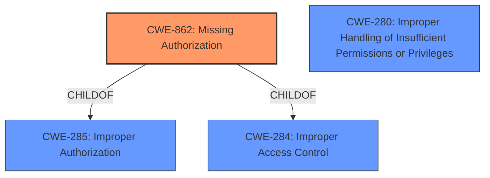

# Raw Analyzer Response for CVE-2022-47333

# Summary
| CWE ID | CWE Name | Confidence | CWE Abstraction Level | CWE Vulnerability Mapping Label | CWE-Vulnerability Mapping Notes |
|---|---|---|---|---|---|
| CWE-862 | Missing Authorization | 0.9 | Class | Primary CWE | Allowed-with-Review |
| CWE-280 | Improper Handling of Insufficient Permissions or Privileges | 0.7 | Base | Secondary Candidate | Allowed |

## Evidence and Confidence

*   **Confidence Score:** 0.8
*   **Evidence Strength:** HIGH

## Relationship Analysis
The primary CWE is CWE-862 (Missing Authorization), which is a Class-level CWE. It has child relationships with CWE-285 (Improper Authorization) and CWE-284 (Improper Access Control). CWE-280 (Improper Handling of Insufficient Permissions or Privileges) is at the Base level and could be a more specific alternative if the description explicitly mentioned that the software handled the insufficient permissions incorrectly. Since the vulnerability description only mentioned **missing permission check**, CWE-862 is more appropriate.

## Vulnerability Chain
The vulnerability chain starts with the **missing permission check** (CWE-862), leading to local information disclosure.
  - Missing Authorization (CWE-862) -> Local Information Disclosure

## Summary of Analysis
The initial analysis correctly identifies the root cause as a **missing permission check**, leading to local information disclosure. The vulnerability description key phrases clearly indicate the root cause. The primary CWE match from similar CVE descriptions is CWE-862, which aligns with the vulnerability description.

The analysis is primarily based on the provided evidence, specifically the vulnerability description and key phrases: "In wlan driver, there is a possible **missing permission check**. This could lead to local information disclosure."

The graph relationships helped understand that CWE-862 is a class-level CWE, and while more specific base-level CWEs exist, the current description does not provide enough information to map to a more specific CWE. The selected CWE is at the optimal level of specificity given the available information.

Relevant CWE Information:

# Enhanced Context (25 CWEs)

## CWE-280: Improper Handling of Insufficient Permissions or Privileges 
**Abstraction Level**: Base
**Similarity Score**: 0.79
**Source**: dense

**Description**:
The product does not handle or incorrectly handles when it has insufficient privileges to access resources or functionality as specified by their permissions. This may cause it to follow unexpected code paths that may leave the product in an invalid state.

**Mapping Guidance**:
- Usage: Allowed
- Rationale: This CWE entry is at the Base level of abstraction, which is a preferred level of abstraction for mapping to the root causes of vulnerabilities.

## CWE-862: Missing Authorization
**Abstraction:** Class
**Status:** Incomplete

### Description
The product does not perform an authorization check when an actor attempts to access a resource or perform an action.

### Observed Examples
- **CVE-2022-24730:** Go-based continuous deployment product does not check that a user has certain privileges to update or create an app, allowing adversaries to read sensitive repository information
- **CVE-2009-3168:** Web application does not restrict access to admin scripts, allowing authenticated users to reset administrative passwords.

Based on the vulnerability description, "In wlan driver, there is a possible **missing permission check**. This could lead to local information disclosure," the most appropriate CWE is CWE-862 (Missing Authorization). The vulnerability stems from the absence of a permission check, which directly aligns with the description of CWE-862. The impact is local information disclosure, which is a common consequence of missing authorization.

CWE-280 (Improper Handling of Insufficient Permissions or Privileges) was considered but not selected as the primary CWE because the vulnerability description specifically states that the permission check is **missing**, not that it's improperly handled.