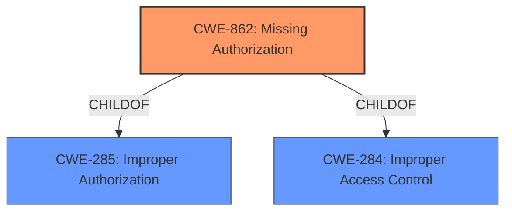

# Raw Analyzer Response for CVE-2022-47341

# Summary
| CWE ID | CWE Name | Confidence | CWE Abstraction Level | CWE Vulnerability Mapping Label | CWE-Vulnerability Mapping Notes |
|---|---|---|---|---|---|
| CWE-862 | Missing Authorization | 1.0 | Class | Allowed-with-Review | Primary CWE |

## Evidence and Confidence

*   **Confidence Score:** 1.0
*   **Evidence Strength:** HIGH

## Relationship Analysis
The primary CWE is CWE-862, Missing Authorization, which is a Class-level CWE. It directly addresses the root cause identified in the vulnerability description: a **missing permission check**. CWE-862 is a child of CWE-285 and CWE-284, both related to improper authorization. While there might be more specific Base-level children of CWE-862, the provided description doesn't offer enough detail to pinpoint a more precise variant.

## Vulnerability Chain
The vulnerability chain is straightforward:
1.  **Root Cause:** **Missing permission check** (CWE-862)
2.  **Impact:** Local escalation of privilege.

## Summary of Analysis
The vulnerability description explicitly states a **missing permission check** in engineermode services, directly leading to a local escalation of privilege. The phrase "**missing permission check**" strongly indicates that the software lacks a necessary authorization mechanism.

The Retriever Results list CWE-862, Missing Authorization, as the top candidate with a high score, reinforcing this assessment. While the Usage for CWE-862 is "Allowed-with-Review" because it is a Class-level CWE, the description doesn't provide sufficient information to refine the classification to a more specific Base-level CWE. Therefore, CWE-862 is the most appropriate and specific CWE based on the available evidence.

The analysis relies heavily on the vulnerability description's explicit mention of the **missing permission check**.

# Relevant CWE Information:

# Enhanced Context (25 CWEs)

## CWE-862: Missing Authorization
**Abstraction:** Class
**Status:** Incomplete

### Description
The product does not perform an authorization check when an actor attempts to access a resource or perform an action.