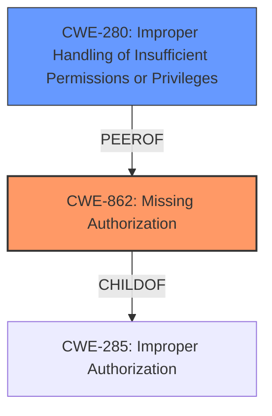

# Analysis Report for CVE-2022-47343

# Vulnerability Analysis Report: CVE-2022-47343

## Description


## Analysis (with Relationship Data)

# Summary
| CWE ID | CWE Name | Confidence | CWE Abstraction Level | CWE Vulnerability Mapping Label | CWE-Vulnerability Mapping Notes |
|---|---|---|---|---|---|
| CWE-862 | Missing Authorization | 0.9 | Class | Primary | Allowed-with-Review |
| CWE-280 | Improper Handling of Insufficient Permissions or Privileges  | 0.7 | Base | Secondary | Allowed |

## Evidence and Confidence

*   **Confidence Score:** 0.9
*   **Evidence Strength:** HIGH

## Relationship Analysis
The primary relationship influencing the CWE selection is the parent-child relationship between CWE-285 (Improper Authorization) and CWE-862 (Missing Authorization), as well as the close similarity with CWE-280. CWE-862 is a child of CWE-285, representing a more specific case where authorization is entirely missing. The vulnerability description indicates a **missing permission check**, which directly aligns with the concept of missing authorization.



## Vulnerability Chain
The chain of root cause and weakness that followed for the Vulnerability Description is:
1.  **Root Cause:** **Missing Permission Check** (CWE-862 Missing Authorization)
2.  **Impact:** Local Denial of Service

## Summary of Analysis
The initial analysis focused on identifying the most appropriate CWE for a **missing permission check** vulnerability. The vulnerability description clearly states that there is a **missing permission check** in engineermode services, which could lead to a local denial of service. The phrase "**missing permission check**" is strong evidence for a **missing authorization** issue.

The Retriever Results listed CWE-129 (Improper Validation of Array Index) as the top result. However, this CWE relates to array index validation, which is not directly relevant to the vulnerability description. The second result, CWE-862 (Missing Authorization), aligns perfectly with the **missing permission check** mentioned in the description. Therefore, CWE-862 is selected as the primary CWE.

CWE-280 (Improper Handling of Insufficient Permissions or Privileges) was also considered due to its similarity to CWE-862. However, CWE-862 is more specific because it explicitly addresses the absence of an authorization check, while CWE-280 covers broader scenarios where permissions or privileges are mishandled. I am overriding the retriever results due to the strong and direct evidence.

The relevant evidence from the vulnerability description is: "In engineermode services, there is a **missing permission check**." This statement directly supports the selection of CWE-862 (Missing Authorization).

The hierarchical relationships also influenced the selection. CWE-862 is a child of CWE-285 (Improper Authorization), making it a more specific and appropriate choice for a **missing authorization** issue.

CWE-862 is at the Class level of abstraction, and while the guidance suggests looking for Base-level children, there isn't a more specific CWE that fits the provided information.

Relevant CWE Information:

# Enhanced Context (25 CWEs)
The following CWEs were identified as potentially relevant to this vulnerability:

## CWE-280: Improper Handling of Insufficient Permissions or Privileges 
**Abstraction Level**: Base
**Similarity Score**: 0.80
**Source**: dense

**Description**:
The product does not handle or incorrectly handles when it has insufficient privileges to access resources or functionality as specified by their permissions. This may cause it to follow unexpected code paths that may leave the product in an invalid state.

**Mapping Guidance**:
- Usage: Allowed
- Rationale: This CWE entry is at the Base level of abstraction, which is a preferred level of abstraction for mapping to the root causes of vulnerabilities.

## CWE-862: Missing Authorization
**Abstraction:** Class
**Status:** Incomplete

### Description
The product does not perform an authorization check when an actor attempts to access a resource or perform an action.

### Extended Description
Not provided

### Alternative Terms
AuthZ: "AuthZ" is typically used as an abbreviation of "authorization" within the web application security community. It is distinct from "AuthN" (or, sometimes, "AuthC") which is an abbreviation of "authentication." The use of "Auth" as an abbreviation is discouraged, since it could be used for either authentication or authorization.

### Relationships
ChildOf -> CWE-285
ChildOf -> CWE-284

### Mapping Guidance
**Usage:** Allowed-with-Review
**Rationale:** This CWE entry is a Class and might have Base-level children that would be more appropriate
**Comments:** Examine children of this entry to see if there is a better fit
**Reasons:**
- Abstraction

### Additional Notes
**[Terminology]** Assuming a user with a given identity, authorization is the process of determining whether that user can access a given resource, based on the user's privileges and any permissions or other access-control specifications that apply to the resource.


## CWE Relationship Analysis

Current CWEs represent these abstraction levels: .


### Vulnerability Chain Analysis

**Chain starting from CWE-862:**
- 862 (Missing Authorization) - ROOT


**Chain starting from CWE-280:**
- 280 (Improper Handling of Insufficient Permissions or Privileges ) - ROOT


### CWE Relationship Diagram

```mermaid
graph TD
    classDef primary fill:#f96,stroke:#333,stroke-width:2px
    classDef secondary fill:#69f,stroke:#333
    classDef tertiary fill:#9e9,stroke:#333
```


*Report generated on 2025-03-30 21:29:33*
