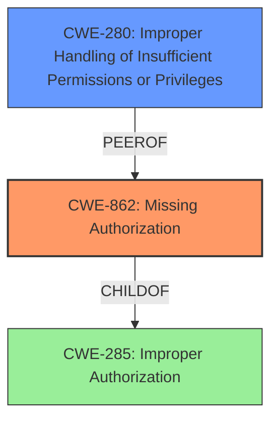

# Analysis for CVE-2022-47344

# Summary
| CWE ID  | CWE Name                                                      | Confidence | CWE Abstraction Level | CWE Vulnerability Mapping Label | CWE-Vulnerability Mapping Notes |
| :-------- | :------------------------------------------------------------ | :--------- | :---------------------- | :------------------------------ | :------------------------------ |
| CWE-862 | Missing Authorization                                          | 0.9        | Class                   | Primary                         | Allowed-with-Review             |
| CWE-280 | Improper Handling of Insufficient Permissions or Privileges | 0.7        | Base                    | Secondary                       | Allowed                         |

## Evidence and Confidence

*   **Confidence Score:** 0.8
*   **Evidence Strength:** MEDIUM

## Relationship Analysis
The primary relationship influencing the decision is the hierarchical one. CWE-862 **Missing Authorization** is a child of CWE-285 **Improper Authorization**. However, the description is clear about the authorization being missing, so the more specific CWE-862 is appropriate. CWE-280 **Improper Handling of Insufficient Permissions or Privileges** is also considered as an alternative to CWE-862 but determined that **Missing Authorization** is the best fit.

## Vulnerability Chain
The chain of root cause and weaknesses that followed for the Vulnerability Description:
1.  The **root cause** is a **missing permission check** in engineermode services.
2.  The **impact** is local denial of service.

## Summary of Analysis
The initial assessment, based on the vulnerability description and key phrases, points to a **missing permission check** as the root cause. The retriever results also suggest CWE-862 **Missing Authorization** as a strong candidate. The Unisoc webpage provides no information about the specific vulnerability.

The final decision is to assign CWE-862 **Missing Authorization** as the primary CWE because the vulnerability description explicitly mentions a **missing permission check**. This aligns perfectly with the definition of CWE-862.

The vulnerability description states: "In engineermode services, there is a **missing permission check**. This could lead to local denial of service in engineermode services."

CWE-862 is selected because it directly addresses the **missing authorization** issue. It's more specific than CWE-285, which covers both missing and incorrect authorization.

Relevant CWE Information:

# Enhanced Context (25 CWEs)

## CWE-280: Improper Handling of Insufficient Permissions or Privileges
**Abstraction Level**: Base
**Similarity Score**: 0.79
**Source**: dense

**Description**:
The product does not handle or incorrectly handles when it has insufficient privileges to access resources or functionality as specified by their permissions. This may cause it to follow unexpected code paths that may leave the product in an invalid state.

**Mapping Guidance**:
- Usage: Allowed
- Rationale: This CWE entry is at the Base level of abstraction, which is a preferred level of abstraction for mapping to the root causes of vulnerabilities.

## CWE-862: Missing Authorization
**Abstraction:** Class
**Status:** Incomplete

### Description
The product does not perform an authorization check when an actor attempts to access a resource or perform an action.

### Extended Description
Not provided

### Alternative Terms
AuthZ: "AuthZ" is typically used as an abbreviation of "authorization" within the web application security community. It is distinct from "AuthN" (or, sometimes, "AuthC") which is an abbreviation of "authentication." The use of "Auth" as an abbreviation is discouraged, since it could be used for either authentication or authorization.

### Relationships
ChildOf -> CWE-285
ChildOf -> CWE-284

### Mapping Guidance
**Usage:** Allowed-with-Review
**Rationale:** This CWE entry is a Class and might have Base-level children that would be more appropriate
**Comments:** Examine children of this entry to see if there is a better fit
**Reasons:**
- Abstraction

### Additional Notes
**[Terminology]** Assuming a user with a given identity, authorization is the process of determining whether that user can access a given resource, based on the user's privileges and any permissions or other access-control specifications that apply to the resource.

### Observed Examples
- **CVE-2022-24730:** Go-based continuous deployment product does not check that a user has certain privileges to update or create an app, allowing adversaries to read sensitive repository information
- **CVE-2009-3168:** Web application does not restrict access to admin scripts, allowing authenticated users to reset administrative passwords.
- **CVE-2009-3597:** Web application stores database file under the web root with insufficient access control (CWE-219), allowing direct request.

## CWE Selection Details:

*   **CWE-862: Missing Authorization**
    *   **Technical Explanation:** The engineermode services lack a mechanism to verify if the user has the necessary privileges to perform actions.
    *   **Security Implications:** An unauthorized user could potentially perform sensitive actions or access restricted resources, leading to a denial of service.
    *   **Relationship:** Child of CWE-285 Improper Authorization.
    *   **Mapping Guidance Influence:** The "Allowed-with-Review" usage is appropriate, as the description clearly states a **missing authorization** check.
*   **CWE-280: Improper Handling of Insufficient Permissions or Privileges**
    *   **Technical Explanation:** The services don't properly handle scenarios where permissions are insufficient, potentially leading to unexpected code paths and DoS.
    *   **Security Implications:** Unexpected behavior and potential DoS scenarios.
    *   **Relationship:** Peer of CWE-862
    *   **Mapping Guidance Influence:** The "Allowed" Usage is followed.

CWE-129 **Improper Validation of Array Index** and CWE-787 **Out-of-bounds Write** were considered because they were in the Top CWEs and Retriever Results, but they are not appropriate for this vulnerability, which concerns a **missing permission check**, not array indexing or memory management issues.