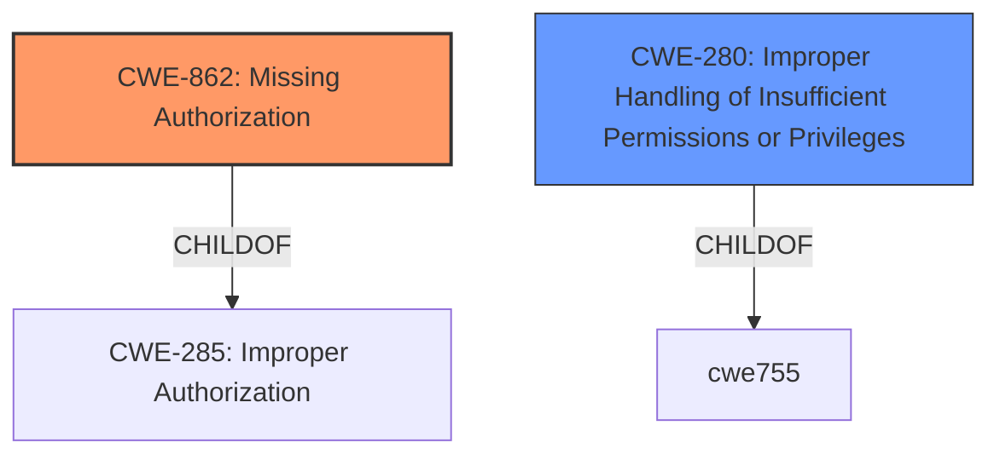

# Analysis for CVE-2022-47345

# Summary
| CWE ID | CWE Name | Confidence | CWE Abstraction Level | CWE Vulnerability Mapping Label | CWE-Vulnerability Mapping Notes |
|---|---|---|---|---|---|
| CWE-862 | Missing Authorization | 0.9 | Class | Primary | Allowed-with-Review |
| CWE-280 | Improper Handling of Insufficient Permissions or Privileges | 0.7 | Base | Secondary | Allowed |

## Evidence and Confidence

*   **Confidence Score:** 0.8
*   **Evidence Strength:** HIGH

## Relationship Analysis
The primary relationship that influenced my decision was the parent-child relationship between CWE-285 (Improper Authorization), CWE-862 (Missing Authorization), and CWE-280 (Improper Handling of Insufficient Permissions or Privileges). CWE-862 and CWE-280 are more specific than CWE-285. The relationship between CWE-862 and CWE-280 is less direct, but both relate to authorization issues. CWE-862 is the **missing** check, while CWE-280 captures the handling of **insufficient** permissions.

## Vulnerability Chain
The chain of events is as follows:
1.  **Root Cause:** **Missing permission check** (CWE-862)
2.  **Impact:** Local denial of service

## Summary of Analysis
The vulnerability description clearly states a **missing permission check** in engineermode services, leading to a local denial of service.

The primary CWE is CWE-862 (Missing Authorization). This aligns directly with the root cause: the system does not perform an authorization check before allowing access to certain functionality. The description of CWE-862 states: "The product does not perform an authorization check when an actor attempts to access a resource or perform an action." This directly matches the provided vulnerability description.

CWE-280 (Improper Handling of Insufficient Permissions or Privileges) is considered as a secondary CWE. While the description mentions a **missing permission check**, it implicitly involves the handling of insufficient permissions. If the permission check was present but the handling of insufficient permissions was incorrect, CWE-280 would have been more appropriate. However, due to the **missing** check, CWE-862 takes precedence.

CWE-129 (Improper Validation of Array Index) was the primary CWE match for similar CVE Descriptions, but is not applicable here because the vulnerability does not involve array indexing.

The evidence for CWE-862 is the phrase "**missing permission check**".

Relevant CWE Information:

# Enhanced Context (25 CWEs)

## CWE-280: Improper Handling of Insufficient Permissions or Privileges
**Abstraction Level**: Base
**Similarity Score**: 0.79
**Source**: dense

**Description**:
The product does not handle or incorrectly handles when it has insufficient privileges to access resources or functionality as specified by their permissions. This may cause it to follow unexpected code paths that may leave the product in an invalid state.

**Mapping Guidance**:
- Usage: Allowed
- Rationale: This CWE entry is at the Base level of abstraction, which is a preferred level of abstraction for mapping to the root causes of vulnerabilities.

## CWE-862: Missing Authorization
**Abstraction:** Class
**Status:** Incomplete

### Description
The product does not perform an authorization check when an actor attempts to access a resource or perform an action.

### Extended Description
Not provided

### Alternative Terms
AuthZ: "AuthZ" is typically used as an abbreviation of "authorization" within the web application security community. It is distinct from "AuthN" (or, sometimes, "AuthC") which is an abbreviation of "authentication." The use of "Auth" as an abbreviation is discouraged, since it could be used for either authentication or authorization.

### Relationships
ChildOf -> CWE-285
ChildOf -> CWE-284

### Mapping Guidance
**Usage:** Allowed-with-Review
**Rationale:** This CWE entry is a Class and might have Base-level children that would be more appropriate
**Comments:** Examine children of this entry to see if there is a better fit
**Reasons:**
- Abstraction

### Additional Notes
**[Terminology]** Assuming a user with a given identity, authorization is the process of determining whether that user can access a given resource, based on the user's privileges and any permissions or other access-control specifications that apply to the resource.