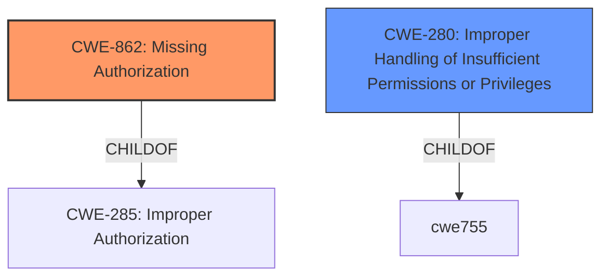

# Raw Analyzer Response for CVE-2022-47347

# Summary
| CWE ID | CWE Name | Confidence | CWE Abstraction Level | CWE Vulnerability Mapping Label | CWE-Vulnerability Mapping Notes |
|---|---|---|---|---|---|
| CWE-862 | Missing Authorization | 0.9 | Class | Primary | Allowed-with-Review |
| CWE-280 | Improper Handling of Insufficient Permissions or Privileges | 0.7 | Base | Secondary | Allowed |

## Evidence and Confidence

*   **Confidence Score:** 0.9
*   **Evidence Strength:** HIGH

## Relationship Analysis
The primary relationship that impacted the decision was the parent-child relationship between CWE-285 (Improper Authorization) and its children, particularly CWE-862 (Missing Authorization) and CWE-863 (Incorrect Authorization). The description clearly indicates a **missing permission check**, which directly aligns with the concept of missing authorization, making CWE-862 a more specific and appropriate choice than its parent, CWE-285.

## Vulnerability Chain
The vulnerability chain starts with the **missing permission check** (CWE-862), which leads to a local denial of service.

## Summary of Analysis
The initial analysis focused on identifying the root cause of the vulnerability. The vulnerability description clearly states "**missing permission check**", which directly corresponds to the concept of missing authorization. The Retriever Results also indicated CWE-862 (Missing Authorization) and CWE-280 (Improper Handling of Insufficient Permissions or Privileges) as relevant.

CWE-862 (Missing Authorization) was chosen as the primary CWE because it accurately reflects the root cause. The vulnerability description explicitly mentions a **missing permission check**, which aligns perfectly with the definition of CWE-862.

CWE-280 (Improper Handling of Insufficient Permissions or Privileges) was considered as a secondary CWE because the **missing permission check** can be viewed as a case where the system does not properly handle the scenario where the user lacks the necessary permissions.

The selected CWEs are at the optimal level of specificity because they directly address the root cause and its potential consequences. CWE-862 is a Class-level CWE, but its description is the most fitting for the provided vulnerability description.

Relevant CWE Information:

# Enhanced Context (25 CWEs)

## CWE-280: Improper Handling of Insufficient Permissions or Privileges 
**Abstraction Level**: Base
**Similarity Score**: 0.79
**Source**: dense

**Description**:
The product does not handle or incorrectly handles when it has insufficient privileges to access resources or functionality as specified by their permissions. This may cause it to follow unexpected code paths that may leave the product in an invalid state.

**Mapping Guidance**:
- Usage: Allowed
- Rationale: This CWE entry is at the Base level of abstraction, which is a preferred level of abstraction for mapping to the root causes of vulnerabilities.

## CWE-862: Missing Authorization
**Abstraction:** Class
**Status:** Incomplete

### Description
The product does not perform an authorization check when an actor attempts to access a resource or perform an action.

### Extended Description
Not provided

### Alternative Terms
AuthZ: "AuthZ" is typically used as an abbreviation of "authorization" within the web application security community. It is distinct from "AuthN" (or, sometimes, "AuthC") which is an abbreviation of "authentication." The use of "Auth" as an abbreviation is discouraged, since it could be used for either authentication or authorization.

### Relationships
ChildOf -> CWE-285
ChildOf -> CWE-284

### Mapping Guidance
**Usage:** Allowed-with-Review
**Rationale:** This CWE entry is a Class and might have Base-level children that would be more appropriate
**Comments:** Examine children of this entry to see if there is a better fit
**Reasons:**
- Abstraction

## CWE Selection Details

*   **CWE-862: Missing Authorization**
    *   **Explanation:** The vulnerability description explicitly states a **missing permission check**, which is the core characteristic of CWE-862. The product fails to verify whether the actor has the necessary privileges to perform an action, directly leading to the vulnerability.
    *   **Justification:** The term "missing permission check" is a direct indicator for missing authorization.
    *   **Confidence:** 0.9

*   **CWE-280: Improper Handling of Insufficient Permissions or Privileges**
    *   **Explanation:** This CWE is considered as a secondary factor because the **missing permission check** results in improper handling of the case where the user doesn't have enough privileges. The system doesn't handle the insufficient privileges correctly.
    *   **Justification:** The **missing permission check** translates to improper handling of insufficient privileges.
    *   **Confidence:** 0.7

**CWEs Considered But Not Used:**

*   **CWE-129 Improper Validation of Array Index:** This CWE was in the similar CVE descriptions, but it does not match the provided evidence. The vulnerability description does not indicate any array index issues.
*   **CWE-863 Incorrect Authorization:** While related to authorization, this CWE implies that an authorization check is performed but is done incorrectly. The vulnerability description states the check is completely missing, which is a more accurate fit for CWE-862.