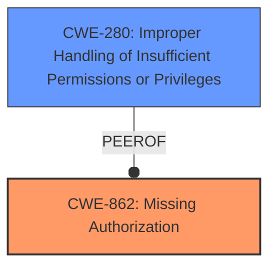

# Analysis Report for CVE-2022-47357

# Vulnerability Analysis Report: CVE-2022-47357

## Description


## Analysis (with Relationship Data)

# Summary
| CWE ID  | CWE Name                     | Confidence | CWE Abstraction Level | CWE Vulnerability Mapping Label | CWE-Vulnerability Mapping Notes |
|---------|------------------------------|------------|-----------------------|---------------------------------|-----------------------------------|
| CWE-862 | Missing Authorization        | 0.9        | Class                 | Allowed-with-Review             | Primary CWE                      |
| CWE-280 | Improper Handling of Insufficient Permissions or Privileges | 0.6        | Base                  | Allowed             | Secondary CWE              |

## Evidence and Confidence

*   **Confidence Score:** 0.8
*   **Evidence Strength:** HIGH

## Relationship Analysis
The primary relationship impacting the decision is the hierarchical relationship between CWE-862 **Missing Authorization** and its potential children, as well as the relationship to CWE-280 **Improper Handling of Insufficient Permissions or Privileges**. The vulnerability description explicitly mentions a **missing permission check**, which directly relates to the concept of authorization. The analysis considered whether a more specific child of CWE-862 would be a better fit, but none were specific enough. CWE-280 was added as a secondary as it focuses on the handling of insufficient privileges, which relates to the **missing permission check**.



## Vulnerability Chain
The vulnerability chain starts with the **missing permission check** (CWE-862), which directly leads to a local denial of service. There are no other weaknesses listed that are explicitly triggered in the chain.

## Summary of Analysis
The initial analysis strongly pointed towards CWE-862 **Missing Authorization** due to the vulnerability description key phrase **missing permission check**. This is a critical aspect of authorization. The Retriever Results also listed CWE-862 as the top combined result.

The decision to select CWE-862 is primarily based on the explicit mention of a **missing permission check** in the vulnerability description.

The choice of CWE-862 is at the Class level because the description lacks specific details to pinpoint a more precise Base or Variant. There isn't enough information to determine the specifics of how the authorization is missing, just that it *is* missing. Selecting a more specific CWE would require making assumptions beyond the provided evidence.

The secondary CWE, CWE-280, was chosen to indicate that the vulnerability is based on insufficient privileges.

Relevant CWE Information:

# Enhanced Context (25 CWEs)
The following CWEs were identified as potentially relevant to this vulnerability:

## CWE-280: Improper Handling of Insufficient Permissions or Privileges
**Abstraction Level**: Base
**Similarity Score**: 0.77
**Source**: dense

**Description**:
The product does not handle or incorrectly handles when it has insufficient privileges to access resources or functionality as specified by their permissions. This may cause it to follow unexpected code paths that may leave the product in an invalid state.

**Mapping Guidance**:
- Usage: Allowed
- Rationale: This CWE entry is at the Base level of abstraction, which is a preferred level of abstraction for mapping to the root causes of vulnerabilities.

## CWE-862: Missing Authorization
**Abstraction:** Class
**Status:** Incomplete

### Description
The product does not perform an authorization check when an actor attempts to access a resource or perform an action.

### Extended Description
Not provided

### Alternative Terms
AuthZ: "AuthZ" is typically used as an abbreviation of "authorization" within the web application security community. It is distinct from "AuthN" (or, sometimes, "AuthC") which is an abbreviation of "authentication." The use of "Auth" as an abbreviation is discouraged, since it could be used for either authentication or authorization.

### Relationships
ChildOf -> CWE-285
ChildOf -> CWE-284

### Mapping Guidance
**Usage:** Allowed-with-Review
**Rationale:** This CWE entry is a Class and might have Base-level children that would be more appropriate
**Comments:** Examine children of this entry to see if there is a better fit
**Reasons:**
- Abstraction

### Additional Notes
**[Terminology]** Assuming a user with a given identity, authorization is the process of determining whether that user can access a given resource, based on the user's privileges and any permissions or other access-control specifications that apply to the resource.
### Observed Examples
- **CVE-2022-24730:** Go-based continuous deployment product does not check that a user has certain privileges to update or create an app, allowing adversaries to read sensitive repository information
- **CVE-2009-3168:** Web application does not restrict access to admin scripts, allowing authenticated users to reset administrative passwords.
- **CVE-2009-3597:** Web application stores database file under the web root with insufficient access control (CWE-219), allowing direct request.


## CWE Relationship Analysis

Current CWEs represent these abstraction levels: .


### Vulnerability Chain Analysis

**Chain starting from CWE-862:**
- 862 (Missing Authorization) - ROOT


**Chain starting from CWE-280:**
- 280 (Improper Handling of Insufficient Permissions or Privileges ) - ROOT


### CWE Relationship Diagram

```mermaid
graph TD
    classDef primary fill:#f96,stroke:#333,stroke-width:2px
    classDef secondary fill:#69f,stroke:#333
    classDef tertiary fill:#9e9,stroke:#333
```


*Report generated on 2025-03-31 04:00:18*
