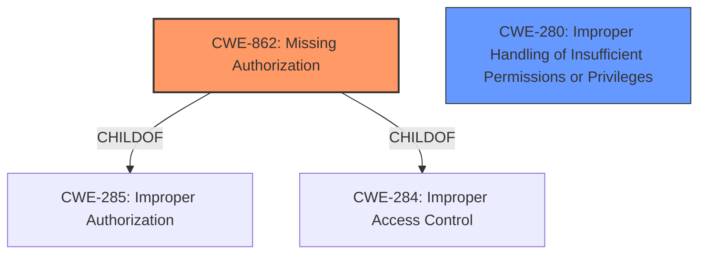

# Analysis for CVE-2022-47360

# Summary
| CWE ID | CWE Name | Confidence | CWE Abstraction Level | CWE Vulnerability Mapping Label | CWE-Vulnerability Mapping Notes |
|---|---|---|---|---|---|
| CWE-862 | Missing Authorization | 0.9 | Class | Primary | Allowed-with-Review |
| CWE-280 | Improper Handling of Insufficient Permissions or Privileges | 0.7 | Base | Secondary | Allowed |

## Evidence and Confidence

*   **Confidence Score:** 0.8
*   **Evidence Strength:** MEDIUM

## Relationship Analysis
The primary CWE is CWE-862 [Missing Authorization], which is a Class-level CWE. The vulnerability description explicitly mentions a **missing permission check**, which aligns well with the description of CWE-862. CWE-862 is a parent of CWE-285 [Improper Authorization] and CWE-284 [Improper Access Control]. Since the description only specifies a **missing permission check** and doesn't give details of the authorization process, the class level is more appropriate. CWE-280 [Improper Handling of Insufficient Permissions or Privileges] is related because the **missing permission check** means that the privileges are not being sufficiently handled, so it is added as a secondary CWE.

## Vulnerability Chain
The chain of the vulnerability is: **Missing permission check** (CWE-862) leading to local denial of service.

## Summary of Analysis
The initial analysis focused on the **missing permission check** as the root cause of the vulnerability. This aligns with the definition of CWE-862 [Missing Authorization], which describes the product not performing an authorization check.

The evidence supporting this decision comes directly from the "Vulnerability Description Key Phrases", which indicates a **rootcause** of "**missing permission check**."

The graph relationships influenced the selection by highlighting the hierarchical nature of CWE-862, allowing for consideration of more specific child CWEs if the evidence supported it. However, the description is limited, so a Class-level CWE is optimal.

The selected CWEs are at the optimal level of specificity because the provided evidence clearly indicates the absence of a permission check (CWE-862) and the consequences of this **missing permission check** leads to insufficient handling of permissions or privileges (CWE-280).

Relevant CWE Information:
# Enhanced Context (25 CWEs)
The following CWEs were identified as potentially relevant to this vulnerability:

## CWE-280: Improper Handling of Insufficient Permissions or Privileges
**Abstraction Level**: Base
**Similarity Score**: 0.77
**Source**: dense

**Description**:
The product does not handle or incorrectly handles when it has insufficient privileges to access resources or functionality as specified by their permissions. This may cause it to follow unexpected code paths that may leave the product in an invalid state.

**Mapping Guidance**:
- Usage: Allowed
- Rationale: This CWE entry is at the Base level of abstraction, which is a preferred level of abstraction for mapping to the root causes of vulnerabilities.

## CWE-862: Missing Authorization
**Abstraction:** Class
**Status:** Incomplete

### Description
The product does not perform an authorization check when an actor attempts to access a resource or perform an action.

### Extended Description
Not provided

### Alternative Terms
AuthZ: "AuthZ" is typically used as an abbreviation of "authorization" within the web application security community. It is distinct from "AuthN" (or, sometimes, "AuthC") which is an abbreviation of "authentication." The use of "Auth" as an abbreviation is discouraged, since it could be used for either authentication or authorization.

### Relationships
ChildOf -> CWE-285
ChildOf -> CWE-284

### Mapping Guidance
**Usage:** Allowed-with-Review
**Rationale:** This CWE entry is a Class and might have Base-level children that would be more appropriate
**Comments:** Examine children of this entry to see if there is a better fit
**Reasons:**
- Abstraction
### Additional Notes
**[Terminology]** Assuming a user with a given identity, authorization is the process of determining whether that user can access a given resource, based on the user's privileges and any permissions or other access-control specifications that apply to the resource.
### Observed Examples
- **CVE-2022-24730:** Go-based continuous deployment product does not check that a user has certain privileges to update or create an app, allowing adversaries to read sensitive repository information
- **CVE-2009-3168:** Web application does not restrict access to admin scripts, allowing authenticated users to reset administrative passwords.
- **CVE-2009-3597:** Web application stores database file under the web root with insufficient access control (CWE-219), allowing direct request.