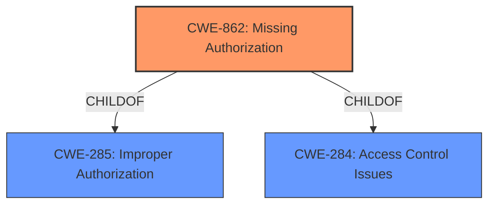

# Enhanced Analysis for CVE-2022-47367

# Summary
| CWE ID | CWE Name | Confidence | CWE Abstraction Level | CWE Vulnerability Mapping Label | CWE-Vulnerability Mapping Notes |
|---|---|---|---|---|---|
| CWE-862 | Missing Authorization | 1.0 | Class | Primary | Allowed-with-Review |

## Evidence and Confidence

*   **Confidence Score:** 1.0
*   **Evidence Strength:** HIGH

## Relationship Analysis
The primary CWE, CWE-862, is a class-level weakness. It has parent relationships with CWE-285 (Improper Authorization) and CWE-284 (Access Control Issues). Given the provided information, there are no specific details available to select a more specific, base-level child of CWE-862.



## Vulnerability Chain
The vulnerability chain is straightforward: **Missing permission check** (CWE-862) leads to local information disclosure.

## Summary of Analysis
The analysis is based on the provided vulnerability description, which explicitly states a **missing permission check** as the root cause, leading to local information disclosure.

The vulnerability description key phrases clearly state:
*   **rootcause:** **missing permission check**
*   **impact:** local information disclosure

The primary CWE match in the provided data is CWE-862, which aligns perfectly with the **missing permission check**. The evidence provided is sufficient and directly supports the classification of CWE-862. The decision is based on the root cause description and is at the appropriate level of specificity, as no further details are given to select a more specific CWE.

Relevant CWE Information:

## CWE-404: Improper Resource Shutdown or Release
**Why Not Used**: Irrelevant, the description mentions resource shutdown.

## CWE-667: Improper Locking
**Why Not Used**: Irrelevant, the description mentions locking of resources.

## CWE-665: Improper Initialization
**Why Not Used**: Irrelevant, the description mentions initialization of resources.

## CWE-226: Sensitive Information in Resource Not Removed Before Reuse
**Why Not Used**: Irrelevant, the description mentions removing information from resources.

## CWE-754: Improper Check for Unusual or Exceptional Conditions
**Why Not Used**: Irrelevant, the description mentions unusual conditions.

## CWE-1289: Improper Validation of Unsafe Equivalence in Input
**Why Not Used**: Irrelevant, the description mentions validation of input.

## CWE-662: Improper Synchronization
**Why Not Used**: Irrelevant, the description mentions synchronization of resources.

## CWE-703: Improper Check or Handling of Exceptional Conditions
**Why Not Used**: Irrelevant, the description mentions handling exceptional conditions.

## CWE-909: Missing Initialization of Resource
**Why Not Used**: Irrelevant, the description mentions initialization of resources.

## CWE-280: Improper Handling of Insufficient Permissions or Privileges
**Why Not Used**: Irrelevant, the description mentions handling permissions.

## CWE-252: Unchecked Return Value
**Why Not Used**: Irrelevant, the description mentions return values.

## CWE-362: Concurrent Execution using Shared Resource with Improper Synchronization ('Race Condition')
**Why Not Used**: Irrelevant, the description mentions concurrent execution.

## CWE-476: NULL Pointer Dereference
**Why Not Used**: Irrelevant, the description mentions null pointers.

## CWE-178: Improper Handling of Case Sensitivity
**Why Not Used**: Irrelevant, the description mentions case sensitivity.

## CWE-367: Time-of-check Time-of-use (TOCTOU) Race Condition
**Why Not Used**: Irrelevant, the description mentions TOCTOU.

## CWE-416: Use After Free
**Why Not Used**: Irrelevant, the description mentions use after free.

## CWE-386: Symbolic Name not Mapping to Correct Object
**Why Not Used**: Irrelevant, the description mentions mapping objects.

## CWE-908: Use of Uninitialized Resource
**Why Not Used**: Irrelevant, the description mentions uninitialized resources.

## CWE-364: Signal Handler Race Condition
**Why Not Used**: Irrelevant, the description mentions race conditions with signal handlers.

## CWE-1265: Unintended Reentrant Invocation of Non-reentrant Code Via Nested Calls
**Why Not Used**: Irrelevant, the description mentions reentrant code.

## CWE-609: Double-Checked Locking
**Why Not Used**: Irrelevant, the description mentions double-checked locking.


## CWE Relationship Analysis

Current CWEs represent these abstraction levels: .


### Vulnerability Chain Analysis

**Chain starting from CWE-908:**
- 908 (Use of Uninitialized Resource) - ROOT


**Chain starting from CWE-609:**
- 609 (Double-Checked Locking) - ROOT


### CWE Relationship Diagram

```mermaid
graph TD
    classDef primary fill:#f96,stroke:#333,stroke-width:2px
    classDef secondary fill:#69f,stroke:#333
    classDef tertiary fill:#9e9,stroke:#333
```