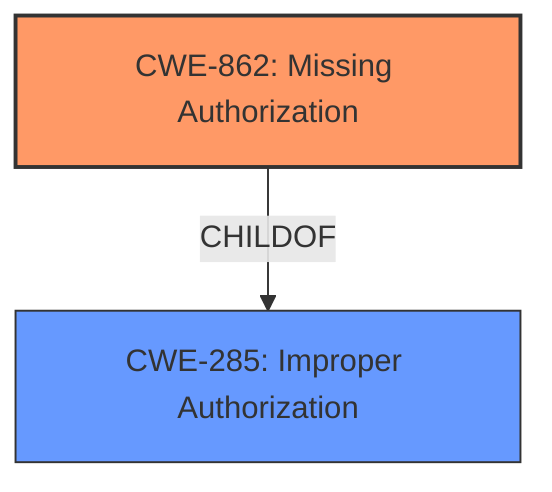

# Analysis Report for CVE-2022-47461

# Vulnerability Analysis Report: CVE-2022-47461

## Description


## Analysis (with Relationship Data)

# Summary
| CWE ID | CWE Name | Confidence | CWE Abstraction Level | CWE Vulnerability Mapping Label | CWE-Vulnerability Mapping Notes |
|---|---|---|---|---|---|
| CWE-862 | Missing Authorization | 1.0 | Class | Allowed-with-Review | Primary CWE |
| CWE-285 | Improper Authorization | 0.5 | Class | Discouraged | Secondary Candidate |

## Evidence and Confidence

*   **Confidence Score:** 1.0
*   **Evidence Strength:** HIGH

## Relationship Analysis
The primary CWE is CWE-862 **Missing Authorization**, which is a child of CWE-285 **Improper Authorization**. The relationship shows that CWE-862 is a more specific case of **Improper Authorization**, where the authorization check is simply missing.



## Vulnerability Chain
The chain of events is as follows:
1.  **Root Cause:** **Missing permission check** (CWE-862)
2.  **Impact:** Local escalation of privilege

## Summary of Analysis
The vulnerability description clearly states a **missing permission check**, leading to local privilege escalation in a telephone service.

The primary CWE match from similar CVE descriptions is CWE-862 **Missing Authorization**, which aligns perfectly with the **root cause** identified in the vulnerability description key phrases. The retriever results also list CWE-862 as the top candidate.

CWE-862 is a Class-level CWE, and the mapping guidance suggests reviewing child CWEs for a better fit. However, the description explicitly mentions a **missing permission check**, making CWE-862 the most appropriate choice.

CWE-285 **Improper Authorization** was considered as a parent of CWE-862, but it is less specific since it covers all types of authorization failures, not just missing checks. Therefore, CWE-862 is the optimal level of specificity.

The evidence for the **missing permission check** is found in the "Vulnerability Description Key Phrases" section.

Relevant CWE Information:

# Enhanced Context (25 CWEs)
The following CWEs were identified as potentially relevant to this vulnerability:

## CWE-1289: Improper Validation of Unsafe Equivalence in Input
**Abstraction Level**: Base
**Similarity Score**: 0.81
**Source**: dense

**Description**:
The product receives an input value that is used as a resource identifier or other type of reference, but it does not validate or incorrectly validates that the input is equivalent to a potentially-unsafe value.

**Mapping Guidance**:
- Usage: Allowed
- Rationale: This CWE entry is at the Base level of abstraction, which is a preferred level of abstraction for mapping to the root causes of vulnerabilities.

## CWE-862: Missing Authorization
**Abstraction:** Class
**Status:** Incomplete

### Description
The product does not perform an authorization check when an actor attempts to access a resource or perform an action.

### Extended Description
Not provided

### Alternative Terms
AuthZ: "AuthZ" is typically used as an abbreviation of "authorization" within the web application security community. It is distinct from "AuthN" (or, sometimes, "AuthC") which is an abbreviation of "authentication." The use of "Auth" as an abbreviation is discouraged, since it could be used for either authentication or authorization.

### Relationships
ChildOf -> CWE-285
ChildOf -> CWE-284

### Mapping Guidance
**Usage:** Allowed-with-Review
**Rationale:** This CWE entry is a Class and might have Base-level children that would be more appropriate
**Comments:** Examine children of this entry to see if there is a better fit
**Reasons:**
- Abstraction

### Additional Notes
**[Terminology]** Assuming a user with a given identity, authorization is the process of determining whether that user can access a given resource, based on the user's privileges and any permissions or other access-control specifications that apply to the resource.

### Observed Examples
- **CVE-2022-24730:** Go-based continuous deployment product does not check that a user has certain privileges to update or create an app, allowing adversaries to read sensitive repository information
- **CVE-2009-3168:** Web application does not restrict access to admin scripts, allowing authenticated users to reset administrative passwords.
- **CVE-2009-3597:** Web application stores database file under the web root with insufficient access control (CWE-219), allowing direct request.

## CWE-285: Improper Authorization
**Abstraction:** Class
**Status:** Stable

### Description
The product does not perform or incorrectly performs an authorization check when an actor attempts to access a resource or perform an action.

### Extended Description
Authorization is the process of determining whether a user is allowed to have a certain resource, or perform a particular action.

An authorization weakness occurs when there is missing or incorrect authorization for access to a resource or execution of code. This allows unintended access to functionality or data.

There are many factors that can contribute to improper authorization. The product may not use an authentication mechanism at all (see CWE-306). The product may use an authentication mechanism, but it does not prevent an attacker from bypassing it (see CWE-287). The product might not perform any authorization checks after authentication (see CWE-862). The product might not use the correct information to perform the authorization check (see CWE-863). The product might perform the check but then allow the attacker to perform actions that violate the authorization scheme (see CWE-275). The product might not properly invalidate authorization upon logout (see CWE-384).

### Alternative Terms
AuthZ: "AuthZ" is typically used as an abbreviation of "authorization" within the web application security community. It is distinct from "AuthN" (or, sometimes, "AuthC") which is an abbreviation of "authentication." The use of "Auth" as an abbreviation is discouraged, since it could be used for either authentication or authorization.

### Relationships
ChildOf -> CWE-284

### Mapping Guidance
**Usage:** Discouraged
**Rationale:** CWE-285 is high-level and lower-level CWEs can frequently be used instead. It is a level-1 Class (i.e., a child of a Pillar).
**Comments:** Consider children of this entry to see if there is a better fit.
**Reasons:**
- Abstraction

### Additional Notes
**[Terminology]** 

Authorization is distinct from authentication. Authentication is the process of verifying that someone is who they claim to be. Authorization determines if that person is allowed to access a certain resource.

**[Terminology]** 

Authorization is distinct from privileges. Privileges are granted to actors such as users, while authorization is the process of determining whether those privileges are sufficient to allow the actor to perform a certain action.

### Observed Examples
- **CVE-2023-43269:** Improper Authorization vulnerability in microService-unified-gateway prior to commit 8478f1f7706e88e67d4af694b9c4590ebdd221a0 allows a remote attacker to execute arbitrary code.
- **CVE-2023-42812:** Improper Authorization in GitHub repository francoisjacquet/rosariosis prior to 12.3.
- **CVE-2023-41267:** Improper Authorization in GitHub repository ikubernetes/ikubo prior to v1.15.0.


## CWE Relationship Analysis

Current CWEs represent these abstraction levels: .


### Vulnerability Chain Analysis

**Chain starting from CWE-862:**
- 862 (Missing Authorization) - ROOT


**Chain starting from CWE-1289:**
- 1289 (Improper Validation of Unsafe Equivalence in Input) - ROOT


### CWE Relationship Diagram

```mermaid
graph TD
    classDef primary fill:#f96,stroke:#333,stroke-width:2px
    classDef secondary fill:#69f,stroke:#333
    classDef tertiary fill:#9e9,stroke:#333
```


*Report generated on 2025-03-31 07:34:32*
