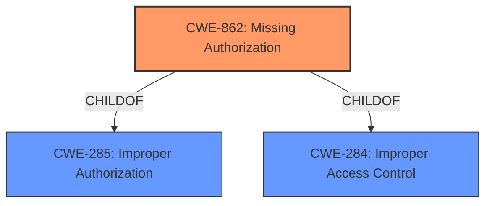

# Analysis for CVE-2022-47473

# Summary
| CWE ID  | CWE Name                   | Confidence | CWE Abstraction Level | CWE Vulnerability Mapping Label | CWE-Vulnerability Mapping Notes |
| :------- | :-------------------------- | :--------- | :--------------------- | :----------------------------- | :----------------------------- |
| CWE-862 | Missing Authorization  | 1          | Class                | Primary                        | Allowed-with-Review            |

## Evidence and Confidence

*   **Confidence Score:** 1
*   **Evidence Strength:** HIGH

## Relationship Analysis
The primary identified weakness is CWE-862 [Missing Authorization], which is a Class-level CWE. While it has child CWEs, none are more specific to the provided vulnerability description, which indicates a general **missing permission check**. It is a child of CWE-285 [Improper Authorization], highlighting its place within the broader authorization context. No specific chain relationships are apparent from the provided information.

## Vulnerability Chain
The vulnerability chain is straightforward: a **missing permission check** (CWE-862) leads directly to local information disclosure. The root cause is the lack of authorization, and the impact is the exposure of sensitive information.

## Summary of Analysis
The analysis is based on the vulnerability description, which explicitly mentions a **missing permission check** in the telephony service. This directly corresponds to CWE-862 [Missing Authorization], which describes a situation where a product does not perform an authorization check when an actor attempts to access a resource or perform an action. The impact, as stated, is local information disclosure.

The primary evidence is in the "Vulnerability Description Key Phrases" section:
- **rootcause:** **missing permission check**
- **impact:** local information disclosure

The CWE for similar CVE Descriptions section also suggests CWE-862 as the primary match.

The Retriever Results also ranked CWE-862 [Missing Authorization] as the top match.

Given the direct evidence and the recommendations, CWE-862 is the most appropriate choice. The mapping guidance for CWE-862 suggests reviewing its children for a better fit, but none of the children offer a more specific classification given the available information. Therefore, I am overriding the "Examine children of this entry to see if there is a better fit" comment, because the description indicates a general lack of authorization check.

Relevant CWE Information:

# Enhanced Context (25 CWEs)

## CWE-862: Missing Authorization
**Abstraction:** Class
**Status:** Incomplete

### Description
The product does not perform an authorization check when an actor attempts to access a resource or perform an action.

### Extended Description
Not provided

### Alternative Terms
AuthZ: "AuthZ" is typically used as an abbreviation of "authorization" within the web application security community. It is distinct from "AuthN" (or, sometimes, "AuthC") which is an abbreviation of "authentication." The use of "Auth" as an abbreviation is discouraged, since it could be used for either authentication or authorization.

### Relationships
ChildOf -> CWE-285
ChildOf -> CWE-284

### Mapping Guidance
**Usage:** Allowed-with-Review
**Rationale:** This CWE entry is a Class and might have Base-level children that would be more appropriate
**Comments:** Examine children of this entry to see if there is a better fit
**Reasons:**
- Abstraction

### Additional Notes
**[Terminology]** Assuming a user with a given identity, authorization is the process of determining whether that user can access a given resource, based on the user's privileges and any permissions or other access-control specifications that apply to the resource.

### Observed Examples
- **CVE-2022-24730:** Go-based continuous deployment product does not check that a user has certain privileges to update or create an app, allowing adversaries to read sensitive repository information
- **CVE-2009-3168:** Web application does not restrict access to admin scripts, allowing authenticated users to reset administrative passwords.
- **CVE-2009-3597:** Web application stores database file under the web root with insufficient access control (CWE-219), allowing direct request.

CWE-863 [Incorrect Authorization] was considered because it relates to authorization issues, but the vulnerability description explicitly states "**missing permission check**," indicating the absence of any authorization mechanism rather than an incorrect one. Therefore, CWE-862 is more accurate.

CWE-20 [Improper Input Validation] was also considered, as input validation is a common security measure. However, the root cause is specifically a **missing permission check**, not a failure to validate input. Therefore, CWE-20 is not appropriate.