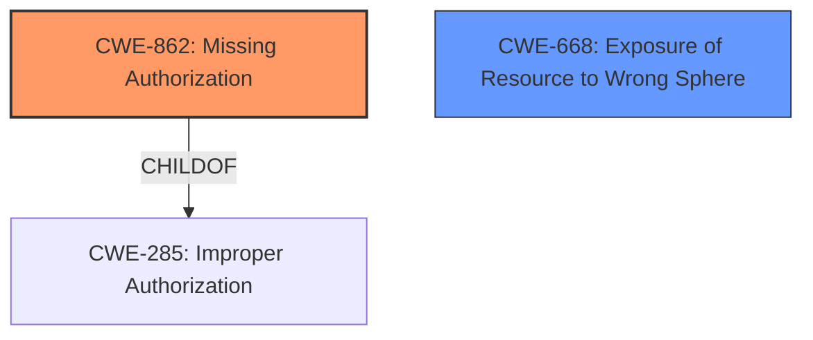

# Raw Analyzer Response for CVE-2022-47474

# Summary
| CWE ID | CWE Name | Confidence | CWE Abstraction Level | CWE Vulnerability Mapping Label | CWE-Vulnerability Mapping Notes |
|---|---|---|---|---|---|
| CWE-862 | Missing Authorization | 1.0 | Class | Allowed-with-Review | Primary CWE |
| CWE-668 | Exposure of Resource to Wrong Sphere | 0.7 | Base | Allowed | Secondary Candidate |

## Evidence and Confidence

*   **Confidence Score:** 0.9
*   **Evidence Strength:** HIGH

## Relationship Analysis
The primary CWE is CWE-862 [CWE-862: Missing Authorization], which is a Class-level CWE. The retriever results suggest that CWE-862 is a strong candidate. CWE-862 is a parent of more specific Base-level CWEs. While a more specific CWE would be ideal, the provided information does not give enough details to determine a better fit. CWE-668 [CWE-668: Exposure of Resource to Wrong Sphere] is also considered as a secondary CWE because information intended for a specific component/user might be exposed to others due to the **missing permission check**.

## Vulnerability Chain
The chain of events is as follows:
1.  **Root Cause:** **Missing permission check** (CWE-862 [CWE-862: Missing Authorization])
2.  **Impact:** Local information disclosure (CWE-668 [CWE-668: Exposure of Resource to Wrong Sphere])

## Summary of Analysis
The initial assessment focuses on the **missing permission check** as the root cause, leading to local information disclosure.

The evidence supporting the selection of CWE-862 [CWE-862: Missing Authorization] is derived directly from the "Vulnerability Description Key Phrases," which identifies "**missing permission check**" as the root cause. This aligns precisely with the description of CWE-862, which states, "The product does not perform an authorization check when an actor attempts to access a resource or perform an action."

The selection of CWE-668 [CWE-668: Exposure of Resource to Wrong Sphere] is based on the vulnerability's impact, which is "local information disclosure." This suggests that information intended for a specific component or user is being exposed to others due to the **missing authorization**.

The graph relationships show that CWE-862 [CWE-862: Missing Authorization] is a child of CWE-285 [CWE-285: Improper Authorization], indicating a hierarchical relationship. While CWE-285 could be considered, CWE-862 is more specific to the **missing permission check**, making it a better fit.

The chosen CWEs are at the optimal level of specificity because they directly address the root cause (**missing permission check**) and the resulting impact (local information disclosure). Further refinement may be possible with additional information.