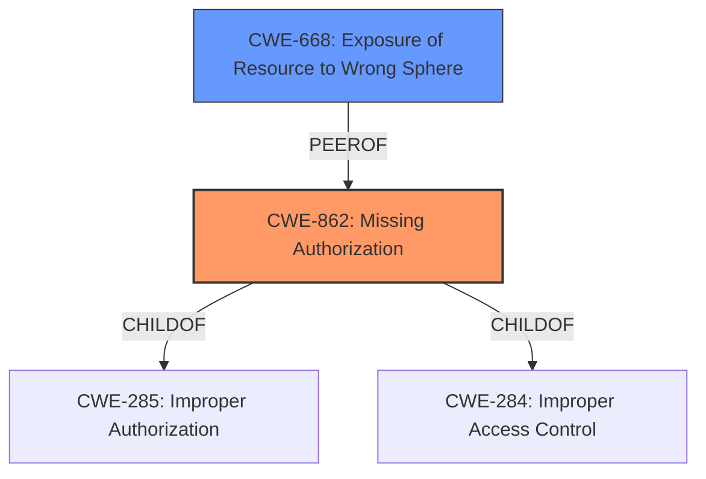

# Enhanced Analysis for CVE-2022-47475

# Summary

| CWE ID | CWE Name | Confidence | CWE Abstraction Level | CWE Vulnerability Mapping Label | CWE-Vulnerability Mapping Notes |
|---|---|---|---|---|---|
| CWE-862 | Missing Authorization | 1.0 | Class | Allowed-with-Review | Primary CWE |
| CWE-668 | Exposure of Resource to Wrong Sphere | 0.7 | Class | Allowed-with-Review | Secondary Candidate |

## Evidence and Confidence

*   **Confidence Score:** 1.0
*   **Evidence Strength:** HIGH

## Relationship Analysis
The primary CWE is CWE-862 [Missing Authorization], which is a Class-level CWE. The vulnerability involves a **missing permission check**, directly aligning with the description of CWE-862. CWE-862 is related to other authorization CWEs through ChildOf relationships (CWE-285, CWE-284).



## Vulnerability Chain
The vulnerability chain starts with the **missing permission check**, leading to local information disclosure.
  - **Root Cause:** **Missing permission check** (CWE-862)
  - **Impact:** Local information disclosure

## Summary of Analysis
The vulnerability description clearly indicates a **missing permission check** in a telephony service, leading to local information disclosure.

The selection of CWE-862 [Missing Authorization] is based on the following evidence:
  - **Vulnerability Description Key Phrases:** "***missing permission check***" directly aligns with the concept of missing authorization.
  - **CWE for similar CVE Descriptions:** CWE-862 is listed as the Primary CWE Match for similar vulnerabilities.
  - **Retriever Results:** CWE-862 is the top-ranked CWE.
  - **Complete CWE Specifications:** CWE-862's description, "The product does not perform an authorization check when an actor attempts to access a resource or perform an action," perfectly matches the vulnerability description.

The MITRE mapping guidance for CWE-862 suggests reviewing child entries for a better fit, but since the description is a direct match, CWE-862 is the most appropriate choice.

I considered CWE-668 [Exposure of Resource to Wrong Sphere], as information disclosure often results from a resource being exposed to an unintended context. However, the root cause is specifically a **missing permission check**, making CWE-862 a more direct and accurate fit.

I also considered CWE-20 [Improper Input Validation], but this is too generic. The **missing permission check** is a specific type of authorization failure, not a general input validation issue.

The final selection of CWE-862 is at the optimal level of specificity, as it directly reflects the **missing permission check** described in the vulnerability.

Relevant CWE Information:

# Enhanced Context (25 CWEs)

## CWE-862: Missing Authorization
**Abstraction:** Class
**Similarity Score**: 0.241 (sparse)

**Description:**
The product does not perform an authorization check when an actor attempts to access a resource or perform an action.

## CWE-668: Exposure of Resource to Wrong Sphere
**Abstraction:** Class
**Similarity Score**: N/A

**Description:** The software exposes resources or functionality to unintended actors. This can be internal data, system resources, or even privileged functionality. The actors can be other software, machines, or users.


## CWE Relationship Analysis

Current CWEs represent these abstraction levels: .


### Vulnerability Chain Analysis

**Chain starting from CWE-862:**
- 862 (Missing Authorization) - ROOT


**Chain starting from CWE-668:**
- 668 (Exposure of Resource to Wrong Sphere) - ROOT


### CWE Relationship Diagram

```mermaid
graph TD
    classDef primary fill:#f96,stroke:#333,stroke-width:2px
    classDef secondary fill:#69f,stroke:#333
    classDef tertiary fill:#9e9,stroke:#333
```