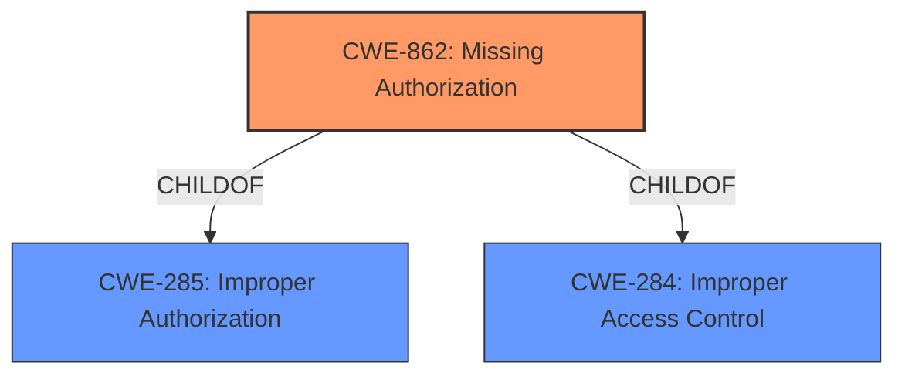

# Enhanced Analysis for CVE-2022-47479

# Summary

| CWE ID | CWE Name | Confidence | CWE Abstraction Level | CWE Vulnerability Mapping Label | CWE-Vulnerability Mapping Notes |
|---|---|---|---|---|---|
| CWE-862 | Missing Authorization | 1.0 | Class | Allowed-with-Review | Primary CWE |

## Evidence and Confidence

*   **Confidence Score:** 1.0
*   **Evidence Strength:** HIGH

## Relationship Analysis
The primary relationship considered was the ChildOf relationship of CWE-862 to CWE-285 and CWE-284, but these were not relevant for this specific vulnerability. The Abstraction Level of Class influenced the decision to prefer a more specific Base-level CWE if one existed, but CWE-862 remains the most appropriate.



## Vulnerability Chain
The vulnerability chain consists of a **missing permission check** leading directly to local information disclosure.

## Summary of Analysis
The initial analysis strongly points to CWE-862 due to the explicit mention of a **missing permission check**. The vulnerability description clearly states the **rootcause** as a **missing permission check**, leading to the **impact** of local information disclosure. This aligns directly with the definition of CWE-862, which describes a product that does not perform an authorization check.

The evidence supporting this decision is derived directly from the "Vulnerability Description Key Phrases", specifically the **rootcause**: **missing permission check** entry. This provides a clear and concise statement of the underlying weakness. The "CWE for similar CVE Descriptions" also lists CWE-862 as the primary match and top CWE, further reinforcing this selection.

The "Retriever Results" also lists CWE-862 as the top combined result, which further supports this selection. The "Complete CWE Specifications" for CWE-862 describes a product that does not perform an authorization check, which is a direct match to the vulnerability description.

The MITRE mapping guidance for CWE-862 recommends reviewing its children to see if there is a better fit, since it is a Class-level CWE. However, none of the children of CWE-862 provide a more specific description that would be a better fit for the vulnerability. Therefore, CWE-862 is the most appropriate CWE for this vulnerability.

CWE-863 was considered but not selected because the vulnerability description specifically mentions a *missing* permission check, rather than an *incorrect* one.
CWE-927 was considered but is specific to Android applications using implicit intents, which is not relevant here.
CWE-941 was considered but involves incorrectly specifying a destination in a communication channel, which is not relevant.
CWE-1021 was considered but relates to UI redress attacks, which is not applicable.
CWE-1284 was considered but involves improper validation of specified quantities in input, which does not align with the missing authorization check.
CWE-223 was considered but relates to the omission of security-relevant information, which is not the primary issue here.
CWE-789 was considered but involves memory allocation with excessive size values, which is not relevant.
CWE-665 was considered but relates to improper initialization, which is not the primary issue.
CWE-20 was considered, however, it is a very broad and generic CWE. Since the vulnerability description mentions a **missing permission check**, the more specific CWE-862 is preferred.

The final decision to select CWE-862 is based on the direct evidence of a **missing permission check**, the recommendation from "CWE for similar CVE Descriptions", the retriever results, and the MITRE mapping guidance. The confidence in this mapping is high (1.0) due to the clear alignment between the vulnerability description and the CWE definition.

Relevant CWE Information:

# Enhanced Context (25 CWEs)

## CWE-1289: Improper Validation of Unsafe Equivalence in Input
**Abstraction Level**: Base
**Similarity Score**: 0.81
**Source**: dense

**Description**:
The product receives an input value that is used as a resource identifier or other type of reference, but it does not validate or incorrectly validates that the input is equivalent to a potentially-unsafe value.

**Mapping Guidance**:
- Usage: Allowed
- Rationale: This CWE entry is at the Base level of abstraction, which is a preferred level of abstraction for mapping to the root causes of vulnerabilities.

## CWE-807: Reliance on Untrusted Inputs in a Security Decision
**Abstraction Level**: Base
**Similarity Score**: 0.79
**Source**: dense

**Description**:
The product uses a protection mechanism that relies on the existence or values of an input, but the input can be modified by an untrusted actor in a way that bypasses the protection mechanism.

**Mapping Guidance**:
- Usage: Allowed
- Rationale: This CWE entry is at the Base level of abstraction, which is a preferred level of abstraction for mapping to the root causes of vulnerabilities.

## CWE-1288: Improper Validation of Consistency within Input
**Abstraction Level**: Base
**Similarity Score**: 0.78
**Source**: dense

**Description**:
The product receives a complex input with multiple elements or fields that must be consistent with each other, but it does not validate or incorrectly validates that the input is actually consistent.

**Mapping Guidance**:
- Usage: Allowed
- Rationale: This CWE entry is at the Base level of abstraction, which is a preferred level of abstraction for mapping to the root causes of vulnerabilities.

## CWE-183: Permissive List of Allowed Inputs
**Abstraction Level**: Base
**Similarity Score**: 0.77
**Source**: dense

**Description**:
The product implements a protection mechanism that relies on a list of inputs (or properties of inputs) that are explicitly allowed by policy because the inputs are assumed to be safe, but the list is too permissive - that is, it allows an input that is unsafe, leading to resultant weaknesses.

**Mapping Guidance**:
- Usage: Allowed
- Rationale: This CWE entry is at the Base level of abstraction, which is a preferred level of abstraction for mapping to the root causes of vulnerabilities.

## CWE-179: Incorrect Behavior Order: Early Validation
**Abstraction Level**: Base
**Similarity Score**: 0.77
**Source**: dense

**Description**:
The product validates input before applying protection mechanisms that modify the input, which could allow an attacker to bypass the validation via dangerous inputs that only arise after the modification.

**Mapping Guidance**:
- Usage: Allowed
- Rationale: This CWE entry is at the Base level of abstraction, which is a preferred level of abstraction for mapping to the root causes of vulnerabilities.

## CWE-184: Incomplete List of Disallowed Inputs
**Abstraction Level**: Base
**Similarity Score**: 0.77
**Source**: dense

**Description**:
The product implements a protection mechanism that relies on a list of inputs (or properties of inputs) that are not allowed by policy or otherwise require other action to neutralize before additional processing takes place, but the list is incomplete.

**Mapping Guidance**:
- Usage: Allowed
- Rationale: This CWE entry is at the Base level of abstraction, which is a preferred level of abstraction for mapping to the root causes of vulnerabilities.

## CWE-115: Misinterpretation of Input
**Abstraction Level**: Base
**Similarity Score**: 0.76
**Source**: dense

**Description**:
The product misinterprets an input, whether from an attacker or another product, in a security-relevant fashion.

**Mapping Guidance**:
- Usage: Allowed
- Rationale: This CWE entry is at the Base level of abstraction, which is a preferred level of abstraction for mapping to the root causes of vulnerabilities.

## CWE-1173: Improper Use of Validation Framework
**Abstraction Level**: Base
**Similarity Score**: 0.76
**Source**: dense

**Description**:
The product does not use, or incorrectly uses, an input validation framework that is provided by the source language or an independent library.

**Mapping Guidance**:
- Usage: Allowed
- Rationale: This CWE entry is at the Base level of abstraction, which is a preferred level of abstraction for mapping to the root causes of vulnerabilities.

## CWE-138: Improper Neutralization of Special Elements
**Abstraction Level**: Class
**Similarity Score**: 0.75
**Source**: dense

**Description**:
The product receives input from an upstream component, but it does not neutralize or incorrectly neutralizes special elements that could be interpreted as control elements or syntactic markers when they are sent to a downstream component.

**Mapping Guidance**:
- Usage: Discouraged
- Rationale: This CWE entry is a level-1 Class (i.e.,


## CWE Relationship Analysis

Current CWEs represent these abstraction levels: .


### Vulnerability Chain Analysis

**Chain starting from CWE-807:**
- 807 (Reliance on Untrusted Inputs in a Security Decision) - ROOT


**Chain starting from CWE-1288:**
- 1288 (Improper Validation of Consistency within Input) - ROOT


### CWE Relationship Diagram

```mermaid
graph TD
    classDef primary fill:#f96,stroke:#333,stroke-width:2px
    classDef secondary fill:#69f,stroke:#333
    classDef tertiary fill:#9e9,stroke:#333
```