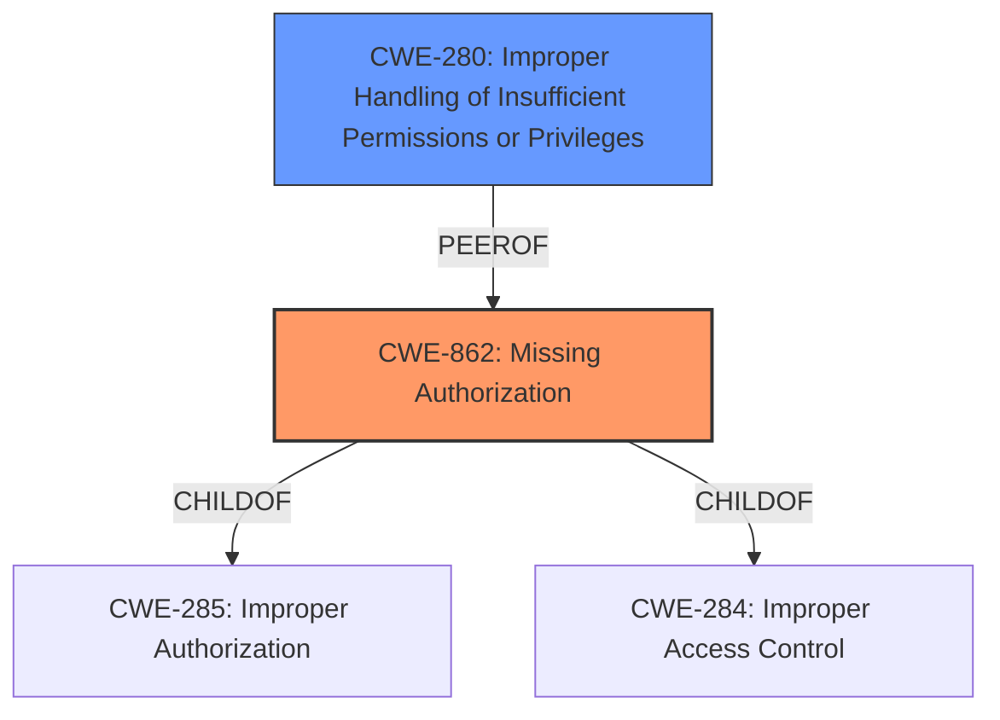

# Analysis for CVE-2022-47482

# Summary
| CWE ID | CWE Name | Confidence | CWE Abstraction Level | CWE Vulnerability Mapping Label | CWE-Vulnerability Mapping Notes |
|---|---|---|---|---|---|
| CWE-862 | Missing Authorization | 1 | Class | Primary | Allowed-with-Review |
| CWE-280 | Improper Handling of Insufficient Permissions or Privileges | 0.7 | Base | Secondary | Allowed |

## Evidence and Confidence

*   **Confidence Score:** 0.85
*   **Evidence Strength:** HIGH

## Relationship Analysis
The primary CWE selected is CWE-862 which is a Class-level CWE. The analysis also considered CWE-280, a Base-level CWE, as a secondary mapping option due to its relevance to permission handling issues. CWE-862 is the more direct match because the vulnerability description mentions a **missing permission check**.

## Vulnerability Chain
The vulnerability chain starts with the **missing permission check** (CWE-862), which directly leads to a local denial of service.

## Summary of Analysis
The initial analysis strongly points to CWE-862 (Missing Authorization) as the primary weakness due to the explicit mention of a "**missing permission check**" in the vulnerability description. This aligns well with the CWE's description, which states that "The product does not perform an authorization check when an actor attempts to access a resource or perform an action." The impact, a local denial of service, further supports this classification.

CWE-280 (Improper Handling of Insufficient Permissions or Privileges) was considered because it relates to permission issues, but it is a more general case. Since the root cause is a "**missing permission check**", CWE-862 is more specific and appropriate.

The evidence provided in the vulnerability description key phrases directly supports the selection of CWE-862: "**rootcause: missing permission check**".

The choice of CWE-862 as the primary CWE is at the optimal level of specificity, as it directly reflects the **missing authorization** aspect of the vulnerability.

Relevant CWE Information:

# Enhanced Context (25 CWEs)

## CWE-280: Improper Handling of Insufficient Permissions or Privileges
**Abstraction Level**: Base
**Similarity Score**: 0.77
**Source**: dense

**Description**:
The product does not handle or incorrectly handles when it has insufficient privileges to access resources or functionality as specified by their permissions. This may cause it to follow unexpected code paths that may leave the product in an invalid state.

**Mapping Guidance**:
- Usage: Allowed
- Rationale: This CWE entry is at the Base level of abstraction, which is a preferred level of abstraction for mapping to the root causes of vulnerabilities.

**Why CWE-280 was considered:** This CWE was considered because it describes a scenario where the product doesn't handle insufficient privileges correctly. The vulnerability description mentions a **missing permission check**, which could be related to improper handling of privileges. However, the primary issue is the **missing check** itself, making CWE-862 a better fit.

## CWE-862: Missing Authorization
**Abstraction:** Class
**Status:** Incomplete

### Description
The product does not perform an authorization check when an actor attempts to access a resource or perform an action.

### Extended Description
Not provided

### Alternative Terms
AuthZ: "AuthZ" is typically used as an abbreviation of "authorization" within the web application security community. It is distinct from "AuthN" (or, sometimes, "AuthC") which is an abbreviation of "authentication." The use of "Auth" as an abbreviation is discouraged, since it could be used for either authentication or authorization.

### Relationships
ChildOf -> CWE-285
ChildOf -> CWE-284

### Mapping Guidance
**Usage:** Allowed-with-Review
**Rationale:** This CWE entry is a Class and might have Base-level children that would be more appropriate
**Comments:** Examine children of this entry to see if there is a better fit
**Reasons:**
- Abstraction

### Additional Notes
**[Terminology]** Assuming a user with a given identity, authorization is the process of determining whether that user can access a given resource, based on the user's privileges and any permissions or other access-control specifications that apply to the resource.

### Observed Examples
- **CVE-2022-24730:** Go-based continuous deployment product does not check that a user has certain privileges to update or create an app, allowing adversaries to read sensitive repository information
- **CVE-2009-3168:** Web application does not restrict access to admin scripts, allowing authenticated users to reset administrative passwords.
- **CVE-2009-3597:** Web application stores database file under the web root with insufficient access control (CWE-219), allowing direct request.

**Why CWE-862 was selected:** The vulnerability description clearly states a "**missing permission check**". This directly aligns with the description of CWE-862, making it the most appropriate choice. The impact, a local denial of service, is a logical consequence of **missing authorization**.