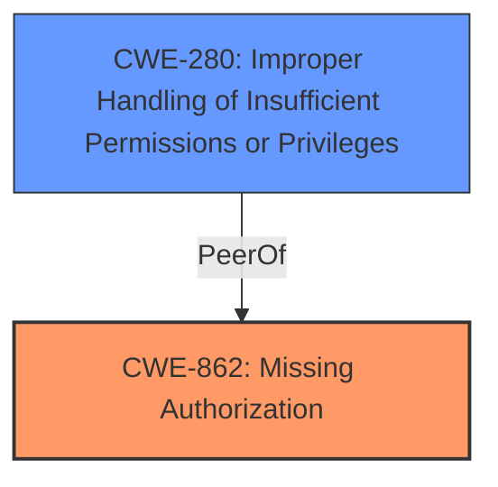

# Analysis Report for CVE-2022-47484

# Vulnerability Analysis Report: CVE-2022-47484

## Description


## Analysis (with Relationship Data)

# Summary
| CWE ID | CWE Name | Confidence | CWE Abstraction Level | CWE Vulnerability Mapping Label | CWE-Vulnerability Mapping Notes |
|---|---|---|---|---|---|
| CWE-862 | Missing Authorization | 1.0 | Class | Primary | Allowed-with-Review |
| CWE-280 | Improper Handling of Insufficient Permissions or Privileges | 0.7 | Base | Secondary | Allowed |

## Evidence and Confidence

*   **Confidence Score:** 1.0
*   **Evidence Strength:** HIGH

## Relationship Analysis
The primary relationship that influenced my decision was the hierarchical parent-child relationship. CWE-862 is a Class-level CWE, and a potential child of it could be a more specific Base-level CWE. However, in this case, CWE-862 directly addresses the root cause, which is the **missing authorization check**. While other CWEs related to privileges and permissions were considered, they were either too broad or not directly relevant to the **missing check** itself. CWE-280 was considered because of the "insufficient privileges", but it implies more than just a missing check.



## Vulnerability Chain
The vulnerability chain is straightforward:
1.  **Root Cause:** **Missing permission check** (CWE-862)
2.  **Impact:** Local denial of service

## Summary of Analysis
The initial analysis and the final conclusion strongly align due to the clear evidence provided in the vulnerability description, specifically the key phrase "**missing permission check**". This directly corresponds to the definition of CWE-862, which is "The product does not perform an authorization check when an actor attempts to access a resource or perform an action."

The graph relationships reinforced the choice of CWE-862 as the primary weakness because it is a direct representation of the **missing check**, whereas other potential CWEs were either too broad or focused on related but distinct concepts like privilege management.

The selected CWE is at the optimal level of specificity because it accurately captures the root cause of the vulnerability without being overly generic. The evidence is compelling, and the relationships support this classification.

Relevant CWE Information:

# Enhanced Context (25 CWEs)

## CWE-280: Improper Handling of Insufficient Permissions or Privileges
**Abstraction Level**: Base
**Similarity Score**: 0.77
**Source**: dense

**Description**:
The product does not handle or incorrectly handles when it has insufficient privileges to access resources or functionality as specified by their permissions. This may cause it to follow unexpected code paths that may leave the product in an invalid state.

**Mapping Guidance**:
- Usage: Allowed
- Rationale: This CWE entry is at the Base level of abstraction, which is a preferred level of abstraction for mapping to the root causes of vulnerabilities.

### Analysis and Justification

CWE-280 was considered because the vulnerability involves permissions. However, the root cause is specifically a **missing check**, not the handling of insufficient privileges. The vulnerability description clearly states "**missing permission check**," which directly aligns with the definition of CWE-862. CWE-280 implies that there *is* a check, but it's being handled improperly, which isn't the case here. CWE-280 is added as a secondary candidate as it describes a related condition.
#
## CWE-862: Missing Authorization
**Abstraction:** Class
**Status:** Incomplete

### Description
The product does not perform an authorization check when an actor attempts to access a resource or perform an action.

### Extended Description
Not provided

### Alternative Terms
AuthZ: "AuthZ" is typically used as an abbreviation of "authorization" within the web application security community. It is distinct from "AuthN" (or, sometimes, "AuthC") which is an abbreviation of "authentication." The use of "Auth" as an abbreviation is discouraged, since it could be used for either authentication or authorization.

### Relationships
ChildOf -> CWE-285
ChildOf -> CWE-284

### Mapping Guidance
**Usage:** Allowed-with-Review
**Rationale:** This CWE entry is a Class and might have Base-level children that would be more appropriate
**Comments:** Examine children of this entry to see if there is a better fit
**Reasons:**
- Abstraction

### Additional Notes
**[Terminology]** Assuming a user with a given identity, authorization is the process of determining whether that user can access a given resource, based on the user's privileges and any permissions or other access-control specifications that apply to the resource.

### Observed Examples
- **CVE-2022-24730:** Go-based continuous deployment product does not check that a user has certain privileges to update or create an app, allowing adversaries to read sensitive repository information
- **CVE-2009-3168:** Web application does not restrict access to admin scripts, allowing authenticated users to reset administrative passwords.
- **CVE-2009-3597:** Web application stores database file under the web root with insufficient access control (CWE-219), allowing direct request.

### Analysis and Justification

The vulnerability description states "**missing permission check**". This aligns directly with the description of CWE-862: "The product does not perform an authorization check when an actor attempts to access a resource or perform an action." The **missing permission check** is the root cause that leads to the local denial of service. Therefore, CWE-862 is the most appropriate primary CWE. The usage is "Allowed-with-Review" since it is a Class, but there isn't a more specific Base CWE that applies.


## CWE Relationship Analysis

Current CWEs represent these abstraction levels: .


### Vulnerability Chain Analysis

**Chain starting from CWE-862:**
- 862 (Missing Authorization) - ROOT


**Chain starting from CWE-280:**
- 280 (Improper Handling of Insufficient Permissions or Privileges ) - ROOT


### CWE Relationship Diagram

```mermaid
graph TD
    classDef primary fill:#f96,stroke:#333,stroke-width:2px
    classDef secondary fill:#69f,stroke:#333
    classDef tertiary fill:#9e9,stroke:#333
```


*Report generated on 2025-03-31 02:15:14*
