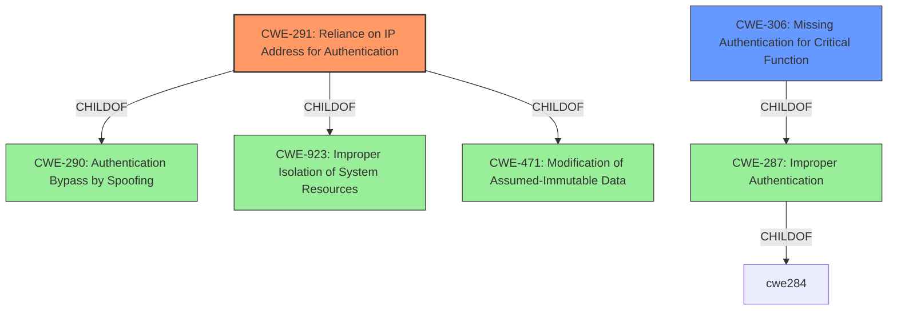

# Analysis Report for CVE-2022-47648

# Vulnerability Analysis Report: CVE-2022-47648

## Description


## Analysis (with Relationship Data)

# Summary
| CWE ID  | CWE Name  | Confidence | CWE Abstraction Level | CWE Vulnerability Mapping Label | CWE-Vulnerability Mapping Notes |
|---|---|---|---|---|---|
| CWE-291 | Reliance on IP Address for Authentication | 1.0  | Variant | Allowed | Primary CWE |
| CWE-306 | Missing Authentication for Critical Function  | 0.8 | Base  | Allowed | Secondary Candidate |

## Evidence and Confidence

*   **Confidence Score:** 0.9
*   **Evidence Strength:** HIGH

## Relationship Analysis
The primary CWE, CWE-291, is a Variant of CWE-290 (Authentication Bypass by Spoofing) and CWE-923 (Improper Isolation of System Resources). CWE-291 directly addresses the vulnerability's root cause by highlighting the **reliance on IP addresses for authentication**, which can be easily spoofed. The secondary CWE, CWE-306, represents the lack of authentication for critical functions, providing a broader context.



## Vulnerability Chain
The vulnerability chain starts with the **improper access control** due to the **reliance on IP address for authentication** (CWE-291). This leads to a **missing authentication** for critical functions (CWE-306), allowing an attacker to bypass security measures and gain unauthorized access to the control panel. The final impact is a compromise of confidentiality, integrity, and availability.

## Summary of Analysis
The analysis concludes that CWE-291 (Reliance on IP Address for Authentication) is the most specific and appropriate primary CWE, as it directly reflects the **root cause** of the vulnerability. The evidence from the "CVE Reference Links Content Summary" explicitly states that the "B420 Ethernet communication module has an **improper access control vulnerability** due to its IP-based authentication mechanism," indicating a clear **reliance on IP addresses for authentication**. CWE-306 (Missing Authentication for Critical Function) is a relevant secondary CWE because the **reliance on IP-based authentication** effectively means there is no proper authentication mechanism in place for critical functions.

Other CWEs were considered but deemed less appropriate. CWE-863 (Incorrect Authorization) and CWE-285 (Improper Authorization) are too generic, as the issue is not an incorrect implementation of authorization, but the **reliance on a weak authentication** mechanism. CWE-639 (Authorization Bypass Through User-Controlled Key) does not apply because the bypass is not through a user-controlled key, but through a **lack of proper authentication** based on a spoofable IP address. CWE-287 (Improper Authentication) is also too broad and is a parent of CWE-291 and CWE-306.

The final selection of CWE-291 and CWE-306 is based on the direct evidence from the vulnerability description and the relationship analysis, ensuring the most accurate and specific classification.


## CWE Relationship Analysis

Current CWEs represent these abstraction levels: .


### Vulnerability Chain Analysis

**Chain starting from CWE-290:**
- 290 (Authentication Bypass by Spoofing) - ROOT


**Chain starting from CWE-923:**
- 923 (Improper Restriction of Communication Channel to Intended Endpoints) - ROOT


### CWE Relationship Diagram

```mermaid
graph TD
    classDef primary fill:#f96,stroke:#333,stroke-width:2px
    classDef secondary fill:#69f,stroke:#333
    classDef tertiary fill:#9e9,stroke:#333
```


*Report generated on 2025-03-31 07:10:00*
